### 一 ESMAScript概述
- 也是一门脚本语言，通常看作JavaScript语言的规范，实际上JavaScript是ESMAScript的扩展语言S
- ESMAScript中只提供了最基本的语法
- web环境
<svg xmlns="http://www.w3.org/2000/svg" xmlns:xlink="http://www.w3.org/1999/xlink" version="1.1" width="501px" viewBox="-0.5 -0.5 501 401" content="&lt;mxfile host=&quot;9e69cda2-8b14-4c53-be6d-7c45fe4c70a6&quot; modified=&quot;2020-10-18T05:49:36.068Z&quot; agent=&quot;5.0 (Windows NT 10.0; Win64; x64) AppleWebKit/537.36 (KHTML, like Gecko) Code/1.49.3 Chrome/83.0.4103.122 Electron/9.2.1 Safari/537.36&quot; version=&quot;13.6.5&quot; etag=&quot;TMe8bd4Gx3f_Vf3Ntlsg&quot;&gt;&lt;diagram id=&quot;J4BD0FD1iIkiyncSbiVS&quot; name=&quot;Page-1&quot;&gt;&lt;mxGraphModel dx=&quot;572&quot; dy=&quot;662&quot; grid=&quot;1&quot; gridSize=&quot;10&quot; guides=&quot;1&quot; tooltips=&quot;1&quot; connect=&quot;1&quot; arrows=&quot;1&quot; fold=&quot;1&quot; page=&quot;1&quot; pageScale=&quot;1&quot; pageWidth=&quot;827&quot; pageHeight=&quot;1169&quot; math=&quot;0&quot; shadow=&quot;0&quot;&gt;&lt;root&gt;&lt;mxCell id=&quot;0&quot;/&gt;&lt;mxCell id=&quot;1&quot; parent=&quot;0&quot;/&gt;&lt;mxCell id=&quot;2&quot; value=&quot;&quot; style=&quot;rounded=1;whiteSpace=wrap;html=1;&quot; vertex=&quot;1&quot; parent=&quot;1&quot;&gt;&lt;mxGeometry x=&quot;30&quot; y=&quot;130&quot; width=&quot;500&quot; height=&quot;400&quot; as=&quot;geometry&quot;/&gt;&lt;/mxCell&gt;&lt;mxCell id=&quot;8&quot; value=&quot;&quot; style=&quot;rounded=1;whiteSpace=wrap;html=1;&quot; vertex=&quot;1&quot; parent=&quot;1&quot;&gt;&lt;mxGeometry x=&quot;50&quot; y=&quot;330&quot; width=&quot;450&quot; height=&quot;190&quot; as=&quot;geometry&quot;/&gt;&lt;/mxCell&gt;&lt;mxCell id=&quot;3&quot; value=&quot;&amp;lt;font style=&amp;quot;font-size: 21px&amp;quot;&amp;gt;ECMAScript&amp;lt;/font&amp;gt;&quot; style=&quot;rounded=1;whiteSpace=wrap;html=1;&quot; vertex=&quot;1&quot; parent=&quot;1&quot;&gt;&lt;mxGeometry x=&quot;60&quot; y=&quot;190&quot; width=&quot;430&quot; height=&quot;130&quot; as=&quot;geometry&quot;/&gt;&lt;/mxCell&gt;&lt;mxCell id=&quot;4&quot; value=&quot;&amp;lt;font style=&amp;quot;font-size: 21px&amp;quot;&amp;gt;BOM&amp;lt;/font&amp;gt;&quot; style=&quot;rounded=1;whiteSpace=wrap;html=1;&quot; vertex=&quot;1&quot; parent=&quot;1&quot;&gt;&lt;mxGeometry x=&quot;60&quot; y=&quot;380&quot; width=&quot;200&quot; height=&quot;130&quot; as=&quot;geometry&quot;/&gt;&lt;/mxCell&gt;&lt;mxCell id=&quot;5&quot; value=&quot;&amp;lt;font style=&amp;quot;font-size: 21px&amp;quot;&amp;gt;DOM&amp;lt;/font&amp;gt;&quot; style=&quot;rounded=1;whiteSpace=wrap;html=1;&quot; vertex=&quot;1&quot; parent=&quot;1&quot;&gt;&lt;mxGeometry x=&quot;280&quot; y=&quot;380&quot; width=&quot;210&quot; height=&quot;130&quot; as=&quot;geometry&quot;/&gt;&lt;/mxCell&gt;&lt;mxCell id=&quot;6&quot; value=&quot;&amp;lt;span style=&amp;quot;font-size: 21px&amp;quot;&amp;gt;JavaScript @ web&amp;lt;/span&amp;gt;&quot; style=&quot;text;html=1;strokeColor=none;fillColor=none;align=center;verticalAlign=middle;whiteSpace=wrap;rounded=0;&quot; vertex=&quot;1&quot; parent=&quot;1&quot;&gt;&lt;mxGeometry x=&quot;70&quot; y=&quot;160&quot; width=&quot;200&quot; height=&quot;20&quot; as=&quot;geometry&quot;/&gt;&lt;/mxCell&gt;&lt;mxCell id=&quot;7&quot; value=&quot;&amp;lt;font style=&amp;quot;font-size: 21px&amp;quot;&amp;gt;Web APIs&amp;lt;/font&amp;gt;&quot; style=&quot;text;html=1;strokeColor=none;fillColor=none;align=center;verticalAlign=middle;whiteSpace=wrap;rounded=0;&quot; vertex=&quot;1&quot; parent=&quot;1&quot;&gt;&lt;mxGeometry x=&quot;60&quot; y=&quot;350&quot; width=&quot;140&quot; height=&quot;20&quot; as=&quot;geometry&quot;/&gt;&lt;/mxCell&gt;&lt;/root&gt;&lt;/mxGraphModel&gt;&lt;/diagram&gt;&lt;/mxfile&gt;" onclick="(function(svg){var src=window.event.target||window.event.srcElement;while (src!=null&amp;&amp;src.nodeName.toLowerCase()!='a'){src=src.parentNode;}if(src==null){if(svg.wnd!=null&amp;&amp;!svg.wnd.closed){svg.wnd.focus();}else{var r=function(evt){if(evt.data=='ready'&amp;&amp;evt.source==svg.wnd){svg.wnd.postMessage(decodeURIComponent(svg.getAttribute('content')),'*');window.removeEventListener('message',r);}};window.addEventListener('message',r);svg.wnd=window.open('https://viewer.diagrams.net/?client=1&amp;edit=_blank');}}})(this);" style="cursor:pointer;max-width:100%;max-height:401px;"><defs/><g><rect x="0" y="0" width="500" height="400" rx="60" ry="60" fill="#ffffff" stroke="#000000" pointer-events="all"/><rect x="20" y="200" width="450" height="190" rx="28.5" ry="28.5" fill="#ffffff" stroke="#000000" pointer-events="all"/><rect x="30" y="60" width="430" height="130" rx="19.5" ry="19.5" fill="#ffffff" stroke="#000000" pointer-events="all"/><g transform="translate(-0.5 -0.5)"><switch><foreignObject style="overflow: visible; text-align: left;" pointer-events="none" width="100%" height="100%" requiredFeatures="http://www.w3.org/TR/SVG11/feature#Extensibility"><div xmlns="http://www.w3.org/1999/xhtml" style="display: flex; align-items: unsafe center; justify-content: unsafe center; width: 428px; height: 1px; padding-top: 125px; margin-left: 31px;"><div style="box-sizing: border-box; font-size: 0; text-align: center; "><div style="display: inline-block; font-size: 12px; font-family: Helvetica; color: #000000; line-height: 1.2; pointer-events: all; white-space: normal; word-wrap: normal; "><font style="font-size: 21px">ECMAScript</font></div></div></div></foreignObject><text x="245" y="129" fill="#000000" font-family="Helvetica" font-size="12px" text-anchor="middle">ECMAScript</text></switch></g><rect x="30" y="250" width="200" height="130" rx="19.5" ry="19.5" fill="#ffffff" stroke="#000000" pointer-events="all"/><g transform="translate(-0.5 -0.5)"><switch><foreignObject style="overflow: visible; text-align: left;" pointer-events="none" width="100%" height="100%" requiredFeatures="http://www.w3.org/TR/SVG11/feature#Extensibility"><div xmlns="http://www.w3.org/1999/xhtml" style="display: flex; align-items: unsafe center; justify-content: unsafe center; width: 198px; height: 1px; padding-top: 315px; margin-left: 31px;"><div style="box-sizing: border-box; font-size: 0; text-align: center; "><div style="display: inline-block; font-size: 12px; font-family: Helvetica; color: #000000; line-height: 1.2; pointer-events: all; white-space: normal; word-wrap: normal; "><font style="font-size: 21px">BOM</font></div></div></div></foreignObject><text x="130" y="319" fill="#000000" font-family="Helvetica" font-size="12px" text-anchor="middle">BOM</text></switch></g><rect x="250" y="250" width="210" height="130" rx="19.5" ry="19.5" fill="#ffffff" stroke="#000000" pointer-events="all"/><g transform="translate(-0.5 -0.5)"><switch><foreignObject style="overflow: visible; text-align: left;" pointer-events="none" width="100%" height="100%" requiredFeatures="http://www.w3.org/TR/SVG11/feature#Extensibility"><div xmlns="http://www.w3.org/1999/xhtml" style="display: flex; align-items: unsafe center; justify-content: unsafe center; width: 208px; height: 1px; padding-top: 315px; margin-left: 251px;"><div style="box-sizing: border-box; font-size: 0; text-align: center; "><div style="display: inline-block; font-size: 12px; font-family: Helvetica; color: #000000; line-height: 1.2; pointer-events: all; white-space: normal; word-wrap: normal; "><font style="font-size: 21px">DOM</font></div></div></div></foreignObject><text x="355" y="319" fill="#000000" font-family="Helvetica" font-size="12px" text-anchor="middle">DOM</text></switch></g><rect x="40" y="30" width="200" height="20" fill="none" stroke="none" pointer-events="all"/><g transform="translate(-0.5 -0.5)"><switch><foreignObject style="overflow: visible; text-align: left;" pointer-events="none" width="100%" height="100%" requiredFeatures="http://www.w3.org/TR/SVG11/feature#Extensibility"><div xmlns="http://www.w3.org/1999/xhtml" style="display: flex; align-items: unsafe center; justify-content: unsafe center; width: 198px; height: 1px; padding-top: 40px; margin-left: 41px;"><div style="box-sizing: border-box; font-size: 0; text-align: center; "><div style="display: inline-block; font-size: 12px; font-family: Helvetica; color: #000000; line-height: 1.2; pointer-events: all; white-space: normal; word-wrap: normal; "><span style="font-size: 21px">JavaScript @ web</span></div></div></div></foreignObject><text x="140" y="44" fill="#000000" font-family="Helvetica" font-size="12px" text-anchor="middle">JavaScript @ web</text></switch></g><rect x="30" y="220" width="140" height="20" fill="none" stroke="none" pointer-events="all"/><g transform="translate(-0.5 -0.5)"><switch><foreignObject style="overflow: visible; text-align: left;" pointer-events="none" width="100%" height="100%" requiredFeatures="http://www.w3.org/TR/SVG11/feature#Extensibility"><div xmlns="http://www.w3.org/1999/xhtml" style="display: flex; align-items: unsafe center; justify-content: unsafe center; width: 138px; height: 1px; padding-top: 230px; margin-left: 31px;"><div style="box-sizing: border-box; font-size: 0; text-align: center; "><div style="display: inline-block; font-size: 12px; font-family: Helvetica; color: #000000; line-height: 1.2; pointer-events: all; white-space: normal; word-wrap: normal; "><font style="font-size: 21px">Web APIs</font></div></div></div></foreignObject><text x="100" y="234" fill="#000000" font-family="Helvetica" font-size="12px" text-anchor="middle">Web APIs</text></switch></g></g><switch><g requiredFeatures="http://www.w3.org/TR/SVG11/feature#Extensibility"/><a transform="translate(0,-5)" xlink:href="https://desk.draw.io/support/solutions/articles/16000042487" target="_blank"><text text-anchor="middle" font-size="10px" x="50%" y="100%">Viewer does not support full SVG 1.1</text></a></switch></svg>

- node环境
<svg xmlns="http://www.w3.org/2000/svg" xmlns:xlink="http://www.w3.org/1999/xlink" version="1.1" width="501px" viewBox="-0.5 -0.5 501 401" content="&lt;mxfile host=&quot;9e69cda2-8b14-4c53-be6d-7c45fe4c70a6&quot; modified=&quot;2020-10-18T05:51:37.514Z&quot; agent=&quot;5.0 (Windows NT 10.0; Win64; x64) AppleWebKit/537.36 (KHTML, like Gecko) Code/1.49.3 Chrome/83.0.4103.122 Electron/9.2.1 Safari/537.36&quot; version=&quot;13.6.5&quot; etag=&quot;vgja6WEB3P0AGccAPRMM&quot;&gt;&lt;diagram id=&quot;J4BD0FD1iIkiyncSbiVS&quot; name=&quot;Page-1&quot;&gt;&lt;mxGraphModel dx=&quot;572&quot; dy=&quot;662&quot; grid=&quot;1&quot; gridSize=&quot;10&quot; guides=&quot;1&quot; tooltips=&quot;1&quot; connect=&quot;1&quot; arrows=&quot;1&quot; fold=&quot;1&quot; page=&quot;1&quot; pageScale=&quot;1&quot; pageWidth=&quot;827&quot; pageHeight=&quot;1169&quot; math=&quot;0&quot; shadow=&quot;0&quot;&gt;&lt;root&gt;&lt;mxCell id=&quot;0&quot;/&gt;&lt;mxCell id=&quot;1&quot; parent=&quot;0&quot;/&gt;&lt;mxCell id=&quot;2&quot; value=&quot;&quot; style=&quot;rounded=1;whiteSpace=wrap;html=1;&quot; vertex=&quot;1&quot; parent=&quot;1&quot;&gt;&lt;mxGeometry x=&quot;30&quot; y=&quot;130&quot; width=&quot;500&quot; height=&quot;400&quot; as=&quot;geometry&quot;/&gt;&lt;/mxCell&gt;&lt;mxCell id=&quot;8&quot; value=&quot;&quot; style=&quot;rounded=1;whiteSpace=wrap;html=1;&quot; vertex=&quot;1&quot; parent=&quot;1&quot;&gt;&lt;mxGeometry x=&quot;50&quot; y=&quot;330&quot; width=&quot;450&quot; height=&quot;190&quot; as=&quot;geometry&quot;/&gt;&lt;/mxCell&gt;&lt;mxCell id=&quot;3&quot; value=&quot;&amp;lt;font style=&amp;quot;font-size: 21px&amp;quot;&amp;gt;ECMAScript&amp;lt;/font&amp;gt;&quot; style=&quot;rounded=1;whiteSpace=wrap;html=1;&quot; vertex=&quot;1&quot; parent=&quot;1&quot;&gt;&lt;mxGeometry x=&quot;60&quot; y=&quot;190&quot; width=&quot;430&quot; height=&quot;130&quot; as=&quot;geometry&quot;/&gt;&lt;/mxCell&gt;&lt;mxCell id=&quot;4&quot; value=&quot;&amp;lt;span style=&amp;quot;font-size: 21px&amp;quot;&amp;gt;fs&amp;lt;/span&amp;gt;&quot; style=&quot;rounded=1;whiteSpace=wrap;html=1;&quot; vertex=&quot;1&quot; parent=&quot;1&quot;&gt;&lt;mxGeometry x=&quot;60&quot; y=&quot;380&quot; width=&quot;130&quot; height=&quot;130&quot; as=&quot;geometry&quot;/&gt;&lt;/mxCell&gt;&lt;mxCell id=&quot;5&quot; value=&quot;&amp;lt;span style=&amp;quot;font-size: 21px&amp;quot;&amp;gt;net&amp;lt;/span&amp;gt;&quot; style=&quot;rounded=1;whiteSpace=wrap;html=1;&quot; vertex=&quot;1&quot; parent=&quot;1&quot;&gt;&lt;mxGeometry x=&quot;200&quot; y=&quot;380&quot; width=&quot;140&quot; height=&quot;130&quot; as=&quot;geometry&quot;/&gt;&lt;/mxCell&gt;&lt;mxCell id=&quot;6&quot; value=&quot;&amp;lt;span style=&amp;quot;font-size: 21px&amp;quot;&amp;gt;JavaScript @ node.js&amp;lt;/span&amp;gt;&quot; style=&quot;text;html=1;strokeColor=none;fillColor=none;align=center;verticalAlign=middle;whiteSpace=wrap;rounded=0;&quot; vertex=&quot;1&quot; parent=&quot;1&quot;&gt;&lt;mxGeometry x=&quot;70&quot; y=&quot;160&quot; width=&quot;220&quot; height=&quot;20&quot; as=&quot;geometry&quot;/&gt;&lt;/mxCell&gt;&lt;mxCell id=&quot;7&quot; value=&quot;&amp;lt;font style=&amp;quot;font-size: 21px&amp;quot;&amp;gt;Node APIs&amp;lt;/font&amp;gt;&quot; style=&quot;text;html=1;strokeColor=none;fillColor=none;align=center;verticalAlign=middle;whiteSpace=wrap;rounded=0;&quot; vertex=&quot;1&quot; parent=&quot;1&quot;&gt;&lt;mxGeometry x=&quot;60&quot; y=&quot;350&quot; width=&quot;140&quot; height=&quot;20&quot; as=&quot;geometry&quot;/&gt;&lt;/mxCell&gt;&lt;mxCell id=&quot;9&quot; value=&quot;&amp;lt;span style=&amp;quot;font-size: 21px&amp;quot;&amp;gt;etc.&amp;lt;/span&amp;gt;&quot; style=&quot;rounded=1;whiteSpace=wrap;html=1;&quot; vertex=&quot;1&quot; parent=&quot;1&quot;&gt;&lt;mxGeometry x=&quot;349&quot; y=&quot;380&quot; width=&quot;130&quot; height=&quot;130&quot; as=&quot;geometry&quot;/&gt;&lt;/mxCell&gt;&lt;/root&gt;&lt;/mxGraphModel&gt;&lt;/diagram&gt;&lt;/mxfile&gt;" onclick="(function(svg){var src=window.event.target||window.event.srcElement;while (src!=null&amp;&amp;src.nodeName.toLowerCase()!='a'){src=src.parentNode;}if(src==null){if(svg.wnd!=null&amp;&amp;!svg.wnd.closed){svg.wnd.focus();}else{var r=function(evt){if(evt.data=='ready'&amp;&amp;evt.source==svg.wnd){svg.wnd.postMessage(decodeURIComponent(svg.getAttribute('content')),'*');window.removeEventListener('message',r);}};window.addEventListener('message',r);svg.wnd=window.open('https://viewer.diagrams.net/?client=1&amp;edit=_blank');}}})(this);" style="cursor:pointer;max-width:100%;max-height:401px;"><defs/><g><rect x="0" y="0" width="500" height="400" rx="60" ry="60" fill="#ffffff" stroke="#000000" pointer-events="all"/><rect x="20" y="200" width="450" height="190" rx="28.5" ry="28.5" fill="#ffffff" stroke="#000000" pointer-events="all"/><rect x="30" y="60" width="430" height="130" rx="19.5" ry="19.5" fill="#ffffff" stroke="#000000" pointer-events="all"/><g transform="translate(-0.5 -0.5)"><switch><foreignObject style="overflow: visible; text-align: left;" pointer-events="none" width="100%" height="100%" requiredFeatures="http://www.w3.org/TR/SVG11/feature#Extensibility"><div xmlns="http://www.w3.org/1999/xhtml" style="display: flex; align-items: unsafe center; justify-content: unsafe center; width: 428px; height: 1px; padding-top: 125px; margin-left: 31px;"><div style="box-sizing: border-box; font-size: 0; text-align: center; "><div style="display: inline-block; font-size: 12px; font-family: Helvetica; color: #000000; line-height: 1.2; pointer-events: all; white-space: normal; word-wrap: normal; "><font style="font-size: 21px">ECMAScript</font></div></div></div></foreignObject><text x="245" y="129" fill="#000000" font-family="Helvetica" font-size="12px" text-anchor="middle">ECMAScript</text></switch></g><rect x="30" y="250" width="130" height="130" rx="19.5" ry="19.5" fill="#ffffff" stroke="#000000" pointer-events="all"/><g transform="translate(-0.5 -0.5)"><switch><foreignObject style="overflow: visible; text-align: left;" pointer-events="none" width="100%" height="100%" requiredFeatures="http://www.w3.org/TR/SVG11/feature#Extensibility"><div xmlns="http://www.w3.org/1999/xhtml" style="display: flex; align-items: unsafe center; justify-content: unsafe center; width: 128px; height: 1px; padding-top: 315px; margin-left: 31px;"><div style="box-sizing: border-box; font-size: 0; text-align: center; "><div style="display: inline-block; font-size: 12px; font-family: Helvetica; color: #000000; line-height: 1.2; pointer-events: all; white-space: normal; word-wrap: normal; "><span style="font-size: 21px">fs</span></div></div></div></foreignObject><text x="95" y="319" fill="#000000" font-family="Helvetica" font-size="12px" text-anchor="middle">fs</text></switch></g><rect x="170" y="250" width="140" height="130" rx="19.5" ry="19.5" fill="#ffffff" stroke="#000000" pointer-events="all"/><g transform="translate(-0.5 -0.5)"><switch><foreignObject style="overflow: visible; text-align: left;" pointer-events="none" width="100%" height="100%" requiredFeatures="http://www.w3.org/TR/SVG11/feature#Extensibility"><div xmlns="http://www.w3.org/1999/xhtml" style="display: flex; align-items: unsafe center; justify-content: unsafe center; width: 138px; height: 1px; padding-top: 315px; margin-left: 171px;"><div style="box-sizing: border-box; font-size: 0; text-align: center; "><div style="display: inline-block; font-size: 12px; font-family: Helvetica; color: #000000; line-height: 1.2; pointer-events: all; white-space: normal; word-wrap: normal; "><span style="font-size: 21px">net</span></div></div></div></foreignObject><text x="240" y="319" fill="#000000" font-family="Helvetica" font-size="12px" text-anchor="middle">net</text></switch></g><rect x="40" y="30" width="220" height="20" fill="none" stroke="none" pointer-events="all"/><g transform="translate(-0.5 -0.5)"><switch><foreignObject style="overflow: visible; text-align: left;" pointer-events="none" width="100%" height="100%" requiredFeatures="http://www.w3.org/TR/SVG11/feature#Extensibility"><div xmlns="http://www.w3.org/1999/xhtml" style="display: flex; align-items: unsafe center; justify-content: unsafe center; width: 218px; height: 1px; padding-top: 40px; margin-left: 41px;"><div style="box-sizing: border-box; font-size: 0; text-align: center; "><div style="display: inline-block; font-size: 12px; font-family: Helvetica; color: #000000; line-height: 1.2; pointer-events: all; white-space: normal; word-wrap: normal; "><span style="font-size: 21px">JavaScript @ node.js</span></div></div></div></foreignObject><text x="150" y="44" fill="#000000" font-family="Helvetica" font-size="12px" text-anchor="middle">JavaScript @ node.js</text></switch></g><rect x="30" y="220" width="140" height="20" fill="none" stroke="none" pointer-events="all"/><g transform="translate(-0.5 -0.5)"><switch><foreignObject style="overflow: visible; text-align: left;" pointer-events="none" width="100%" height="100%" requiredFeatures="http://www.w3.org/TR/SVG11/feature#Extensibility"><div xmlns="http://www.w3.org/1999/xhtml" style="display: flex; align-items: unsafe center; justify-content: unsafe center; width: 138px; height: 1px; padding-top: 230px; margin-left: 31px;"><div style="box-sizing: border-box; font-size: 0; text-align: center; "><div style="display: inline-block; font-size: 12px; font-family: Helvetica; color: #000000; line-height: 1.2; pointer-events: all; white-space: normal; word-wrap: normal; "><font style="font-size: 21px">Node APIs</font></div></div></div></foreignObject><text x="100" y="234" fill="#000000" font-family="Helvetica" font-size="12px" text-anchor="middle">Node APIs</text></switch></g><rect x="319" y="250" width="130" height="130" rx="19.5" ry="19.5" fill="#ffffff" stroke="#000000" pointer-events="all"/><g transform="translate(-0.5 -0.5)"><switch><foreignObject style="overflow: visible; text-align: left;" pointer-events="none" width="100%" height="100%" requiredFeatures="http://www.w3.org/TR/SVG11/feature#Extensibility"><div xmlns="http://www.w3.org/1999/xhtml" style="display: flex; align-items: unsafe center; justify-content: unsafe center; width: 128px; height: 1px; padding-top: 315px; margin-left: 320px;"><div style="box-sizing: border-box; font-size: 0; text-align: center; "><div style="display: inline-block; font-size: 12px; font-family: Helvetica; color: #000000; line-height: 1.2; pointer-events: all; white-space: normal; word-wrap: normal; "><span style="font-size: 21px">etc.</span></div></div></div></foreignObject><text x="384" y="319" fill="#000000" font-family="Helvetica" font-size="12px" text-anchor="middle">etc.</text></switch></g></g><switch><g requiredFeatures="http://www.w3.org/TR/SVG11/feature#Extensibility"/><a transform="translate(0,-5)" xlink:href="https://desk.draw.io/support/solutions/articles/16000042487" target="_blank"><text text-anchor="middle" font-size="10px" x="50%" y="100%">Viewer does not support full SVG 1.1</text></a></switch></svg>

- JavaScript中语言本身指的就是ECMAScript
### 二 ES2015(ES6)
- 相比与ES5.1的变化很大
- 自此，标准命名规则发生了变化
- [官方文档](http://www.ecma-international.org/ecma-262/6.0/)
- 解决原有语法上的一些不足(let const)
- 对原有语法进行增强(解构语法)
- 全新的对象和语法功能（Promise） 
- 全新的数据结构（sypmol，map，set）
#### 1.let与块级作用域
- 作用域：代码中的某个成员，能够起作用的范围
- ES2015之前，只有两种作用域
  - 全局作用域
  - 函数作用域
- 块级作用域：指用花括号包裹起来的范围，比如if，for等
- var会出现变量声明的提升，let则要求先声明变量，再引用变量
#### 2.const
- 在let的基础上多了一个只读的特性，变量一旦声明过后，就不能再修改。(对于对象和数组，只读是指不改变内存指向)
#### 3.数组的解构
```
const arr = [1,2,3]
const [a,b,c] = arr
const [d,,e] = arr
//跳过中间的部分
const [f,...g] = arr
//把后面的全部归类到g中
const [h,i,j = 'default'] = arr
//设置默认值
```
#### 4.对象的解构
```
const obj = {name:'abc',age:18}
const {name} = obj
//其他的和解构数组的方法一致，没有解构到的会返回undefined，也可以设置默认值
const {name:objName} = obj
//如果name出现重命名的情况，可以用冒号定义一个新的变量名，在冒号右边
```
#### 5.模版字符串
```
const str = `hello es2015
this is \`string\` `
//支持换行，反引号可以用反斜杠转译输出

const name='tony'
const msg = `hello,${name}`
//插值表达式，可以包含js的表达式
```
#### 6.带标签的模板字符串
```
const str = tag`hello world`
//tag就是标签，是一个函数，首先要定义这个函数
//举个例子
const name = 'tom'
const gender = true
function myTagFun(strings,name,gender){
  console.log(strings,name,gender)
  //输出的strings:  ['hey','is a','.']
  //同时会输出模板字符串的里面的表达式
  //['hey','is a','.'] tom true
  return '123'
  //如果有返回值，那么下面的result打印出来(console.log)的就是返回值
  //如果返回的是原来的值，就是return strings[0]+name+strings[1]+gender+strings[2]
}
const result = myTagFun`hey,${name} is a ${gender}.`

```
#### 7.ES2015的字符串扩展方法
- includes()

想知道字符串是否包含某些字符串，返回布尔值
- startsWith()

想知道字符串是否以某些开头，返回布尔值，message.startWith('string')
- endsWith()

想知道字符串是否以某些结尾，返回布尔值

这些是一组方法，用来更好的判断字符串是否有某些元素

#### 8.参数默认值
```
function(enable = true){

}
//注意：只有函数不传值，或者传入的enable为undefined，才会触发默认参数
//默认参数往往要放在函数参数的最后一个，因为函数参数是按顺序传递的
```
#### 9.剩余参数
```
function foo(...args){
  console.log(args)
  //[1,2,3,4]
}
//因为是接受所有的参数，所以只能出现在参数的最后一个，而且只能用一次 
foo(1,2,3,4)
```
#### 10.展开数组
#### 11.箭头函数
```
var name = 'window'; 

var A = {
   name: 'A',
   sayHello: () => {
      console.log(this.name)
   }
   setTimeout(()=>{
      this.name
  },1000)
}

A.sayHello();// 还是以为输出A ? 错啦，其实输出的是window

```
箭头函数的this指向创建它所在的作用域，且不能改变this指向
#### 12.对象字面量的增强
```
const bar = '345'
const obj = {
  foo:123,
  //bar:bar
  bar,
  //method:function(){}
  method(){}
}
```
以上的创建方式和注释的等价，ES2015之后，可以用方括号，里面包裹表达式，直接定义变量对象名
#### 13.对象的扩展方法
- `Object.assign`
```
const source = {
  a:123,
  b:456
}
const target = {
  a:456,
  c:789
}
const result = Object.assign(target,source)
console.log(target)//{a:123,c:789,b,456}
console.log(result === target)//true
```
- `Object.is`

```
Object.is(NaN,NaN)//true
NaN === NaN//false
```
#### 14.Proxy
- `Object.defineProperty`

只能监听到属性的读取写入
- `Proxy`

能监听到更多的对象操作，比如delete操作，对象方法的调用等
```
const person = {
  name:'zce',
  age:20
}
//第一个参数为需要代理的对象，第二个参数为代理的处理对象
const personProxy = new Proxy(person,{
  //监视属性的访问，可以接受两个参数
  get(target,property){
    //需要代理的对象，外部访问的属性名，返回值为外部访问这个属性得到的结果
    console.log(target,property)
    //target:{name:'zce,age:20}
    //property:name
    return 100
    //一般是return property in target ? target[property]:'default'
  }
  //监视属性的设置
  set(target,property,value){
    //代理的目标对象，写入的属性名称，写入的属性值
    console.log(target,property,value)
    //一般是target[property] = value,不过一般需要校验
  }
})

personProxy.gender = true//会打印出{name:'zce',age:20} gender true

console.log(personProxy.name)//100
//
```
- deleteProperty等更多的操作

```
const person = {
  name:'zce',
  age:20
}
const personProxy = new Proxy(person,{
  deleteProperty(target,property){
    console.log('delete',property)
    delete target[property]
  }
})
delete personProxy.age
```
- 重写数组的操作，对数组进行监视

```
const list = []
const listProxy = new Proxy(list,{
  set(target,property,value){
    console.log('set',property,value)
    target[property] = value
    return true//表示设置成功
  }
})

listProxy.push(100)
//set 0 100
//set length 1
```
#### 15.Reflect
- Reflect属于一个静态类，不能通过new 的方式去创建，只能调用静态类的一些方法，一共提供了13个方法。

- Reflect成员方法就是Proxy处理对象的默认实现

```
const person = {
  name:'zce',
  age:20
}
const personProxy = new Proxy(person,{
   get(target,property){
     return Reflect.get(target,property)
   }
})
console.log(personProxy.name)//'zce'
```
- 提供了统一的一套操作对象的api

```
const obj = {
  name:'zce',
  age:20
}
console.log(name in obj)//判断属性是否在内
console.log(delete obj['age'])//删除属性
console.log(Object.keys(obj))//获取对象的所有属性名

console.log(Reflect.has(obj,'name'))
console.log(Reflect.deleteProperty(obj,'age'))
console.log(Reflect.ownKeys(obj))
//以上方法与上面等价
```
#### 16.Promise
一种更好的异步解决方案，解决了回调嵌套的问题
#### 17.class类
```
class Person {
  constructor(name){
    this.name = name
  }
  say(){
    console.log(this.name)
  }
  //静态方法
  static create(name){
    return new Person(name)
  }
}
const p = new Person()

class Student extends Person{
  constructor(name,number){
    super(name)
    this.number = number
  }
  hello(){
    super.say()
    console.log("say")
  }
}
const jack = new Student("jack",100)
jack.hello()//jack say
```
#### 18.Set
Set内的元素是不能重复的

- 添加


add方法可以添加元素，且返回本身，所以可以链式调用
```
const s = new Set()
s.add(1).add(2).add(3).add(4).add(2)//忽略掉已经重复的值
```
- 遍历

```
s.forEach(i=>console.log(i))
for(let i of s){
  console.log(i)
}
```
- 长度

console.log(s.size)

- 其他方法
  - s.has(1)//判断有没有，返回布尔值
  - s.delete(1)//删除
  - s.clear()//删除全部的元素

- 数组去重

```
const arr = [1,2,3,1]
const result =Array.form(new Set(arr))//[...new Set(arr)]
console.log(result)
```
#### 19.Map
- 先看看传统的Object
  
```
const obj = {}
obj[true] = 'value'
obj[123] = 'value'
obj[{a:1}] = 'value'

console.log(Object.keys(obj))
//['123','true','[object Object]']
```
传统的Object对象，如果键不是字符串的话，会把toString的值作为键
- Map

用来映射任意两个数据类型之间的关系
```
const m = new Map()
const tom = {name:'tom'}
m.set(tom,100)//设置映射关系
console.log(m)
//Map {{name:'tom'}=> 100}
m.get(tom)
m.has(tom)
m.delete
m.clear

m.forEach((value,key)=>{
  //第一个参数是遍历的值，第二个是键
})
```
#### 20.Symbol

```
const s = Symbol()
console.log(s)//Symbol()
typeof s//symbol
Symbol() === Symbol()//false
console.log(Symbol('boo'))//Symbol(boo)
//可以传入一个字符串，用来做symbol的标识 

```
- 从es2015开始，对象的属性名可以是两种类型，一种是string一种是symbol
```
const obj = {}
obj[Symbol()] = '123'
obj[Symbol()] = '456'
//{[Symbol()]:'123',[Symbol()]:'456'}
```
- 利用symbol来建立私有属性
```
const name = Symbol()
const person = {
  [name]:'zce'
  say(){
    console.log(this[name])
  }
}

person.say() 
```
- Symbol的for方法

for方法构建了一个全局的注册表，把字符串和symbol进行了一一对应

同时，如果传入的不是字符串，会转换成字符串，所以true和‘true’是一样的

```
const s1 = Symbol.for('foo')
const s2 = Symbol.for('foo')
s1 ==== s2//true
```
- symbol中的内置方法

适合做内部方法的标示 

Symbol.iterator

Symbol.hasInstance

Symbol.toStringTag

对象的toString标签
```
const obj = {

}
obj.toString()//[object,Object]

const obj2 = {
  [Symbol.toStringTag]:'XObject'
}
obj2.toString()//[object,XObject]
```
toStringTag就是一个内置的symbol常量 

- 其他要点

```
const obj = {
  [Symbol()]:'symbol value',
  foo:'normal value'
}
//for in 会忽略symbol
for(let i in obj){
  console.log(i)
}
Object.keys(obj)//会忽略掉symbol，keys方法只能获取字符串的属性名

Object.getOwnPropertySymbols(obj)//可以获取symbol的属性名

JSON.stringfy(obj)//也会忽略掉symbol
```
所以导致特别适合做对象的私有属性

#### 21.for...of

以后会作为遍历所有数据结构的统一方式 
```
const arr = [1,2,3,4]
for(const i of arr){
  console.log(i)
}
```
可以用break去随时终止

除了可以遍历数组，arguments伪数组，dom节点，set和map对象也可以。

不过在遍历map结构时，会返回一个长度为2的数组，键和值都会返回

object不可被迭代

#### 22.可迭代的接口

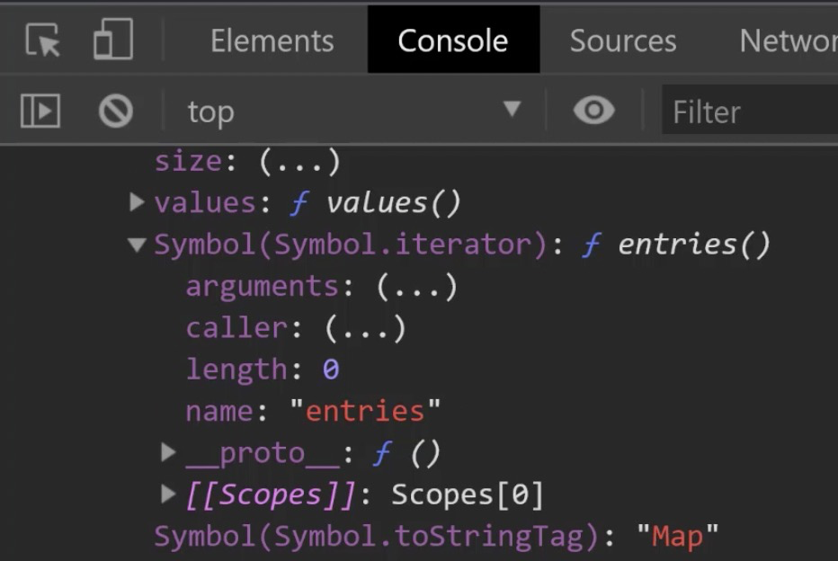


查看数组的iterator方法可以发现，里面有一个next的方法
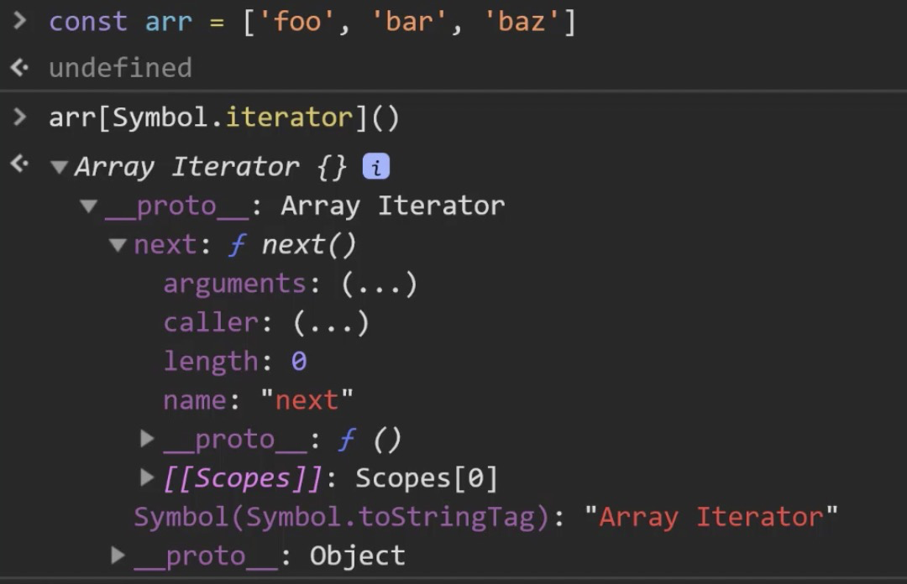

调用next方法可以发现，返回一个对象，和一个done属性
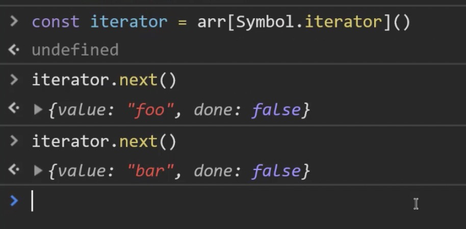

由此可以发现，所有可以被for...of迭代的，都会有一个iterator迭代的方法，这个方法会返回一个next的方法，next方法会返回该数组的值和done属性，当到最后一个元素的时候，value：undefined，done：true

- 实现迭代器接口(Iterator)

```
const obj = {
  [Symbol.iterator]:function (){
    //迭代接口iterable
    return {
      next:function(){
      //itertor
        return {
          //迭代结果接口iterationResult
          value:'zce'
          done:true
        }
      }
    }
  }
}
for(let item of obj){
  console.log('循环体')
}
//显示可以迭代了，但并不会输出，因为done为true，执行即结束
```
- 完整的迭代器接口

```
const obj = {
  store = ['foo','bar','baz']
  [Symbol.iterator]:function (){
    let index = 0
    const self = this
    return {
      next:function(){
        const result =  {
          value:self.store[index],
          done:index>=self.store.length
        }
        index++
        return result
      }
    }
  }
}
for(let item of obj){
  console.log('循环体',item)//这就可以正常被遍历了
}
```
#### 23.设计模式中的迭代器模式
#### 24.生成器Generator

- 避免异步函数嵌套产生的问题，提供更好的异步编程解决方案 
  
```
function *foo(){
  console.log('zce')
  return 100
}
const reuslt = foo()
console.log(result)//Object [Generator] {}

console.log(result.next())
//zce
//{value:100,done:true}
//说明到了这个时候，函数才开始执行，看返回的结构说明也实现了迭代器的接口

function *foo(){
  console.log('1111')
  yield 100
  console.log('2222')
  yield 200
  console.log('3333')
  yield 300
}

const generator = foo()
console.log(generator.next())
//1111
//{value:100,done:false}
```
- 生成器函数，会返回一个生成器对象。
- 调用这个函数的next方法，函数才开始执行。
- 执行的过程中， 一旦遇到yield，就会暂停，其中yield后面跟的是返回值。
- 再次执行next()的时候，就会重暂停的位置，继续开始执行
- 直到这个函数执行完毕，这时候done就变为true

- 生成器的应用

//发号器
```
function *createIdMaker(){
  let id = 1
  while(true){
    yield id++
  }
}
const idMaker = createIdMaker()

console.log(idMaker.next().value)//1
console.log(idMaker.next().value)//2
console.log(idMaker.next().value)//3
```
//生成器函数
```
const todos = {
  life:['吃饭','睡觉','打豆豆'],
  learn:['语文','数学','外语'],
  work:['喝茶'],
  [Symbol.iterator]:function *(){
    const all = [...this.life,...this.learn,...this.work]
    for(item of all){
      yield item
    }
  }
}

for(const item of todos){
  console.log(item)//'吃饭','睡觉','打豆豆','语文','数学','外语','喝茶'
}
```
#### 25.`ES Modules`
#### 26.`ES 2016`
- 多了一个includes方法
```
const arr = [1,2,3]
arr.indexOf(1)//0
//其中indexOf判断NaN，但includes可以
arr.includes(1)//true
//includes返回布尔值
```
- 多了一个指数运算符
```
Math.pow(2,10)
2 ** 10
```
#### 26.`ES 2017`
- `Object.values`

返回对象所有的值，所组成的数组

- `Object.entries`

以数组的形式返回对象中的所有键值对

```
const obj = {
  foo:'value1',
  bar:'value2'
}
console.log(Object.entries(obj))
//[['foo','value1'],['bar','value2']]
for(const [key,value] of Object.entries(obj)){
  console.log(key,value)
}
new Map(Object.entries(obj))
```
- `Object.getOwnPropertyDescriptors`

出现的问题

```
const p1 = {
  firstName:'Let',
  lastName:'Wang',
  get fullName(){
    return this.firstName +' '+this.lastName
  }
}
const p2 = Obejct.assign({},p1)
p2.firstName = 'zce'
console.log(p2)
//Lei Wang
```
用Object.getOwnPropertyDescriptors去解决
```
const descriptors = Object.getOwnPropertyDescriptors(p1)
const p2 = Object.defineProperties({},descriptors)
p2.firstName = 'zce'
console.log(p2.fullName)//'zce wang'
```
- `String.prototyoe.padStart`/`String.prototype.padEnd`

设置指定的字符串，从开始或末尾添加到指定的长度
```
const books = {
  html:5,
  css:16,
  javascripy:128
}

for(const [name,count] of books){
  console.log(`${name.padEnd(16,'-')}|${count.toString().padStart(3,'0')}`)
}
//html------------|005
//css-------------|016
//javascript------|128
```
- 可以添加尾逗号

函数参数的最后一位可以添加尾逗号

- Async/Await

### 二 TypeScript
- 强类型与弱类型
- 静态类型与动态类型
- JavaScript自由系统的问题
- Flow静态类型检查方案
- TypeScript语言规范和基本应用

#### 1.类型系统
- 强类型与弱类型(类型安全)
  - **语言的语法层面**限制函数的实参类型必须与形参类型相同
  - 强类型中不允许任何的隐式转换，弱类型可以
  - JavaScript中所有的类型错误，都是在**代码运行**层面，手动抛出的 
  - 变量的类型随时改变的特点，不是强弱类型的区别
- 静态类型与动态类型(类型检查)
  - (静态类型)一个变量在声明的时候类型就是确定的，且声明过后，它的类型就不允许被修改了
  - (动态类型)运行阶段才能够明确变量的类型，而且变量的类型也可以随时变化。简单来说，变量是没有类型的，但变量的值是有类型的
#### 2.JavaScripy类型系统特征
- 弱类型且动态类型
- 缺失了类型系统的可靠性
- JavaScript是一门脚本语言，即不需要编译就能在环境运行，没有编译的环节。
- 静态类型语言要在编译环节进行类型检查，JavaScript没有编译环节

#### 3.弱类型的问题

1. 只有运行到代码的这一行，才能发现错误,而不是一开始就检查

```
const obj = {}
obj.foo()
```
2. 最典型的类型问题

```
 function sum(a,b){
     return a+b 
 }
 sum(100,200)//300
 sum(100,'100')//'100100'
```
3. 为对象添加属性

对象的属性名只能是字符串或者Symbol，但如果传入的其他值，会自动转换成字符串

强类型语言可以在编码的时候就能解决大部分问题，而不是运行的时候再去debug
#### 4.强类型的优势
1. 错误暴露的更早，编码阶段就能暴露出类型的异常，而不是在运行的时候暴露问题
2. 代码更加智能，编码更加准确
3. 重构更加可靠(某些具有破坏力的改动)
4. 减少在代码层面一些不必要的类型判断(typeof)

#### 5.Flow概述
JavaScript的静态类型检查器
```
//添加类型的注解，通过flow来检查类型的异常，从而实现开发阶段就能发现类型的异常
function square(n:number){
    return n*n
}
function sum(a:number,b:number){
    return a+b
}
//后期可以用babel去除类型注解
```
#### 6.flow的使用
1. npm包flow-bin
2. 文件添加注释//@flow
```
//@flow
function sum(a:number,b:number){
    return a+b
}
```
3. 关闭vscode的JavaScript校验（setting->Javascript validate)
4. flow init初始化flow的配置文件，之后就会出现.flowconfig
5. 执行flow命令，`yarn flow`这个时候flow就会启动，去检查文件中的类型错误
6. yarn flow stop去停止这个服务

#### 7.flow的编译移除
1. yarn flow-remove-types --dev
2. yarn flow-remove-types . -d dist

.需要转换的文件目录，dist最后输出的文件目录
- 利用babel去移除类型注解
1. yarn add @babel/core @babel/cli @babel/preset-flow --dev
2.  创建.babelrc文件

```
{
    "presets":["babel/preset-flow"]
}
```
3. 执行yarn babel src -d dist

将src的文件转换到dist目录中
#### 8.Flow开发工具插件
vscode插件：flow language support

可以在编译器中，直接显示出代码的异常
#### 9.类型推断
```
/**
*类型推断
*@flow
*/
function square(n){
    return n*n
}
square('100')//会推断报错
```
#### 10.类型注解
- 函数参数

```
function square(n:number){
    return n*n
}
```
- 变量声明

```
let num:number = 100
```
- 函数的返回值

```
function foo():number{
    return 'string'
}
//如果没有返回值，也会报错，因为默认返回undefined，所以可以标注`void`
```
#### 11.Flow类型
- 原始类型
```
/**
*类型推断
*@flow
*/
const a:string = 'string'
const b:number = Infinity //NaN //100
const c:boolean = false //true
const d:null = null
const e:void = undefined
const f:symbol = Symbol()
```
- 数组类型

```
const arr1:Array<number> = [1,2,3,'string']//string会报错，因为类型全是数组
const arr2:number[] = [1,23,3]//与以上方法等价
const arr3:[number,string] = [100,'str']
//只能是包含两位的数组，第一个为数字第二个为字符串
//一般这种数据结构称之为元组
```
- 对象类型

```
const obj1:{foo:string,bar:number} = {foo:'string',bar:100}
//必须是两个属性，且属性类型固定
const obj2:{foo?:string,bar:number} = {bar:100}
//foo属性可有可无
const obj3:{[string]:string} = {}
//可以添加任意类型的键和值，但键必须是字符串类似，值必须是字符串类型
obj3.key1 = 'value'
obj3.key2 = 100//报错
```
- 函数类型

参数类型和返回值类型上面介绍过了

当输入的参数是函数的时候

```
function foo(callback:(string,number)=>void){
    //传入的函数有两个参数，一个字符串类型，一个数字类型
    //且返回值是undefined或者没有返回值
    callback('string',100)
}
foo(function(str,n){
    
})
```
- 特殊类型

   - 字面量类型
```
const a:'foo' = 'foo'
//那么a的值只能是'foo'，不能是其他的任何值
//这种情况一般作用在

const type:'success'|'warning'|'danger' = 'success'
//这样type只能是这个值的其中一个，其他的任何值都会报错

//其中这种｜的方法也可以用在其他的地方
const b:string|number = 'str'//100
//那么b是字符串或者数字都是可以的

//还可以用type操作符,相当于一个别名，那么就可以在多个地方重复使用了
type StringOrNumber  = string ｜ number
const c:StringOrNumber = 'str'//100

//maybe的类型
const d:?number = null//100
//正常的number类型是不能为空的，如果可以为空null或undefined，那么number前面得加一个？
```
- 任意类型(mixed和any)

```
//number|string|boolean|....
function passMixed(value:mixed){

}
passMixed(100)
passMixed(true)
passMixed("str")

function passAny(value:any){

}
passAny(100)
passAny(true)
passAny("str")
```
其中，any是弱类型，mixed是强类型
```
//any
function passAny(value:any){
    value.substr(1)//字符串方法
    //value*value，数字方法等等，在写的时候不会报错
}
//mixed
function passMixed(value:mixed){
    value.substr(1)//报错，如果没有明确类型，是不能用字符串的方法
    //value*value，报错，如果没有明确类型，是不能当数字来用，写的时候就会报错
}

//使用mixed不会报错的情况
function passMixed(value:mixed){
    if(typeof value === 'string'){
        value.substr(1)//使用typeof方法后就不会报错了
    }
     if(typeof value === 'number'){
        value*value//使用typeof方法后就不会报错了
    }
}
```
所以尽量不要用any类型
#### 12.Flow运行环境的类型

`const element:HTMLElement | null = document.getElementById('app')`
//可以go to defined 去看看定义，可以去看官方文档

#### 13.TypeScript
<svg xmlns="http://www.w3.org/2000/svg" xmlns:xlink="http://www.w3.org/1999/xlink" version="1.1" width="431px" viewBox="-0.5 -0.5 431 271" content="&lt;mxfile host=&quot;e14bd0c6-c26a-48a0-b544-895721de7a7c&quot; modified=&quot;2020-10-25T12:59:17.937Z&quot; agent=&quot;5.0 (Macintosh; Intel Mac OS X 10_15_6) AppleWebKit/537.36 (KHTML, like Gecko) Code/1.50.1 Chrome/83.0.4103.122 Electron/9.2.1 Safari/537.36&quot; etag=&quot;cbY3nmanaWgDMAjHIGs6&quot; version=&quot;13.6.5&quot;&gt;&lt;diagram id=&quot;6hGFLwfOUW9BJ-s0fimq&quot; name=&quot;Page-1&quot;&gt;&lt;mxGraphModel dx=&quot;677&quot; dy=&quot;680&quot; grid=&quot;1&quot; gridSize=&quot;10&quot; guides=&quot;1&quot; tooltips=&quot;1&quot; connect=&quot;1&quot; arrows=&quot;1&quot; fold=&quot;1&quot; page=&quot;1&quot; pageScale=&quot;1&quot; pageWidth=&quot;827&quot; pageHeight=&quot;1169&quot; math=&quot;0&quot; shadow=&quot;0&quot;&gt;&lt;root&gt;&lt;mxCell id=&quot;0&quot;/&gt;&lt;mxCell id=&quot;1&quot; parent=&quot;0&quot;/&gt;&lt;mxCell id=&quot;3&quot; value=&quot;&quot; style=&quot;ellipse;whiteSpace=wrap;html=1;labelPosition=center;verticalLabelPosition=top;align=center;verticalAlign=bottom;&quot; vertex=&quot;1&quot; parent=&quot;1&quot;&gt;&lt;mxGeometry x=&quot;270&quot; y=&quot;140&quot; width=&quot;430&quot; height=&quot;270&quot; as=&quot;geometry&quot;/&gt;&lt;/mxCell&gt;&lt;mxCell id=&quot;4&quot; value=&quot;&amp;lt;span style=&amp;quot;font-size: 22px&amp;quot;&amp;gt;TypeScript&amp;lt;/span&amp;gt;&quot; style=&quot;text;html=1;strokeColor=none;fillColor=none;align=center;verticalAlign=middle;whiteSpace=wrap;rounded=0;&quot; vertex=&quot;1&quot; parent=&quot;1&quot;&gt;&lt;mxGeometry x=&quot;430&quot; y=&quot;170&quot; width=&quot;120&quot; height=&quot;20&quot; as=&quot;geometry&quot;/&gt;&lt;/mxCell&gt;&lt;mxCell id=&quot;5&quot; value=&quot;&amp;lt;font style=&amp;quot;font-size: 21px&amp;quot;&amp;gt;JavaScript&amp;lt;/font&amp;gt;&quot; style=&quot;ellipse;whiteSpace=wrap;html=1;&quot; vertex=&quot;1&quot; parent=&quot;1&quot;&gt;&lt;mxGeometry x=&quot;340&quot; y=&quot;220&quot; width=&quot;120&quot; height=&quot;80&quot; as=&quot;geometry&quot;/&gt;&lt;/mxCell&gt;&lt;mxCell id=&quot;6&quot; value=&quot;&amp;lt;font style=&amp;quot;font-size: 21px&amp;quot;&amp;gt;类型系统&amp;lt;/font&amp;gt;&quot; style=&quot;ellipse;whiteSpace=wrap;html=1;&quot; vertex=&quot;1&quot; parent=&quot;1&quot;&gt;&lt;mxGeometry x=&quot;520&quot; y=&quot;220&quot; width=&quot;120&quot; height=&quot;80&quot; as=&quot;geometry&quot;/&gt;&lt;/mxCell&gt;&lt;mxCell id=&quot;7&quot; value=&quot;&amp;lt;font style=&amp;quot;font-size: 21px&amp;quot;&amp;gt;ES6+&amp;lt;/font&amp;gt;&quot; style=&quot;ellipse;whiteSpace=wrap;html=1;&quot; vertex=&quot;1&quot; parent=&quot;1&quot;&gt;&lt;mxGeometry x=&quot;430&quot; y=&quot;310&quot; width=&quot;120&quot; height=&quot;80&quot; as=&quot;geometry&quot;/&gt;&lt;/mxCell&gt;&lt;/root&gt;&lt;/mxGraphModel&gt;&lt;/diagram&gt;&lt;/mxfile&gt;" onclick="(function(svg){var src=window.event.target||window.event.srcElement;while (src!=null&amp;&amp;src.nodeName.toLowerCase()!='a'){src=src.parentNode;}if(src==null){if(svg.wnd!=null&amp;&amp;!svg.wnd.closed){svg.wnd.focus();}else{var r=function(evt){if(evt.data=='ready'&amp;&amp;evt.source==svg.wnd){svg.wnd.postMessage(decodeURIComponent(svg.getAttribute('content')),'*');window.removeEventListener('message',r);}};window.addEventListener('message',r);svg.wnd=window.open('https://viewer.diagrams.net/?client=1&amp;edit=_blank');}}})(this);" style="cursor:pointer;max-width:100%;max-height:271px;"><defs/><g><ellipse cx="215" cy="135" rx="215" ry="135" fill="#ffffff" stroke="#000000" pointer-events="all"/><rect x="160" y="30" width="120" height="20" fill="none" stroke="none" pointer-events="all"/><g transform="translate(-0.5 -0.5)"><switch><foreignObject style="overflow: visible; text-align: left;" pointer-events="none" width="100%" height="100%" requiredFeatures="http://www.w3.org/TR/SVG11/feature#Extensibility"><div xmlns="http://www.w3.org/1999/xhtml" style="display: flex; align-items: unsafe center; justify-content: unsafe center; width: 118px; height: 1px; padding-top: 40px; margin-left: 161px;"><div style="box-sizing: border-box; font-size: 0; text-align: center; "><div style="display: inline-block; font-size: 12px; font-family: Helvetica; color: #000000; line-height: 1.2; pointer-events: all; white-space: normal; word-wrap: normal; "><span style="font-size: 22px">TypeScript</span></div></div></div></foreignObject><text x="220" y="44" fill="#000000" font-family="Helvetica" font-size="12px" text-anchor="middle">TypeScript</text></switch></g><ellipse cx="130" cy="120" rx="60" ry="40" fill="#ffffff" stroke="#000000" pointer-events="all"/><g transform="translate(-0.5 -0.5)"><switch><foreignObject style="overflow: visible; text-align: left;" pointer-events="none" width="100%" height="100%" requiredFeatures="http://www.w3.org/TR/SVG11/feature#Extensibility"><div xmlns="http://www.w3.org/1999/xhtml" style="display: flex; align-items: unsafe center; justify-content: unsafe center; width: 118px; height: 1px; padding-top: 120px; margin-left: 71px;"><div style="box-sizing: border-box; font-size: 0; text-align: center; "><div style="display: inline-block; font-size: 12px; font-family: Helvetica; color: #000000; line-height: 1.2; pointer-events: all; white-space: normal; word-wrap: normal; "><font style="font-size: 21px">JavaScript</font></div></div></div></foreignObject><text x="130" y="124" fill="#000000" font-family="Helvetica" font-size="12px" text-anchor="middle">JavaScript</text></switch></g><ellipse cx="310" cy="120" rx="60" ry="40" fill="#ffffff" stroke="#000000" pointer-events="all"/><g transform="translate(-0.5 -0.5)"><switch><foreignObject style="overflow: visible; text-align: left;" pointer-events="none" width="100%" height="100%" requiredFeatures="http://www.w3.org/TR/SVG11/feature#Extensibility"><div xmlns="http://www.w3.org/1999/xhtml" style="display: flex; align-items: unsafe center; justify-content: unsafe center; width: 118px; height: 1px; padding-top: 120px; margin-left: 251px;"><div style="box-sizing: border-box; font-size: 0; text-align: center; "><div style="display: inline-block; font-size: 12px; font-family: Helvetica; color: #000000; line-height: 1.2; pointer-events: all; white-space: normal; word-wrap: normal; "><font style="font-size: 21px">类型系统</font></div></div></div></foreignObject><text x="310" y="124" fill="#000000" font-family="Helvetica" font-size="12px" text-anchor="middle">类型系统</text></switch></g><ellipse cx="220" cy="210" rx="60" ry="40" fill="#ffffff" stroke="#000000" pointer-events="all"/><g transform="translate(-0.5 -0.5)"><switch><foreignObject style="overflow: visible; text-align: left;" pointer-events="none" width="100%" height="100%" requiredFeatures="http://www.w3.org/TR/SVG11/feature#Extensibility"><div xmlns="http://www.w3.org/1999/xhtml" style="display: flex; align-items: unsafe center; justify-content: unsafe center; width: 118px; height: 1px; padding-top: 210px; margin-left: 161px;"><div style="box-sizing: border-box; font-size: 0; text-align: center; "><div style="display: inline-block; font-size: 12px; font-family: Helvetica; color: #000000; line-height: 1.2; pointer-events: all; white-space: normal; word-wrap: normal; "><font style="font-size: 21px">ES6+</font></div></div></div></foreignObject><text x="220" y="214" fill="#000000" font-family="Helvetica" font-size="12px" text-anchor="middle">ES6+</text></switch></g></g><switch><g requiredFeatures="http://www.w3.org/TR/SVG11/feature#Extensibility"/><a transform="translate(0,-5)" xlink:href="https://desk.draw.io/support/solutions/articles/16000042487" target="_blank"><text text-anchor="middle" font-size="10px" x="50%" y="100%">Viewer does not support full SVG 1.1</text></a></switch></svg>

- TypeScript = Javascript+类型系统+新特性的支持ES6+
- 最终会被编译成JavaScript
- 任何一种JavaScript运行环境都支持
- 功能更强大，生态更健全，完善
- 前端领域的第二语言
- 语言本身多了很多概念
- 项目初期，TypeScript会增加一些成本

#### 14.Typescript的使用

1. yarn init -yes//初始化npm模块包
2. yarn add TypeScript --dev

    //在node_modules文件夹下的.bin目录，会多一个tsc的命令
3. 新建一个以ts结尾的文件，例如start.ts
   ```
   const hello = name=>{
       console.log(`hello,${name}`)
   }
   hello("typescript")
   ```
4. yarn tsc start.ts
    //执行完后，会在该目录下出现一个同名的js文件，但所有es6+的方法，会转换成es3的方法
5. 也可以用类型注解
    ```
   const hello = (name:string)=>{
       console.log(`hello,${name}`)
   }
   hello("typescript")
   ```
#### 15.TypeScript的配置文件
- tsc命令不仅可以编译一个文件，还可以编译整个项目，整个工程
1. 生成配置文件

    `yarn tsc --init`

    然后文件夹就会多出一个tsconfig.json的文件

2. 配置文件,如下图所示，绝大多数都被注释掉了
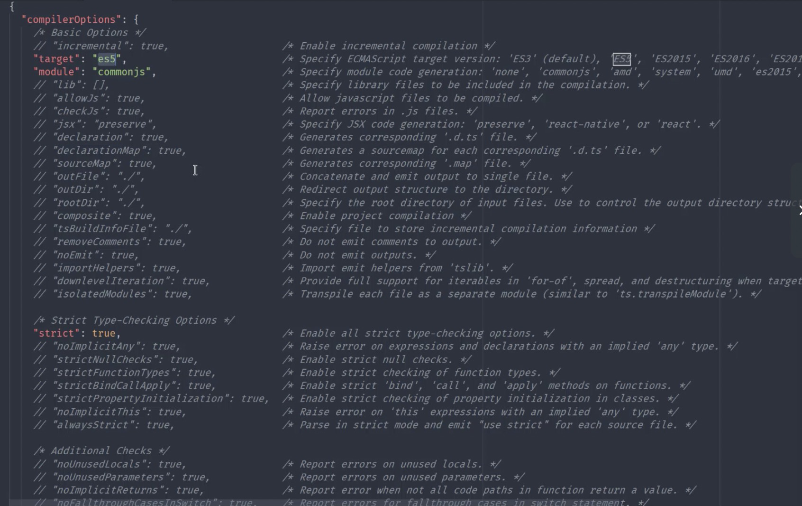
- 其中target是指需要转换成的版本，比如这里是转换成es5
- module表示输出的代码会通过什么样的方式进行模块化
- outDir表示编译结果输出到的文件夹
- rootDir表示源代码，typescript代码所在的文件夹
- sourceMap开启源代码的映射
- strict开启所有的严格检查，在严格检查模式中，所有类型需要明确写出类型，不能隐式推断类型
- 当直接用tsc去编译某个文件的时候，配置文件不会生效，只有编译整个文件的时候，配置文件才会生效
- yarn tsc//根据配置文件进行编译
#### 16.TypeScript数据类型
- `const a:string = 'stt'`
- `const b:number = 100//NaN Infinity`
- `const c:boolean = true`
但和flow不一样的是，typescript这三种数据类型是允许为null或undefined的

严格模式除外

- 配置文件里有一个strickNullChecks，只检查是否为空null

- `const e:void = null //undefined`
其中严格模式下只能是undefined
- `const f:null = null`
- `const g:undefined = undefined`
- `const h:symbol = Symbol()`
可能会报错，在配置文件中把target改成es2015即可

可以输入Array，然后转到定义，查看当前target版本所有的类型定义

当使用es5的时候，symbol和promise都会报错，因为都不存在。

可以改变target，或者lib选项。lib:["es2015"],添加完这个后会发现，console发生报错了，是因为lib中只写了es2015，导致所有的标准库都被es2015覆盖了，console是bom里面的方法，所以还得添加其他的标准库，在typescript中，dom和bom都会归结为一个，所以现在的lib:["es2015,BOM"]即可
- 标准库，内置对象所引用的文件
#### 17.中文的错误消息
yarn tsc --locale zh-CN

也可以在vscode中配置，typescript locale中设置为zh-CN
#### 18.作用域
- 不同文件的变量声明如果一样的话，tsc编译的时候就会报错
- 可以用函数作用域包裹，或者export导出，模块作用域包裹
#### 19.Object 类型
- 这里的Object Types泛指所有的原始类型，对象，数组，函数等
`const obj:Object = function(){}//{}//[]`
这里接受数组，对象，函数，都是可以的，如何任意接受一个原始数值，都会发生错误
- 设定一个真正的对象类型
`const obj2:{foo:number,bar:string} = {foo:123,bar:'str'}`
这里只能添加设定好的类型，不能多也不能少
#### 20.数组类型
`const arr1:Array<number>=[1,2,3]`
这就定义了一个纯数字的数组

等价于`const arr2:number[] = [1,2,3]`
#### 21.元组类型(Tupe Types)
- 元组是一种特殊的类型，指明确数组数量和明确每一个元素类型的数组
```
const tuple:[number,string] = [10.'str']
//数组下标提取
const age = tuple[0]
//解构赋值
const [age,name] = tuple
//一般用来一个函数多个返回值，比如useState，Object.entres()等
```
#### 22.枚举类型
- enum
```
enum PostStatus = {
    Draft = 1,
    Unplished = 0,
    Published = 2
}

```
- 注意枚举类型中使用等号
- 获取成员属性和对象的方式一样，枚举的名称点成名名称
```
enum PostStatus = {
    Draft,
    Unplished ,
    Published
}
```
- 枚举中的值可以不用固定，那么默认就是从0开始累加
- 如果在第一个设定了一个初始值，那么后面的就会从这个开始累加
- 不仅可以是数字枚举，也可以是字符串枚举，但字符串枚举不能累加，所以必须设定一个初始值
- 枚举类型会影响到编译时候的结果
```
//tsc 一个包含枚举类型的文件
//打开编译后的js发现，枚举类型做了一个双向绑定，它既可以通过建取获取值，也可以通过值去获取键
//这样做的目的是，可以动态的根据枚举的值，比如0，1，2，去获取枚举的名称，所以可以用Poststatus[0]//Draft访问名称

```
- 常量枚举
```
const enum PostStatus = {
    Draft,
    Unplished ,
    Published
}
//这样做的话，tsc编译后的文件，就不会出现枚举，也不会出现双向绑定，会用固定的数值替换掉，枚举的名称会以注释的方式标注
```
#### 23.函数类型
- 函数的类型限制无外乎就是输入输出的限制
- 输入，参数。输出。返回值
- JavaScript中有两种生成函数的方式，函数声明，函数表达式
- 函数声明
```
functon fun1(a:number,b:number):string{
    return 'str'
}
//函数参数设置成number，返回值设置成str
fun1(100,200)
//调用的时候只能传入固定类型的值，形参和实参数量完全一致
//可选参数，参数名称后面添加一个问号,这样就可传，也可以不传了
functon fun2(a:number,b?:number):string{
    return 'str'
}
//或者用es6的添加参数默认值的方式，这样参数传不传也都是可以的了
functon fun3(a:number,b:number=10):string{
    return 'str'
}
//但注意，可选参数和默认参数都只能出现在参数的最后一项，因为是按照位置来传递的
//接受任意个数的参数，可以用es6的rest操作符
functon fun4(a:number,...rest:number[]):string{
    return 'str'
}
```
- 函数表达式
```
const fun5 = function(a:number,b:number):string{
    return 'fun5'
}
//一般typescript都能根据函数表达式，推断出接受变量的类型
//但如果是把一个函数当作参数传递，比如回调函数。那么这个时候，就必须约束这个参数的类型
//这个时候就能使用箭头函数的形式去约束
const fun6:(a:number,b:number):string = function(a:number,b:number):string{
    return 'fun5'
}
//定义接口的时候会用到
```
#### 24.任意类型
```
function stringfy(value:any){
    return JSON.stringfy(value)
}
//其中any是动态类型，可以在中途接受任意类型的值
//且typescript不会对any做类型检查，所以foo.bar()在编译的时候不会报错
let foo:any = 'str'
foo = 100
//所以any是一个不安全的类型，不建议使用
```
#### 25.隐式类型推断
```
let age = 100//这时候typescript就会自动推断它为数字类型
age = 'str'//就会报错
//如果typescript无法推断一个变量的类型，就会推断成any
let foo//没有对变量进行赋值，导致typescript无法判断
//尽量给每个变量添加类型，更直观的去阅读代码
```
#### 26.类型断言
```
const nums = [1,2,3,4,5]
const res = nums.find(i=>i>0)
const squre = res * res//报错，因为typescript判断res是number或者undefined类型，这时候就得告诉编译器，res就是只为number类型
```
- 有两种方式
    - as的方式`const num1 = res as number`
    - `const num2 = <number>res`//在jsx下可能会与标签冲突，所以jsx下不能用

类型断言并不是类型转换

#### 27.接口(interface)
- 用来约定对象的结构，一个对象有什么成员，成员类型等
- 使用一个接口，就必须遵循这个接口全部的约定
- interface关键词，可以加分号或者逗号，也可以不加
```
interface Post{
    title:string,
    content:string
}

funtion printPost(post:Post){
    //这样就要求传入的参数必须要有title和content两个成员了
    console.log(post.title)
    console.log(post.content)
    //那么这个对象就必须要有一个title和content属性
}
printPost({title:'str',content:'str'})
tsc 编译之后，js代码中并没关于接口的代码，说明只是ts的一个约束而已

```
- 可选成员,成员名字后面加一个问号
```
interface Post{
    title:string,
    content?:string
}
```
- 只读成员,关键字readonly
```
interface Post{
    title:string,
    content?:string
    readonly summary:string
}
const hello:Post{
    title:'str'
    content:'str'
    summary:'str'
}
hello.summary = 'string'//报错，因为是只读的
```
- 动态成员
```
interface Cache{
    [prop:string]:string
}
//约束成员名称和值的类型
const cache:Cache = {}
cache.foo = 'str'
cache.bar = 'str'
//这样就可以动态的添加值了
```
#### 28.类的基本使用
- 描述一类具体事物的抽象特征
- 可能还有细分的子类，子类拥有父类的所有特征，还拥有一些额外的特征
- 不能直接使用类，只能使用类的具体事务
```
class Person{
    name:string//可以用等号设置初始值，也可以在构造函数中赋值比如this.name = name
    age:number = 10//既不设置初始值，也不赋值就会报错
    constructor(name:string,age:number){
        //类型注解
        this.name = name//直接使用会报错，需要在类中先定义一个name
    }
}
//方法
sayHi(msg:string):void{
    console.log(this.name,msg)
}
//类的属性在使用之前必须声明
```
#### 29.类的访问修饰符
- private 私有属性，只能在类的内部去访问
```
class Person{
    name:stringthis.name 
    private age:number 
    constructor(name:string,age:number){
        this.name = name
        this.age = age
    }
}
//方法
sayHi(msg:string):void{
    console.log(this.name,msg)
    console.log(this.age)//只能在内部访问
}
const tom = new Person('tom',18)
tom.name//tom
tom.age//报错
```
- public 公有成员(默认)所以加不加都一样，不过还是建议加上
- protected 受保护的成员
```
class Person{
    name:stringthis.name 
    private age:number 
    protected gender:boolean
    constructor(name:string,age:number){
        this.name = name
        this.age = age
        this.gender = true
    }
}
//方法
sayHi(msg:string):void{
    console.log(this.name,msg)
    console.log(this.age)//只能在内部访问
    console.log(this.gender)//只能在内部访问
}
const tom = new Person('tom',18)
tom.name//tom
tom.age//报错，私有的
tom.gender//报错，受保护的
//与private的不同
class Student extends Person{
    constructor(name:string,age:number){
        super(name,age)
       console.log(this.gender)//可以访问到父类受保护的成员
    }
}
```
- constructor的类型默认是public，如果设置成private，这个类就不能被实例化和继承，但可以添加一个静态方法，用静态方法去调用构造函数。
- 只读属性readonly
```
class Person{
    name:stringthis.name 
    private age:number 
    protected readonly gender:boolean
    constructor(name:string,age:number){
        this.name = name
        this.age = age
        this.gender = true
    }
}
```
如有属性设置了类型，那么只读就跟在后面，且初始化要么在构造函数内，要么直接初始化，不能两个都有，设置了之后，就不能改了
#### 30.类与接口
```
class Person{
    eat(){

    }
}
class Animal{
    eat(){

    }
}

```
定义了两个类，一个人和一个动物，他们都有eat方法，可以说实现了一个共同的接口，但人和动物是不一样的，所以不能用一个共同的父类
```
interface Eat{
    eat(food:string):void
}
interface Run{
    run(distance:number):void
}
class Person implements Eat{
    eat(){

    }
}
//接口尽量写的比较单独，然后组合，而不是很固定
class Animal implements,Eat,Run{
    eat(){

    }
}
```
#### 31.抽象类(abstract)
```
abstract class Animal{
    eat(food:string):void{
        console.log("吃")
    }
    //抽象类中的抽象方法,抽象方法也不用代码体，有这个方法的时候，子类必须要有这个方法
    abstract run(distance:number):void

}
```
abstract的类只能被继承，不能被new 创建实例
```
class Dog extend Animal{
   run(distance:number):void {

}
}
```
#### 32.泛型
声明函数的时候不去指定具体的类型，等到调用它的时候，再去传递一个具体的类型，就是为了极大程度的复用代码
- 创建一个数字类型的数组
```
function createNumberArray(length:number,value:number):number[] {
    return Array<number>(length).fill(value)
}
const res = createNumberArray(3,100)
//res => [100,100,100]
```
- 创建一个字符串类型的数组
```
function createStringArray(length:number,value:string):string[] {
    return Array<string>(length).fill(value)
}
const res = createStringArray(3,'str')
```
- 使用泛型，把数据类型当参数传递
```
//用T来当一个类型变量
function createArray<T>(length:number,value:T):T[] {
    return Array<T>(length).fill(value)
}
const res = createArray<string>(3,'str')
```
把创建时，不能明确的类型，当一个参数，到用到的时候再传递
#### 33.TypeScript的类型声明
一个成员(函数数组等)，在定义的时候，没有声明类型，在使用的时候，就可以为他们添加声明
```
import {camelCase} from 'lodash'//在ts中引入普通包的时候，ts会报错
//因为没有类型声明文件
//调用函数，但是在调用的时候看不到这个函数的类型是声明
camelCase("str")
//这时候就可以用declare
declare function cameCase(input:string):string//放在调用函数前面
//这时候就有类型声明了，这时候就有对应的类型限制了
```
其实ts社区已经提供了很多类型声明的文件了，将鼠标移到lodash的导入错误的文件上面，可以看到要安装一个类型声明的包@types/lodash，这是一个开发依赖--dev

这个模块中都是.d.ts的文件，就是类型声明文件

### 三 JS性能优化
- 内存管理
- 垃圾回收与常见的GC算法
- v8引擎的垃圾回收机制
- Performance工具
- 代码优化实例

## 一 Javascript内存管理(memory Management)
- 内存：由可读写单元组成，表示一片可操作的空间
- 管理：人为的去操作一片空间的申请，使用和释放
- 内存管理：开发者主动申请空间，使用空间，释放空间
- 管理流程：申请-使用-释放

```
//申请
//JavaScript引擎遇到变量定义的时候，会自动分配内存
let obj = {}
//使用
obj.name = "name"
//释放
obj = null
```
## 二 Javascript中的垃圾回收
垃圾回收就是找到垃圾，让JavaScript执行引擎进行空间的释放和回收

- JavaScript中的内存管理是自动的
- 对象不在被**引用**时是垃圾
- 对象不能**从根上**访问到时是垃圾

JavaScript中的**可达**对象
- 可以访问到的对象就是可达对象(引用，作用域链)
- 可达的标准是从根出发是否能够被找到
- JavaScript中的根就可以理解为是全局变量对象
**基本引用**：
```
let obj = {name:'xm'}
//obj可以从根上被找到，说明obj是可达的
let ali = obj
//说明obj又多来一次引用
obj = null
//到这一步的时候，xm有两个引用，一个是obj，一个是ali
//其中obj=null，那么obj到xm的引用就被断掉来
//但xm依然是可达对象，因为ali还在引用着xm
```
**第二种情况**：
```
function objGroup(obj1,obj2){
    obj1.next = obj2
    obj2.prev = obj1
    return {
        o1:obj1,
        o2:obj2
    }
}
let obj = objGroup({name:'obj1'},{name:'obj2'})
console.log(obj)
//{
//    o1:{name:'obj1',next:{name:'obj2',prev:[Circular]}}
//    o2:{name:'obj2',prev:{name:'obj1',next:[Circular]}}
//}
```
可达对象图示：
<svg xmlns="http://www.w3.org/2000/svg" xmlns:xlink="http://www.w3.org/1999/xlink" version="1.1" width="611px" viewBox="-0.5 -0.5 611 328" content="&lt;mxfile host=&quot;1e5ca5ed-9a55-49de-8271-56b15ef865fe&quot; modified=&quot;2020-11-14T11:45:15.775Z&quot; agent=&quot;5.0 (Macintosh; Intel Mac OS X 10_15_6) AppleWebKit/537.36 (KHTML, like Gecko) Code/1.51.0 Chrome/83.0.4103.122 Electron/9.3.3 Safari/537.36&quot; version=&quot;13.6.5&quot; etag=&quot;xGQvl4lg0V7osIYDLvKV&quot;&gt;&lt;diagram id=&quot;ltfxuGOZBNt81cIaz5kQ&quot; name=&quot;Page-1&quot;&gt;&lt;mxGraphModel dx=&quot;898&quot; dy=&quot;680&quot; grid=&quot;1&quot; gridSize=&quot;10&quot; guides=&quot;1&quot; tooltips=&quot;1&quot; connect=&quot;1&quot; arrows=&quot;1&quot; fold=&quot;1&quot; page=&quot;1&quot; pageScale=&quot;1&quot; pageWidth=&quot;827&quot; pageHeight=&quot;1169&quot; math=&quot;0&quot; shadow=&quot;0&quot;&gt;&lt;root&gt;&lt;mxCell id=&quot;0&quot;/&gt;&lt;mxCell id=&quot;1&quot; parent=&quot;0&quot;/&gt;&lt;mxCell id=&quot;2&quot; value=&quot;&quot; style=&quot;rounded=1;whiteSpace=wrap;html=1;&quot; vertex=&quot;1&quot; parent=&quot;1&quot;&gt;&lt;mxGeometry x=&quot;310&quot; y=&quot;140&quot; width=&quot;140&quot; height=&quot;60&quot; as=&quot;geometry&quot;/&gt;&lt;/mxCell&gt;&lt;mxCell id=&quot;8&quot; style=&quot;edgeStyle=orthogonalEdgeStyle;rounded=0;orthogonalLoop=1;jettySize=auto;html=1;&quot; edge=&quot;1&quot; parent=&quot;1&quot; source=&quot;3&quot; target=&quot;4&quot;&gt;&lt;mxGeometry relative=&quot;1&quot; as=&quot;geometry&quot;/&gt;&lt;/mxCell&gt;&lt;mxCell id=&quot;3&quot; value=&quot;&amp;lt;font style=&amp;quot;font-size: 19px&amp;quot;&amp;gt;全局变量&amp;lt;br&amp;gt;global variable&amp;lt;br&amp;gt;&amp;lt;/font&amp;gt;&quot; style=&quot;text;html=1;strokeColor=none;fillColor=none;align=center;verticalAlign=middle;whiteSpace=wrap;rounded=0;&quot; vertex=&quot;1&quot; parent=&quot;1&quot;&gt;&lt;mxGeometry x=&quot;315&quot; y=&quot;160&quot; width=&quot;130&quot; height=&quot;20&quot; as=&quot;geometry&quot;/&gt;&lt;/mxCell&gt;&lt;mxCell id=&quot;15&quot; style=&quot;edgeStyle=orthogonalEdgeStyle;rounded=0;orthogonalLoop=1;jettySize=auto;html=1;exitX=0;exitY=0.5;exitDx=0;exitDy=0;entryX=0.583;entryY=-0.017;entryDx=0;entryDy=0;entryPerimeter=0;&quot; edge=&quot;1&quot; parent=&quot;1&quot; source=&quot;4&quot; target=&quot;11&quot;&gt;&lt;mxGeometry relative=&quot;1&quot; as=&quot;geometry&quot;&gt;&lt;mxPoint x=&quot;140&quot; y=&quot;390&quot; as=&quot;targetPoint&quot;/&gt;&lt;Array as=&quot;points&quot;&gt;&lt;mxPoint x=&quot;140&quot; y=&quot;325&quot;/&gt;&lt;/Array&gt;&lt;/mxGeometry&gt;&lt;/mxCell&gt;&lt;mxCell id=&quot;17&quot; style=&quot;edgeStyle=orthogonalEdgeStyle;rounded=0;orthogonalLoop=1;jettySize=auto;html=1;entryX=0.5;entryY=0;entryDx=0;entryDy=0;&quot; edge=&quot;1&quot; parent=&quot;1&quot; source=&quot;4&quot; target=&quot;13&quot;&gt;&lt;mxGeometry relative=&quot;1&quot; as=&quot;geometry&quot;&gt;&lt;mxPoint x=&quot;620&quot; y=&quot;325&quot; as=&quot;targetPoint&quot;/&gt;&lt;/mxGeometry&gt;&lt;/mxCell&gt;&lt;mxCell id=&quot;4&quot; value=&quot;&quot; style=&quot;rounded=0;whiteSpace=wrap;html=1;&quot; vertex=&quot;1&quot; parent=&quot;1&quot;&gt;&lt;mxGeometry x=&quot;310&quot; y=&quot;280&quot; width=&quot;140&quot; height=&quot;90&quot; as=&quot;geometry&quot;/&gt;&lt;/mxCell&gt;&lt;mxCell id=&quot;9&quot; value=&quot;&amp;lt;font style=&amp;quot;font-size: 21px&amp;quot;&amp;gt;obj&amp;lt;/font&amp;gt;&quot; style=&quot;text;html=1;strokeColor=none;fillColor=none;align=center;verticalAlign=middle;whiteSpace=wrap;rounded=0;&quot; vertex=&quot;1&quot; parent=&quot;1&quot;&gt;&lt;mxGeometry x=&quot;380&quot; y=&quot;220&quot; width=&quot;40&quot; height=&quot;20&quot; as=&quot;geometry&quot;/&gt;&lt;/mxCell&gt;&lt;mxCell id=&quot;10&quot; value=&quot;&amp;lt;font style=&amp;quot;font-size: 21px&amp;quot;&amp;gt;Object&amp;lt;br&amp;gt;{o1:...}&amp;lt;br&amp;gt;{o2:...}&amp;lt;/font&amp;gt;&quot; style=&quot;text;html=1;strokeColor=none;fillColor=none;align=center;verticalAlign=middle;whiteSpace=wrap;rounded=0;&quot; vertex=&quot;1&quot; parent=&quot;1&quot;&gt;&lt;mxGeometry x=&quot;330&quot; y=&quot;300&quot; width=&quot;110&quot; height=&quot;50&quot; as=&quot;geometry&quot;/&gt;&lt;/mxCell&gt;&lt;mxCell id=&quot;20&quot; style=&quot;edgeStyle=orthogonalEdgeStyle;rounded=0;orthogonalLoop=1;jettySize=auto;html=1;&quot; edge=&quot;1&quot; parent=&quot;1&quot; source=&quot;11&quot;&gt;&lt;mxGeometry relative=&quot;1&quot; as=&quot;geometry&quot;&gt;&lt;mxPoint x=&quot;500&quot; y=&quot;430&quot; as=&quot;targetPoint&quot;/&gt;&lt;/mxGeometry&gt;&lt;/mxCell&gt;&lt;mxCell id=&quot;11&quot; value=&quot;&quot; style=&quot;rounded=0;whiteSpace=wrap;html=1;&quot; vertex=&quot;1&quot; parent=&quot;1&quot;&gt;&lt;mxGeometry x=&quot;70&quot; y=&quot;400&quot; width=&quot;130&quot; height=&quot;60&quot; as=&quot;geometry&quot;/&gt;&lt;/mxCell&gt;&lt;mxCell id=&quot;12&quot; value=&quot;&amp;lt;font style=&amp;quot;font-size: 21px&amp;quot;&amp;gt;Object&amp;lt;br&amp;gt;{name:obj1}&amp;lt;/font&amp;gt;&quot; style=&quot;text;html=1;strokeColor=none;fillColor=none;align=center;verticalAlign=middle;whiteSpace=wrap;rounded=0;&quot; vertex=&quot;1&quot; parent=&quot;1&quot;&gt;&lt;mxGeometry x=&quot;80&quot; y=&quot;405&quot; width=&quot;100&quot; height=&quot;50&quot; as=&quot;geometry&quot;/&gt;&lt;/mxCell&gt;&lt;mxCell id=&quot;21&quot; style=&quot;edgeStyle=orthogonalEdgeStyle;rounded=0;orthogonalLoop=1;jettySize=auto;html=1;&quot; edge=&quot;1&quot; parent=&quot;1&quot; source=&quot;13&quot;&gt;&lt;mxGeometry relative=&quot;1&quot; as=&quot;geometry&quot;&gt;&lt;mxPoint x=&quot;220&quot; y=&quot;435&quot; as=&quot;targetPoint&quot;/&gt;&lt;/mxGeometry&gt;&lt;/mxCell&gt;&lt;mxCell id=&quot;13&quot; value=&quot;&quot; style=&quot;rounded=0;whiteSpace=wrap;html=1;&quot; vertex=&quot;1&quot; parent=&quot;1&quot;&gt;&lt;mxGeometry x=&quot;560&quot; y=&quot;405&quot; width=&quot;120&quot; height=&quot;60&quot; as=&quot;geometry&quot;/&gt;&lt;/mxCell&gt;&lt;mxCell id=&quot;14&quot; value=&quot;&amp;lt;font style=&amp;quot;font-size: 21px&amp;quot;&amp;gt;Object&amp;lt;br&amp;gt;{name:obj2}&amp;lt;/font&amp;gt;&quot; style=&quot;text;html=1;strokeColor=none;fillColor=none;align=center;verticalAlign=middle;whiteSpace=wrap;rounded=0;&quot; vertex=&quot;1&quot; parent=&quot;1&quot;&gt;&lt;mxGeometry x=&quot;570&quot; y=&quot;410&quot; width=&quot;100&quot; height=&quot;50&quot; as=&quot;geometry&quot;/&gt;&lt;/mxCell&gt;&lt;mxCell id=&quot;18&quot; value=&quot;&amp;lt;font style=&amp;quot;font-size: 21px&amp;quot;&amp;gt;O1&amp;lt;/font&amp;gt;&quot; style=&quot;text;html=1;strokeColor=none;fillColor=none;align=center;verticalAlign=middle;whiteSpace=wrap;rounded=0;&quot; vertex=&quot;1&quot; parent=&quot;1&quot;&gt;&lt;mxGeometry x=&quot;100&quot; y=&quot;340&quot; width=&quot;40&quot; height=&quot;20&quot; as=&quot;geometry&quot;/&gt;&lt;/mxCell&gt;&lt;mxCell id=&quot;19&quot; value=&quot;&amp;lt;font style=&amp;quot;font-size: 21px&amp;quot;&amp;gt;O2&amp;lt;/font&amp;gt;&quot; style=&quot;text;html=1;strokeColor=none;fillColor=none;align=center;verticalAlign=middle;whiteSpace=wrap;rounded=0;&quot; vertex=&quot;1&quot; parent=&quot;1&quot;&gt;&lt;mxGeometry x=&quot;620&quot; y=&quot;330&quot; width=&quot;40&quot; height=&quot;20&quot; as=&quot;geometry&quot;/&gt;&lt;/mxCell&gt;&lt;mxCell id=&quot;22&quot; value=&quot;&amp;lt;font style=&amp;quot;font-size: 21px&amp;quot;&amp;gt;Next&amp;lt;/font&amp;gt;&quot; style=&quot;text;html=1;strokeColor=none;fillColor=none;align=center;verticalAlign=middle;whiteSpace=wrap;rounded=0;&quot; vertex=&quot;1&quot; parent=&quot;1&quot;&gt;&lt;mxGeometry x=&quot;260&quot; y=&quot;400&quot; width=&quot;40&quot; height=&quot;20&quot; as=&quot;geometry&quot;/&gt;&lt;/mxCell&gt;&lt;mxCell id=&quot;23&quot; value=&quot;&amp;lt;font style=&amp;quot;font-size: 21px&amp;quot;&amp;gt;Prev&amp;lt;/font&amp;gt;&quot; style=&quot;text;html=1;strokeColor=none;fillColor=none;align=center;verticalAlign=middle;whiteSpace=wrap;rounded=0;&quot; vertex=&quot;1&quot; parent=&quot;1&quot;&gt;&lt;mxGeometry x=&quot;420&quot; y=&quot;445&quot; width=&quot;40&quot; height=&quot;20&quot; as=&quot;geometry&quot;/&gt;&lt;/mxCell&gt;&lt;/root&gt;&lt;/mxGraphModel&gt;&lt;/diagram&gt;&lt;/mxfile&gt;" onclick="(function(svg){var src=window.event.target||window.event.srcElement;while (src!=null&amp;&amp;src.nodeName.toLowerCase()!='a'){src=src.parentNode;}if(src==null){if(svg.wnd!=null&amp;&amp;!svg.wnd.closed){svg.wnd.focus();}else{var r=function(evt){if(evt.data=='ready'&amp;&amp;evt.source==svg.wnd){svg.wnd.postMessage(decodeURIComponent(svg.getAttribute('content')),'*');window.removeEventListener('message',r);}};window.addEventListener('message',r);svg.wnd=window.open('https://viewer.diagrams.net/?client=1&amp;edit=_blank');}}})(this);" style="cursor:pointer;max-width:100%;max-height:328px;"><defs/><g><rect x="240" y="0" width="140" height="60" rx="9" ry="9" fill="#ffffff" stroke="#000000" pointer-events="all"/><path d="M 310 40 L 310 133.63" fill="none" stroke="#000000" stroke-miterlimit="10" pointer-events="stroke"/><path d="M 310 138.88 L 306.5 131.88 L 310 133.63 L 313.5 131.88 Z" fill="#000000" stroke="#000000" stroke-miterlimit="10" pointer-events="all"/><rect x="245" y="20" width="130" height="20" fill="none" stroke="none" pointer-events="all"/><g transform="translate(-0.5 -0.5)"><switch><foreignObject style="overflow: visible; text-align: left;" pointer-events="none" width="100%" height="100%" requiredFeatures="http://www.w3.org/TR/SVG11/feature#Extensibility"><div xmlns="http://www.w3.org/1999/xhtml" style="display: flex; align-items: unsafe center; justify-content: unsafe center; width: 128px; height: 1px; padding-top: 30px; margin-left: 246px;"><div style="box-sizing: border-box; font-size: 0; text-align: center; "><div style="display: inline-block; font-size: 12px; font-family: Helvetica; color: #000000; line-height: 1.2; pointer-events: all; white-space: normal; word-wrap: normal; "><font style="font-size: 19px">全局变量<br />global variable<br /></font></div></div></div></foreignObject><text x="310" y="34" fill="#000000" font-family="Helvetica" font-size="12px" text-anchor="middle">全局变量global variable...</text></switch></g><path d="M 240 185 L 70 185 L 70 259 L 69.42 259" fill="none" stroke="#000000" stroke-miterlimit="10" pointer-events="stroke"/><path d="M 74.67 258.98 L 67.68 262.51 L 69.42 259 L 67.66 255.51 Z" fill="#000000" stroke="#000000" stroke-miterlimit="10" pointer-events="all"/><path d="M 380 185 L 550 185 L 550 258.63" fill="none" stroke="#000000" stroke-miterlimit="10" pointer-events="stroke"/><path d="M 550 263.88 L 546.5 256.88 L 550 258.63 L 553.5 256.88 Z" fill="#000000" stroke="#000000" stroke-miterlimit="10" pointer-events="all"/><rect x="240" y="140" width="140" height="90" fill="#ffffff" stroke="#000000" pointer-events="all"/><rect x="310" y="80" width="40" height="20" fill="none" stroke="none" pointer-events="all"/><g transform="translate(-0.5 -0.5)"><switch><foreignObject style="overflow: visible; text-align: left;" pointer-events="none" width="100%" height="100%" requiredFeatures="http://www.w3.org/TR/SVG11/feature#Extensibility"><div xmlns="http://www.w3.org/1999/xhtml" style="display: flex; align-items: unsafe center; justify-content: unsafe center; width: 38px; height: 1px; padding-top: 90px; margin-left: 311px;"><div style="box-sizing: border-box; font-size: 0; text-align: center; "><div style="display: inline-block; font-size: 12px; font-family: Helvetica; color: #000000; line-height: 1.2; pointer-events: all; white-space: normal; word-wrap: normal; "><font style="font-size: 21px">obj</font></div></div></div></foreignObject><text x="330" y="94" fill="#000000" font-family="Helvetica" font-size="12px" text-anchor="middle">obj</text></switch></g><rect x="260" y="160" width="110" height="50" fill="none" stroke="none" pointer-events="all"/><g transform="translate(-0.5 -0.5)"><switch><foreignObject style="overflow: visible; text-align: left;" pointer-events="none" width="100%" height="100%" requiredFeatures="http://www.w3.org/TR/SVG11/feature#Extensibility"><div xmlns="http://www.w3.org/1999/xhtml" style="display: flex; align-items: unsafe center; justify-content: unsafe center; width: 108px; height: 1px; padding-top: 185px; margin-left: 261px;"><div style="box-sizing: border-box; font-size: 0; text-align: center; "><div style="display: inline-block; font-size: 12px; font-family: Helvetica; color: #000000; line-height: 1.2; pointer-events: all; white-space: normal; word-wrap: normal; "><font style="font-size: 21px">Object<br />{o1:...}<br />{o2:...}</font></div></div></div></foreignObject><text x="315" y="189" fill="#000000" font-family="Helvetica" font-size="12px" text-anchor="middle">Object...</text></switch></g><path d="M 130 290 L 423.63 290" fill="none" stroke="#000000" stroke-miterlimit="10" pointer-events="stroke"/><path d="M 428.88 290 L 421.88 293.5 L 423.63 290 L 421.88 286.5 Z" fill="#000000" stroke="#000000" stroke-miterlimit="10" pointer-events="all"/><rect x="0" y="260" width="130" height="60" fill="#ffffff" stroke="#000000" pointer-events="all"/><rect x="10" y="265" width="100" height="50" fill="none" stroke="none" pointer-events="all"/><g transform="translate(-0.5 -0.5)"><switch><foreignObject style="overflow: visible; text-align: left;" pointer-events="none" width="100%" height="100%" requiredFeatures="http://www.w3.org/TR/SVG11/feature#Extensibility"><div xmlns="http://www.w3.org/1999/xhtml" style="display: flex; align-items: unsafe center; justify-content: unsafe center; width: 98px; height: 1px; padding-top: 290px; margin-left: 11px;"><div style="box-sizing: border-box; font-size: 0; text-align: center; "><div style="display: inline-block; font-size: 12px; font-family: Helvetica; color: #000000; line-height: 1.2; pointer-events: all; white-space: normal; word-wrap: normal; "><font style="font-size: 21px">Object<br />{name:obj1}</font></div></div></div></foreignObject><text x="60" y="294" fill="#000000" font-family="Helvetica" font-size="12px" text-anchor="middle">Object...</text></switch></g><path d="M 490 295 L 156.37 295" fill="none" stroke="#000000" stroke-miterlimit="10" pointer-events="stroke"/><path d="M 151.12 295 L 158.12 291.5 L 156.37 295 L 158.12 298.5 Z" fill="#000000" stroke="#000000" stroke-miterlimit="10" pointer-events="all"/><rect x="490" y="265" width="120" height="60" fill="#ffffff" stroke="#000000" pointer-events="all"/><rect x="500" y="270" width="100" height="50" fill="none" stroke="none" pointer-events="all"/><g transform="translate(-0.5 -0.5)"><switch><foreignObject style="overflow: visible; text-align: left;" pointer-events="none" width="100%" height="100%" requiredFeatures="http://www.w3.org/TR/SVG11/feature#Extensibility"><div xmlns="http://www.w3.org/1999/xhtml" style="display: flex; align-items: unsafe center; justify-content: unsafe center; width: 98px; height: 1px; padding-top: 295px; margin-left: 501px;"><div style="box-sizing: border-box; font-size: 0; text-align: center; "><div style="display: inline-block; font-size: 12px; font-family: Helvetica; color: #000000; line-height: 1.2; pointer-events: all; white-space: normal; word-wrap: normal; "><font style="font-size: 21px">Object<br />{name:obj2}</font></div></div></div></foreignObject><text x="550" y="299" fill="#000000" font-family="Helvetica" font-size="12px" text-anchor="middle">Object...</text></switch></g><rect x="30" y="200" width="40" height="20" fill="none" stroke="none" pointer-events="all"/><g transform="translate(-0.5 -0.5)"><switch><foreignObject style="overflow: visible; text-align: left;" pointer-events="none" width="100%" height="100%" requiredFeatures="http://www.w3.org/TR/SVG11/feature#Extensibility"><div xmlns="http://www.w3.org/1999/xhtml" style="display: flex; align-items: unsafe center; justify-content: unsafe center; width: 38px; height: 1px; padding-top: 210px; margin-left: 31px;"><div style="box-sizing: border-box; font-size: 0; text-align: center; "><div style="display: inline-block; font-size: 12px; font-family: Helvetica; color: #000000; line-height: 1.2; pointer-events: all; white-space: normal; word-wrap: normal; "><font style="font-size: 21px">O1</font></div></div></div></foreignObject><text x="50" y="214" fill="#000000" font-family="Helvetica" font-size="12px" text-anchor="middle">O1</text></switch></g><rect x="550" y="190" width="40" height="20" fill="none" stroke="none" pointer-events="all"/><g transform="translate(-0.5 -0.5)"><switch><foreignObject style="overflow: visible; text-align: left;" pointer-events="none" width="100%" height="100%" requiredFeatures="http://www.w3.org/TR/SVG11/feature#Extensibility"><div xmlns="http://www.w3.org/1999/xhtml" style="display: flex; align-items: unsafe center; justify-content: unsafe center; width: 38px; height: 1px; padding-top: 200px; margin-left: 551px;"><div style="box-sizing: border-box; font-size: 0; text-align: center; "><div style="display: inline-block; font-size: 12px; font-family: Helvetica; color: #000000; line-height: 1.2; pointer-events: all; white-space: normal; word-wrap: normal; "><font style="font-size: 21px">O2</font></div></div></div></foreignObject><text x="570" y="204" fill="#000000" font-family="Helvetica" font-size="12px" text-anchor="middle">O2</text></switch></g><rect x="190" y="260" width="40" height="20" fill="none" stroke="none" pointer-events="all"/><g transform="translate(-0.5 -0.5)"><switch><foreignObject style="overflow: visible; text-align: left;" pointer-events="none" width="100%" height="100%" requiredFeatures="http://www.w3.org/TR/SVG11/feature#Extensibility"><div xmlns="http://www.w3.org/1999/xhtml" style="display: flex; align-items: unsafe center; justify-content: unsafe center; width: 38px; height: 1px; padding-top: 270px; margin-left: 191px;"><div style="box-sizing: border-box; font-size: 0; text-align: center; "><div style="display: inline-block; font-size: 12px; font-family: Helvetica; color: #000000; line-height: 1.2; pointer-events: all; white-space: normal; word-wrap: normal; "><font style="font-size: 21px">Next</font></div></div></div></foreignObject><text x="210" y="274" fill="#000000" font-family="Helvetica" font-size="12px" text-anchor="middle">Next</text></switch></g><rect x="350" y="305" width="40" height="20" fill="none" stroke="none" pointer-events="all"/><g transform="translate(-0.5 -0.5)"><switch><foreignObject style="overflow: visible; text-align: left;" pointer-events="none" width="100%" height="100%" requiredFeatures="http://www.w3.org/TR/SVG11/feature#Extensibility"><div xmlns="http://www.w3.org/1999/xhtml" style="display: flex; align-items: unsafe center; justify-content: unsafe center; width: 38px; height: 1px; padding-top: 315px; margin-left: 351px;"><div style="box-sizing: border-box; font-size: 0; text-align: center; "><div style="display: inline-block; font-size: 12px; font-family: Helvetica; color: #000000; line-height: 1.2; pointer-events: all; white-space: normal; word-wrap: normal; "><font style="font-size: 21px">Prev</font></div></div></div></foreignObject><text x="370" y="319" fill="#000000" font-family="Helvetica" font-size="12px" text-anchor="middle">Prev</text></switch></g></g><switch><g requiredFeatures="http://www.w3.org/TR/SVG11/feature#Extensibility"/><a transform="translate(0,-5)" xlink:href="https://desk.draw.io/support/solutions/articles/16000042487" target="_blank"><text text-anchor="middle" font-size="10px" x="50%" y="100%">Viewer does not support full SVG 1.1</text></a></switch></svg>

- 在编写代码的时候，会存在变量引用的关系
- 我们可以从根的下面开始查找，按照图上的链条，终归能找到一些对象
- 如果找到对象的路径被破坏了，导致不可达，那就会被js执行引擎回收

## 三 GC算法
- GC就是垃圾回收机制的简写
- GC可以找到内存中的垃圾，并释放和回收空间

#### 1.两种情况：
1. 程序中不在需要使用的对象

```
function func(){
    name = "mike"
    return `${name} is a coder`
}
func()
//这段程序运行完了之后，name就不会在被用到了
```
2. 程序中不能再访问到的对象

```
function func(){
    const name = "mike"
    return `${name} is a coder`
}
func()
//执行完了之后，函数的外部空间无法访问到这个变量
//无法被引用,这就成了垃圾
```
- GC是一种机制，垃圾回收器完成的具体工作
- 工作内容就是查找垃圾释放空间，回收空间
- 算法就是工作时查找和回收所遵循的规则(如何去查找空间，释放空间的时候，又该怎么去释放，回收空间的过程中，又该如何去分配)


#### 2.常见的GC算法
- 引用计数

通过一个数字来判断一个对象是不是垃圾
- 标记清除

给活动对象添加一个标记，来判断是否是一个垃圾
- 标记整理

与标记清除类似，但回收与标记清除不同
- 分代回收

V8中所用到的算法
## 四 引用计数算法

#### 1.核心思想：设置引用数，判断当前引用数是否为0
- 引用计数器：因为引用计数器的存在，使其在效率上和其他计数器有所差别
    - 当引用关系发生变化的时候，引用计数器就会去修改对象的引用数值
    - 引用关系：例如，这时候，有一个变量名指向一个内存空间，那么引用数值就加一。如果这时候，又有一个变量指向这个内存空间，那么引用数值就再加一，如果是减少的情况减一
- 引用数字为0，GC就会立即工作，将这个空间 立刻回收
#### 2.引用计数器的算法优缺点
- 优点：

    - 发现垃圾立即回收，看数值是否为0，为0就立即释放
    - 最大限度减少程序暂停，防止内存被占满

- 缺点：
    - 无法回收循环引用的对象,例如：
  ```
  function fn(){
      const obj1 = {}
      const obj2 = {}
      obj1.name = obj2
      obj2.name = obj1
      return 
  }
  fn()
  ```
    - 时间开销大，需要去维护一个数值的变化，监控其修改

## 五 标记清除算法
 - 核心思想： 将整个垃圾回收操作分成两个阶段，1.标记，2.清除
 - 遍历所有对象，找到活动的对象(可达对象)，进行标记操作
 - 遍历所有的对象，清除没有标记的对象，同时会抹去上个阶段的标记，让下次GC能正常工作
 - 通过两次遍历行为，回收相应的空间
<svg xmlns="http://www.w3.org/2000/svg" xmlns:xlink="http://www.w3.org/1999/xlink" version="1.1" width="501px" viewBox="-0.5 -0.5 501 431" content="&lt;mxfile host=&quot;e65d3a10-4f4c-4620-aa5d-4af15e94452d&quot; modified=&quot;2020-11-15T14:56:31.634Z&quot; agent=&quot;5.0 (Macintosh; Intel Mac OS X 10_15_6) AppleWebKit/537.36 (KHTML, like Gecko) Code/1.51.0 Chrome/83.0.4103.122 Electron/9.3.3 Safari/537.36&quot; version=&quot;13.6.5&quot; etag=&quot;d3bfDZjaRtuhYK2TFgsk&quot;&gt;&lt;diagram id=&quot;eRQsvwLWjOItZQGmFMB6&quot; name=&quot;Page-1&quot;&gt;&lt;mxGraphModel dx=&quot;681&quot; dy=&quot;680&quot; grid=&quot;1&quot; gridSize=&quot;10&quot; guides=&quot;1&quot; tooltips=&quot;1&quot; connect=&quot;1&quot; arrows=&quot;1&quot; fold=&quot;1&quot; page=&quot;1&quot; pageScale=&quot;1&quot; pageWidth=&quot;827&quot; pageHeight=&quot;1169&quot; math=&quot;0&quot; shadow=&quot;0&quot;&gt;&lt;root&gt;&lt;mxCell id=&quot;0&quot;/&gt;&lt;mxCell id=&quot;1&quot; parent=&quot;0&quot;/&gt;&lt;mxCell id=&quot;2&quot; style=&quot;edgeStyle=orthogonalEdgeStyle;rounded=0;orthogonalLoop=1;jettySize=auto;html=1;exitX=0.5;exitY=1;exitDx=0;exitDy=0;entryX=0.5;entryY=0;entryDx=0;entryDy=0;&quot; edge=&quot;1&quot; parent=&quot;1&quot; source=&quot;5&quot; target=&quot;9&quot;&gt;&lt;mxGeometry relative=&quot;1&quot; as=&quot;geometry&quot;&gt;&lt;Array as=&quot;points&quot;&gt;&lt;mxPoint x=&quot;320&quot; y=&quot;240&quot;/&gt;&lt;mxPoint x=&quot;320&quot; y=&quot;240&quot;/&gt;&lt;/Array&gt;&lt;/mxGeometry&gt;&lt;/mxCell&gt;&lt;mxCell id=&quot;3&quot; style=&quot;edgeStyle=orthogonalEdgeStyle;rounded=0;orthogonalLoop=1;jettySize=auto;html=1;entryX=0.5;entryY=0;entryDx=0;entryDy=0;&quot; edge=&quot;1&quot; parent=&quot;1&quot; source=&quot;5&quot; target=&quot;8&quot;&gt;&lt;mxGeometry relative=&quot;1&quot; as=&quot;geometry&quot;&gt;&lt;Array as=&quot;points&quot;&gt;&lt;mxPoint x=&quot;320&quot; y=&quot;220&quot;/&gt;&lt;mxPoint x=&quot;120&quot; y=&quot;220&quot;/&gt;&lt;/Array&gt;&lt;/mxGeometry&gt;&lt;/mxCell&gt;&lt;mxCell id=&quot;4&quot; style=&quot;edgeStyle=orthogonalEdgeStyle;rounded=0;orthogonalLoop=1;jettySize=auto;html=1;entryX=0.5;entryY=0;entryDx=0;entryDy=0;&quot; edge=&quot;1&quot; parent=&quot;1&quot; source=&quot;5&quot; target=&quot;11&quot;&gt;&lt;mxGeometry relative=&quot;1&quot; as=&quot;geometry&quot;&gt;&lt;Array as=&quot;points&quot;&gt;&lt;mxPoint x=&quot;320&quot; y=&quot;220&quot;/&gt;&lt;mxPoint x=&quot;540&quot; y=&quot;220&quot;/&gt;&lt;/Array&gt;&lt;/mxGeometry&gt;&lt;/mxCell&gt;&lt;mxCell id=&quot;5&quot; value=&quot;&quot; style=&quot;rounded=1;whiteSpace=wrap;html=1;&quot; vertex=&quot;1&quot; parent=&quot;1&quot;&gt;&lt;mxGeometry x=&quot;260&quot; y=&quot;120&quot; width=&quot;120&quot; height=&quot;60&quot; as=&quot;geometry&quot;/&gt;&lt;/mxCell&gt;&lt;mxCell id=&quot;6&quot; value=&quot;&amp;lt;font style=&amp;quot;font-size: 21px&amp;quot;&amp;gt;global&amp;lt;/font&amp;gt;&quot; style=&quot;text;html=1;strokeColor=none;fillColor=none;align=center;verticalAlign=middle;whiteSpace=wrap;rounded=0;&quot; vertex=&quot;1&quot; parent=&quot;1&quot;&gt;&lt;mxGeometry x=&quot;300&quot; y=&quot;140&quot; width=&quot;40&quot; height=&quot;20&quot; as=&quot;geometry&quot;/&gt;&lt;/mxCell&gt;&lt;mxCell id=&quot;7&quot; style=&quot;edgeStyle=orthogonalEdgeStyle;rounded=0;orthogonalLoop=1;jettySize=auto;html=1;entryX=0.5;entryY=0;entryDx=0;entryDy=0;&quot; edge=&quot;1&quot; parent=&quot;1&quot; source=&quot;8&quot; target=&quot;15&quot;&gt;&lt;mxGeometry relative=&quot;1&quot; as=&quot;geometry&quot;/&gt;&lt;/mxCell&gt;&lt;mxCell id=&quot;8&quot; value=&quot;&quot; style=&quot;ellipse;whiteSpace=wrap;html=1;aspect=fixed;&quot; vertex=&quot;1&quot; parent=&quot;1&quot;&gt;&lt;mxGeometry x=&quot;80&quot; y=&quot;280&quot; width=&quot;80&quot; height=&quot;80&quot; as=&quot;geometry&quot;/&gt;&lt;/mxCell&gt;&lt;mxCell id=&quot;9&quot; value=&quot;&quot; style=&quot;ellipse;whiteSpace=wrap;html=1;aspect=fixed;&quot; vertex=&quot;1&quot; parent=&quot;1&quot;&gt;&lt;mxGeometry x=&quot;280&quot; y=&quot;280&quot; width=&quot;80&quot; height=&quot;80&quot; as=&quot;geometry&quot;/&gt;&lt;/mxCell&gt;&lt;mxCell id=&quot;10&quot; style=&quot;edgeStyle=orthogonalEdgeStyle;rounded=0;orthogonalLoop=1;jettySize=auto;html=1;entryX=0.5;entryY=0;entryDx=0;entryDy=0;&quot; edge=&quot;1&quot; parent=&quot;1&quot; source=&quot;11&quot; target=&quot;16&quot;&gt;&lt;mxGeometry relative=&quot;1&quot; as=&quot;geometry&quot;/&gt;&lt;/mxCell&gt;&lt;mxCell id=&quot;11&quot; value=&quot;&quot; style=&quot;ellipse;whiteSpace=wrap;html=1;aspect=fixed;&quot; vertex=&quot;1&quot; parent=&quot;1&quot;&gt;&lt;mxGeometry x=&quot;500&quot; y=&quot;280&quot; width=&quot;80&quot; height=&quot;80&quot; as=&quot;geometry&quot;/&gt;&lt;/mxCell&gt;&lt;mxCell id=&quot;12&quot; value=&quot;&amp;lt;font style=&amp;quot;font-size: 21px&amp;quot;&amp;gt;A&amp;lt;/font&amp;gt;&quot; style=&quot;text;html=1;strokeColor=none;fillColor=none;align=center;verticalAlign=middle;whiteSpace=wrap;rounded=0;&quot; vertex=&quot;1&quot; parent=&quot;1&quot;&gt;&lt;mxGeometry x=&quot;100&quot; y=&quot;310&quot; width=&quot;40&quot; height=&quot;20&quot; as=&quot;geometry&quot;/&gt;&lt;/mxCell&gt;&lt;mxCell id=&quot;13&quot; value=&quot;&amp;lt;font style=&amp;quot;font-size: 20px&amp;quot;&amp;gt;B&amp;lt;/font&amp;gt;&quot; style=&quot;text;html=1;strokeColor=none;fillColor=none;align=center;verticalAlign=middle;whiteSpace=wrap;rounded=0;&quot; vertex=&quot;1&quot; parent=&quot;1&quot;&gt;&lt;mxGeometry x=&quot;300&quot; y=&quot;310&quot; width=&quot;40&quot; height=&quot;20&quot; as=&quot;geometry&quot;/&gt;&lt;/mxCell&gt;&lt;mxCell id=&quot;14&quot; value=&quot;&amp;lt;font style=&amp;quot;font-size: 21px&amp;quot;&amp;gt;C&amp;lt;/font&amp;gt;&quot; style=&quot;text;html=1;strokeColor=none;fillColor=none;align=center;verticalAlign=middle;whiteSpace=wrap;rounded=0;&quot; vertex=&quot;1&quot; parent=&quot;1&quot;&gt;&lt;mxGeometry x=&quot;520&quot; y=&quot;310&quot; width=&quot;40&quot; height=&quot;20&quot; as=&quot;geometry&quot;/&gt;&lt;/mxCell&gt;&lt;mxCell id=&quot;15&quot; value=&quot;&quot; style=&quot;ellipse;whiteSpace=wrap;html=1;aspect=fixed;&quot; vertex=&quot;1&quot; parent=&quot;1&quot;&gt;&lt;mxGeometry x=&quot;80&quot; y=&quot;470&quot; width=&quot;80&quot; height=&quot;80&quot; as=&quot;geometry&quot;/&gt;&lt;/mxCell&gt;&lt;mxCell id=&quot;16&quot; value=&quot;&quot; style=&quot;ellipse;whiteSpace=wrap;html=1;aspect=fixed;&quot; vertex=&quot;1&quot; parent=&quot;1&quot;&gt;&lt;mxGeometry x=&quot;500&quot; y=&quot;470&quot; width=&quot;80&quot; height=&quot;80&quot; as=&quot;geometry&quot;/&gt;&lt;/mxCell&gt;&lt;mxCell id=&quot;17&quot; value=&quot;&amp;lt;font style=&amp;quot;font-size: 21px&amp;quot;&amp;gt;D&amp;lt;/font&amp;gt;&quot; style=&quot;text;html=1;strokeColor=none;fillColor=none;align=center;verticalAlign=middle;whiteSpace=wrap;rounded=0;&quot; vertex=&quot;1&quot; parent=&quot;1&quot;&gt;&lt;mxGeometry x=&quot;100&quot; y=&quot;500&quot; width=&quot;40&quot; height=&quot;20&quot; as=&quot;geometry&quot;/&gt;&lt;/mxCell&gt;&lt;mxCell id=&quot;18&quot; value=&quot;&amp;lt;font style=&amp;quot;font-size: 21px&amp;quot;&amp;gt;E&amp;lt;/font&amp;gt;&quot; style=&quot;text;html=1;strokeColor=none;fillColor=none;align=center;verticalAlign=middle;whiteSpace=wrap;rounded=0;&quot; vertex=&quot;1&quot; parent=&quot;1&quot;&gt;&lt;mxGeometry x=&quot;520&quot; y=&quot;500&quot; width=&quot;40&quot; height=&quot;20&quot; as=&quot;geometry&quot;/&gt;&lt;/mxCell&gt;&lt;/root&gt;&lt;/mxGraphModel&gt;&lt;/diagram&gt;&lt;/mxfile&gt;" onclick="(function(svg){var src=window.event.target||window.event.srcElement;while (src!=null&amp;&amp;src.nodeName.toLowerCase()!='a'){src=src.parentNode;}if(src==null){if(svg.wnd!=null&amp;&amp;!svg.wnd.closed){svg.wnd.focus();}else{var r=function(evt){if(evt.data=='ready'&amp;&amp;evt.source==svg.wnd){svg.wnd.postMessage(decodeURIComponent(svg.getAttribute('content')),'*');window.removeEventListener('message',r);}};window.addEventListener('message',r);svg.wnd=window.open('https://viewer.diagrams.net/?client=1&amp;edit=_blank');}}})(this);" style="cursor:pointer;max-width:100%;max-height:431px;"><defs/><g><path d="M 240 60 L 240 120 L 240 153.63" fill="none" stroke="#000000" stroke-miterlimit="10" pointer-events="stroke"/><path d="M 240 158.88 L 236.5 151.88 L 240 153.63 L 243.5 151.88 Z" fill="#000000" stroke="#000000" stroke-miterlimit="10" pointer-events="all"/><path d="M 240 60 L 240 100 L 40 100 L 40 153.63" fill="none" stroke="#000000" stroke-miterlimit="10" pointer-events="stroke"/><path d="M 40 158.88 L 36.5 151.88 L 40 153.63 L 43.5 151.88 Z" fill="#000000" stroke="#000000" stroke-miterlimit="10" pointer-events="all"/><path d="M 240 60 L 240 100 L 460 100 L 460 153.63" fill="none" stroke="#000000" stroke-miterlimit="10" pointer-events="stroke"/><path d="M 460 158.88 L 456.5 151.88 L 460 153.63 L 463.5 151.88 Z" fill="#000000" stroke="#000000" stroke-miterlimit="10" pointer-events="all"/><rect x="180" y="0" width="120" height="60" rx="9" ry="9" fill="#ffffff" stroke="#000000" pointer-events="all"/><rect x="220" y="20" width="40" height="20" fill="none" stroke="none" pointer-events="all"/><g transform="translate(-0.5 -0.5)"><switch><foreignObject style="overflow: visible; text-align: left;" pointer-events="none" width="100%" height="100%" requiredFeatures="http://www.w3.org/TR/SVG11/feature#Extensibility"><div xmlns="http://www.w3.org/1999/xhtml" style="display: flex; align-items: unsafe center; justify-content: unsafe center; width: 38px; height: 1px; padding-top: 30px; margin-left: 221px;"><div style="box-sizing: border-box; font-size: 0; text-align: center; "><div style="display: inline-block; font-size: 12px; font-family: Helvetica; color: #000000; line-height: 1.2; pointer-events: all; white-space: normal; word-wrap: normal; "><font style="font-size: 21px">global</font></div></div></div></foreignObject><text x="240" y="34" fill="#000000" font-family="Helvetica" font-size="12px" text-anchor="middle">global</text></switch></g><path d="M 40 240 L 40 343.63" fill="none" stroke="#000000" stroke-miterlimit="10" pointer-events="stroke"/><path d="M 40 348.88 L 36.5 341.88 L 40 343.63 L 43.5 341.88 Z" fill="#000000" stroke="#000000" stroke-miterlimit="10" pointer-events="all"/><ellipse cx="40" cy="200" rx="40" ry="40" fill="#ffffff" stroke="#000000" pointer-events="all"/><ellipse cx="240" cy="200" rx="40" ry="40" fill="#ffffff" stroke="#000000" pointer-events="all"/><path d="M 460 240 L 460 343.63" fill="none" stroke="#000000" stroke-miterlimit="10" pointer-events="stroke"/><path d="M 460 348.88 L 456.5 341.88 L 460 343.63 L 463.5 341.88 Z" fill="#000000" stroke="#000000" stroke-miterlimit="10" pointer-events="all"/><ellipse cx="460" cy="200" rx="40" ry="40" fill="#ffffff" stroke="#000000" pointer-events="all"/><rect x="20" y="190" width="40" height="20" fill="none" stroke="none" pointer-events="all"/><g transform="translate(-0.5 -0.5)"><switch><foreignObject style="overflow: visible; text-align: left;" pointer-events="none" width="100%" height="100%" requiredFeatures="http://www.w3.org/TR/SVG11/feature#Extensibility"><div xmlns="http://www.w3.org/1999/xhtml" style="display: flex; align-items: unsafe center; justify-content: unsafe center; width: 38px; height: 1px; padding-top: 200px; margin-left: 21px;"><div style="box-sizing: border-box; font-size: 0; text-align: center; "><div style="display: inline-block; font-size: 12px; font-family: Helvetica; color: #000000; line-height: 1.2; pointer-events: all; white-space: normal; word-wrap: normal; "><font style="font-size: 21px">A</font></div></div></div></foreignObject><text x="40" y="204" fill="#000000" font-family="Helvetica" font-size="12px" text-anchor="middle">A</text></switch></g><rect x="220" y="190" width="40" height="20" fill="none" stroke="none" pointer-events="all"/><g transform="translate(-0.5 -0.5)"><switch><foreignObject style="overflow: visible; text-align: left;" pointer-events="none" width="100%" height="100%" requiredFeatures="http://www.w3.org/TR/SVG11/feature#Extensibility"><div xmlns="http://www.w3.org/1999/xhtml" style="display: flex; align-items: unsafe center; justify-content: unsafe center; width: 38px; height: 1px; padding-top: 200px; margin-left: 221px;"><div style="box-sizing: border-box; font-size: 0; text-align: center; "><div style="display: inline-block; font-size: 12px; font-family: Helvetica; color: #000000; line-height: 1.2; pointer-events: all; white-space: normal; word-wrap: normal; "><font style="font-size: 20px">B</font></div></div></div></foreignObject><text x="240" y="204" fill="#000000" font-family="Helvetica" font-size="12px" text-anchor="middle">B</text></switch></g><rect x="440" y="190" width="40" height="20" fill="none" stroke="none" pointer-events="all"/><g transform="translate(-0.5 -0.5)"><switch><foreignObject style="overflow: visible; text-align: left;" pointer-events="none" width="100%" height="100%" requiredFeatures="http://www.w3.org/TR/SVG11/feature#Extensibility"><div xmlns="http://www.w3.org/1999/xhtml" style="display: flex; align-items: unsafe center; justify-content: unsafe center; width: 38px; height: 1px; padding-top: 200px; margin-left: 441px;"><div style="box-sizing: border-box; font-size: 0; text-align: center; "><div style="display: inline-block; font-size: 12px; font-family: Helvetica; color: #000000; line-height: 1.2; pointer-events: all; white-space: normal; word-wrap: normal; "><font style="font-size: 21px">C</font></div></div></div></foreignObject><text x="460" y="204" fill="#000000" font-family="Helvetica" font-size="12px" text-anchor="middle">C</text></switch></g><ellipse cx="40" cy="390" rx="40" ry="40" fill="#ffffff" stroke="#000000" pointer-events="all"/><ellipse cx="460" cy="390" rx="40" ry="40" fill="#ffffff" stroke="#000000" pointer-events="all"/><rect x="20" y="380" width="40" height="20" fill="none" stroke="none" pointer-events="all"/><g transform="translate(-0.5 -0.5)"><switch><foreignObject style="overflow: visible; text-align: left;" pointer-events="none" width="100%" height="100%" requiredFeatures="http://www.w3.org/TR/SVG11/feature#Extensibility"><div xmlns="http://www.w3.org/1999/xhtml" style="display: flex; align-items: unsafe center; justify-content: unsafe center; width: 38px; height: 1px; padding-top: 390px; margin-left: 21px;"><div style="box-sizing: border-box; font-size: 0; text-align: center; "><div style="display: inline-block; font-size: 12px; font-family: Helvetica; color: #000000; line-height: 1.2; pointer-events: all; white-space: normal; word-wrap: normal; "><font style="font-size: 21px">D</font></div></div></div></foreignObject><text x="40" y="394" fill="#000000" font-family="Helvetica" font-size="12px" text-anchor="middle">D</text></switch></g><rect x="440" y="380" width="40" height="20" fill="none" stroke="none" pointer-events="all"/><g transform="translate(-0.5 -0.5)"><switch><foreignObject style="overflow: visible; text-align: left;" pointer-events="none" width="100%" height="100%" requiredFeatures="http://www.w3.org/TR/SVG11/feature#Extensibility"><div xmlns="http://www.w3.org/1999/xhtml" style="display: flex; align-items: unsafe center; justify-content: unsafe center; width: 38px; height: 1px; padding-top: 390px; margin-left: 441px;"><div style="box-sizing: border-box; font-size: 0; text-align: center; "><div style="display: inline-block; font-size: 12px; font-family: Helvetica; color: #000000; line-height: 1.2; pointer-events: all; white-space: normal; word-wrap: normal; "><font style="font-size: 21px">E</font></div></div></div></foreignObject><text x="460" y="394" fill="#000000" font-family="Helvetica" font-size="12px" text-anchor="middle">E</text></switch></g></g><switch><g requiredFeatures="http://www.w3.org/TR/SVG11/feature#Extensibility"/><a transform="translate(0,-5)" xlink:href="https://desk.draw.io/support/solutions/articles/16000042487" target="_blank"><text text-anchor="middle" font-size="10px" x="50%" y="100%">Viewer does not support full SVG 1.1</text></a></switch></svg>
- 从根节点开始出发，循环遍历所有对象，进行标记
<svg xmlns="http://www.w3.org/2000/svg" xmlns:xlink="http://www.w3.org/1999/xlink" version="1.1" width="281px" viewBox="-0.5 -0.5 281 176" content="&lt;mxfile host=&quot;e65d3a10-4f4c-4620-aa5d-4af15e94452d&quot; modified=&quot;2020-11-15T14:58:21.706Z&quot; agent=&quot;5.0 (Macintosh; Intel Mac OS X 10_15_6) AppleWebKit/537.36 (KHTML, like Gecko) Code/1.51.0 Chrome/83.0.4103.122 Electron/9.3.3 Safari/537.36&quot; version=&quot;13.6.5&quot; etag=&quot;anVZZxxzhePpd6Bym2eN&quot;&gt;&lt;diagram id=&quot;eRQsvwLWjOItZQGmFMB6&quot; name=&quot;Page-1&quot;&gt;&lt;mxGraphModel dx=&quot;681&quot; dy=&quot;680&quot; grid=&quot;1&quot; gridSize=&quot;10&quot; guides=&quot;1&quot; tooltips=&quot;1&quot; connect=&quot;1&quot; arrows=&quot;1&quot; fold=&quot;1&quot; page=&quot;1&quot; pageScale=&quot;1&quot; pageWidth=&quot;827&quot; pageHeight=&quot;1169&quot; math=&quot;0&quot; shadow=&quot;0&quot;&gt;&lt;root&gt;&lt;mxCell id=&quot;0&quot;/&gt;&lt;mxCell id=&quot;1&quot; parent=&quot;0&quot;/&gt;&lt;mxCell id=&quot;19&quot; style=&quot;edgeStyle=orthogonalEdgeStyle;rounded=0;orthogonalLoop=1;jettySize=auto;html=1;entryX=0.5;entryY=0;entryDx=0;entryDy=0;&quot; edge=&quot;1&quot; parent=&quot;1&quot; source=&quot;8&quot; target=&quot;9&quot;&gt;&lt;mxGeometry relative=&quot;1&quot; as=&quot;geometry&quot;&gt;&lt;Array as=&quot;points&quot;&gt;&lt;mxPoint x=&quot;120&quot; y=&quot;240&quot;/&gt;&lt;mxPoint x=&quot;320&quot; y=&quot;240&quot;/&gt;&lt;/Array&gt;&lt;/mxGeometry&gt;&lt;/mxCell&gt;&lt;mxCell id=&quot;8&quot; value=&quot;&quot; style=&quot;ellipse;whiteSpace=wrap;html=1;aspect=fixed;&quot; vertex=&quot;1&quot; parent=&quot;1&quot;&gt;&lt;mxGeometry x=&quot;80&quot; y=&quot;280&quot; width=&quot;80&quot; height=&quot;80&quot; as=&quot;geometry&quot;/&gt;&lt;/mxCell&gt;&lt;mxCell id=&quot;20&quot; style=&quot;edgeStyle=orthogonalEdgeStyle;rounded=0;orthogonalLoop=1;jettySize=auto;html=1;exitX=0.5;exitY=1;exitDx=0;exitDy=0;entryX=0.5;entryY=1;entryDx=0;entryDy=0;&quot; edge=&quot;1&quot; parent=&quot;1&quot; source=&quot;9&quot; target=&quot;8&quot;&gt;&lt;mxGeometry relative=&quot;1&quot; as=&quot;geometry&quot;&gt;&lt;Array as=&quot;points&quot;&gt;&lt;mxPoint x=&quot;320&quot; y=&quot;400&quot;/&gt;&lt;mxPoint x=&quot;120&quot; y=&quot;400&quot;/&gt;&lt;/Array&gt;&lt;/mxGeometry&gt;&lt;/mxCell&gt;&lt;mxCell id=&quot;9&quot; value=&quot;&quot; style=&quot;ellipse;whiteSpace=wrap;html=1;aspect=fixed;&quot; vertex=&quot;1&quot; parent=&quot;1&quot;&gt;&lt;mxGeometry x=&quot;280&quot; y=&quot;280&quot; width=&quot;80&quot; height=&quot;80&quot; as=&quot;geometry&quot;/&gt;&lt;/mxCell&gt;&lt;mxCell id=&quot;12&quot; value=&quot;&amp;lt;font style=&amp;quot;font-size: 21px&amp;quot;&amp;gt;A&amp;lt;/font&amp;gt;&quot; style=&quot;text;html=1;strokeColor=none;fillColor=none;align=center;verticalAlign=middle;whiteSpace=wrap;rounded=0;&quot; vertex=&quot;1&quot; parent=&quot;1&quot;&gt;&lt;mxGeometry x=&quot;100&quot; y=&quot;310&quot; width=&quot;40&quot; height=&quot;20&quot; as=&quot;geometry&quot;/&gt;&lt;/mxCell&gt;&lt;mxCell id=&quot;13&quot; value=&quot;&amp;lt;font style=&amp;quot;font-size: 20px&amp;quot;&amp;gt;B&amp;lt;/font&amp;gt;&quot; style=&quot;text;html=1;strokeColor=none;fillColor=none;align=center;verticalAlign=middle;whiteSpace=wrap;rounded=0;&quot; vertex=&quot;1&quot; parent=&quot;1&quot;&gt;&lt;mxGeometry x=&quot;300&quot; y=&quot;310&quot; width=&quot;40&quot; height=&quot;20&quot; as=&quot;geometry&quot;/&gt;&lt;/mxCell&gt;&lt;/root&gt;&lt;/mxGraphModel&gt;&lt;/diagram&gt;&lt;/mxfile&gt;" onclick="(function(svg){var src=window.event.target||window.event.srcElement;while (src!=null&amp;&amp;src.nodeName.toLowerCase()!='a'){src=src.parentNode;}if(src==null){if(svg.wnd!=null&amp;&amp;!svg.wnd.closed){svg.wnd.focus();}else{var r=function(evt){if(evt.data=='ready'&amp;&amp;evt.source==svg.wnd){svg.wnd.postMessage(decodeURIComponent(svg.getAttribute('content')),'*');window.removeEventListener('message',r);}};window.addEventListener('message',r);svg.wnd=window.open('https://viewer.diagrams.net/?client=1&amp;edit=_blank');}}})(this);" style="cursor:pointer;max-width:100%;max-height:176px;"><defs/><g><path d="M 40 47 L 40 7 L 240 7 L 240 40.63" fill="none" stroke="#000000" stroke-miterlimit="10" pointer-events="stroke"/><path d="M 240 45.88 L 236.5 38.88 L 240 40.63 L 243.5 38.88 Z" fill="#000000" stroke="#000000" stroke-miterlimit="10" pointer-events="all"/><ellipse cx="40" cy="87" rx="40" ry="40" fill="#ffffff" stroke="#000000" pointer-events="all"/><path d="M 240 127 L 240 167 L 40 167 L 40 133.37" fill="none" stroke="#000000" stroke-miterlimit="10" pointer-events="stroke"/><path d="M 40 128.12 L 43.5 135.12 L 40 133.37 L 36.5 135.12 Z" fill="#000000" stroke="#000000" stroke-miterlimit="10" pointer-events="all"/><ellipse cx="240" cy="87" rx="40" ry="40" fill="#ffffff" stroke="#000000" pointer-events="all"/><rect x="20" y="77" width="40" height="20" fill="none" stroke="none" pointer-events="all"/><g transform="translate(-0.5 -0.5)"><switch><foreignObject style="overflow: visible; text-align: left;" pointer-events="none" width="100%" height="100%" requiredFeatures="http://www.w3.org/TR/SVG11/feature#Extensibility"><div xmlns="http://www.w3.org/1999/xhtml" style="display: flex; align-items: unsafe center; justify-content: unsafe center; width: 38px; height: 1px; padding-top: 87px; margin-left: 21px;"><div style="box-sizing: border-box; font-size: 0; text-align: center; "><div style="display: inline-block; font-size: 12px; font-family: Helvetica; color: #000000; line-height: 1.2; pointer-events: all; white-space: normal; word-wrap: normal; "><font style="font-size: 21px">A</font></div></div></div></foreignObject><text x="40" y="91" fill="#000000" font-family="Helvetica" font-size="12px" text-anchor="middle">A</text></switch></g><rect x="220" y="77" width="40" height="20" fill="none" stroke="none" pointer-events="all"/><g transform="translate(-0.5 -0.5)"><switch><foreignObject style="overflow: visible; text-align: left;" pointer-events="none" width="100%" height="100%" requiredFeatures="http://www.w3.org/TR/SVG11/feature#Extensibility"><div xmlns="http://www.w3.org/1999/xhtml" style="display: flex; align-items: unsafe center; justify-content: unsafe center; width: 38px; height: 1px; padding-top: 87px; margin-left: 221px;"><div style="box-sizing: border-box; font-size: 0; text-align: center; "><div style="display: inline-block; font-size: 12px; font-family: Helvetica; color: #000000; line-height: 1.2; pointer-events: all; white-space: normal; word-wrap: normal; "><font style="font-size: 20px">B</font></div></div></div></foreignObject><text x="240" y="91" fill="#000000" font-family="Helvetica" font-size="12px" text-anchor="middle">B</text></switch></g></g><switch><g requiredFeatures="http://www.w3.org/TR/SVG11/feature#Extensibility"/><a transform="translate(0,-5)" xlink:href="https://desk.draw.io/support/solutions/articles/16000042487" target="_blank"><text text-anchor="middle" font-size="10px" x="50%" y="100%">Viewer does not support full SVG 1.1</text></a></switch></svg>
- 如果从根结点上出发，找不到引用，就不会标记，进行清除，所有标记清除算法可以解决循环引用的问题

#### 1.标记清除算法的优缺点
- 优点：可以解决循环引用的问题，发现不可达对象，进行清除
- 缺点：空间的碎片化

<svg xmlns="http://www.w3.org/2000/svg" xmlns:xlink="http://www.w3.org/1999/xlink" version="1.1" width="631px" viewBox="-0.5 -0.5 631 241" content="&lt;mxfile host=&quot;e65d3a10-4f4c-4620-aa5d-4af15e94452d&quot; modified=&quot;2020-11-15T15:05:14.527Z&quot; agent=&quot;5.0 (Macintosh; Intel Mac OS X 10_15_6) AppleWebKit/537.36 (KHTML, like Gecko) Code/1.51.0 Chrome/83.0.4103.122 Electron/9.3.3 Safari/537.36&quot; version=&quot;13.6.5&quot; etag=&quot;wknPwGTK7_UjfkEcqzQK&quot;&gt;&lt;diagram id=&quot;eRQsvwLWjOItZQGmFMB6&quot; name=&quot;Page-1&quot;&gt;&lt;mxGraphModel dx=&quot;681&quot; dy=&quot;680&quot; grid=&quot;1&quot; gridSize=&quot;10&quot; guides=&quot;1&quot; tooltips=&quot;1&quot; connect=&quot;1&quot; arrows=&quot;1&quot; fold=&quot;1&quot; page=&quot;1&quot; pageScale=&quot;1&quot; pageWidth=&quot;827&quot; pageHeight=&quot;1169&quot; math=&quot;0&quot; shadow=&quot;0&quot;&gt;&lt;root&gt;&lt;mxCell id=&quot;0&quot;/&gt;&lt;mxCell id=&quot;1&quot; parent=&quot;0&quot;/&gt;&lt;mxCell id=&quot;21&quot; value=&quot;&quot; style=&quot;rounded=1;whiteSpace=wrap;html=1;&quot; vertex=&quot;1&quot; parent=&quot;1&quot;&gt;&lt;mxGeometry x=&quot;40&quot; y=&quot;250&quot; width=&quot;630&quot; height=&quot;130&quot; as=&quot;geometry&quot;/&gt;&lt;/mxCell&gt;&lt;mxCell id=&quot;25&quot; style=&quot;edgeStyle=orthogonalEdgeStyle;rounded=0;orthogonalLoop=1;jettySize=auto;html=1;entryX=0.5;entryY=0;entryDx=0;entryDy=0;&quot; edge=&quot;1&quot; parent=&quot;1&quot; source=&quot;22&quot; target=&quot;24&quot;&gt;&lt;mxGeometry relative=&quot;1&quot; as=&quot;geometry&quot;/&gt;&lt;/mxCell&gt;&lt;mxCell id=&quot;22&quot; value=&quot;&quot; style=&quot;rounded=1;whiteSpace=wrap;html=1;&quot; vertex=&quot;1&quot; parent=&quot;1&quot;&gt;&lt;mxGeometry x=&quot;280&quot; y=&quot;140&quot; width=&quot;120&quot; height=&quot;60&quot; as=&quot;geometry&quot;/&gt;&lt;/mxCell&gt;&lt;mxCell id=&quot;23&quot; value=&quot;&amp;lt;font style=&amp;quot;font-size: 21px&amp;quot;&amp;gt;global&amp;lt;/font&amp;gt;&quot; style=&quot;text;html=1;strokeColor=none;fillColor=none;align=center;verticalAlign=middle;whiteSpace=wrap;rounded=0;&quot; vertex=&quot;1&quot; parent=&quot;1&quot;&gt;&lt;mxGeometry x=&quot;320&quot; y=&quot;160&quot; width=&quot;40&quot; height=&quot;20&quot; as=&quot;geometry&quot;/&gt;&lt;/mxCell&gt;&lt;mxCell id=&quot;24&quot; value=&quot;&quot; style=&quot;rounded=1;whiteSpace=wrap;html=1;&quot; vertex=&quot;1&quot; parent=&quot;1&quot;&gt;&lt;mxGeometry x=&quot;280&quot; y=&quot;280&quot; width=&quot;120&quot; height=&quot;60&quot; as=&quot;geometry&quot;/&gt;&lt;/mxCell&gt;&lt;mxCell id=&quot;26&quot; value=&quot;&quot; style=&quot;rounded=1;whiteSpace=wrap;html=1;&quot; vertex=&quot;1&quot; parent=&quot;1&quot;&gt;&lt;mxGeometry x=&quot;80&quot; y=&quot;280&quot; width=&quot;120&quot; height=&quot;60&quot; as=&quot;geometry&quot;/&gt;&lt;/mxCell&gt;&lt;mxCell id=&quot;27&quot; value=&quot;&quot; style=&quot;rounded=1;whiteSpace=wrap;html=1;&quot; vertex=&quot;1&quot; parent=&quot;1&quot;&gt;&lt;mxGeometry x=&quot;500&quot; y=&quot;285&quot; width=&quot;120&quot; height=&quot;60&quot; as=&quot;geometry&quot;/&gt;&lt;/mxCell&gt;&lt;mxCell id=&quot;28&quot; value=&quot;&amp;lt;font style=&amp;quot;font-size: 16px&amp;quot;&amp;gt;A有三个空间&amp;lt;/font&amp;gt;&quot; style=&quot;text;html=1;strokeColor=none;fillColor=none;align=center;verticalAlign=middle;whiteSpace=wrap;rounded=0;&quot; vertex=&quot;1&quot; parent=&quot;1&quot;&gt;&lt;mxGeometry x=&quot;90&quot; y=&quot;300&quot; width=&quot;100&quot; height=&quot;20&quot; as=&quot;geometry&quot;/&gt;&lt;/mxCell&gt;&lt;mxCell id=&quot;29&quot; value=&quot;B&quot; style=&quot;text;html=1;strokeColor=none;fillColor=none;align=center;verticalAlign=middle;whiteSpace=wrap;rounded=0;&quot; vertex=&quot;1&quot; parent=&quot;1&quot;&gt;&lt;mxGeometry x=&quot;320&quot; y=&quot;300&quot; width=&quot;40&quot; height=&quot;20&quot; as=&quot;geometry&quot;/&gt;&lt;/mxCell&gt;&lt;mxCell id=&quot;30&quot; value=&quot;&amp;lt;font style=&amp;quot;font-size: 16px&amp;quot;&amp;gt;C有两个空间&amp;lt;/font&amp;gt;&quot; style=&quot;text;html=1;strokeColor=none;fillColor=none;align=center;verticalAlign=middle;whiteSpace=wrap;rounded=0;&quot; vertex=&quot;1&quot; parent=&quot;1&quot;&gt;&lt;mxGeometry x=&quot;520&quot; y=&quot;305&quot; width=&quot;100&quot; height=&quot;20&quot; as=&quot;geometry&quot;/&gt;&lt;/mxCell&gt;&lt;/root&gt;&lt;/mxGraphModel&gt;&lt;/diagram&gt;&lt;/mxfile&gt;" onclick="(function(svg){var src=window.event.target||window.event.srcElement;while (src!=null&amp;&amp;src.nodeName.toLowerCase()!='a'){src=src.parentNode;}if(src==null){if(svg.wnd!=null&amp;&amp;!svg.wnd.closed){svg.wnd.focus();}else{var r=function(evt){if(evt.data=='ready'&amp;&amp;evt.source==svg.wnd){svg.wnd.postMessage(decodeURIComponent(svg.getAttribute('content')),'*');window.removeEventListener('message',r);}};window.addEventListener('message',r);svg.wnd=window.open('https://viewer.diagrams.net/?client=1&amp;edit=_blank');}}})(this);" style="cursor:pointer;max-width:100%;max-height:241px;"><defs/><g><rect x="0" y="110" width="630" height="130" rx="19.5" ry="19.5" fill="#ffffff" stroke="#000000" pointer-events="all"/><path d="M 300 60 L 300 133.63" fill="none" stroke="#000000" stroke-miterlimit="10" pointer-events="stroke"/><path d="M 300 138.88 L 296.5 131.88 L 300 133.63 L 303.5 131.88 Z" fill="#000000" stroke="#000000" stroke-miterlimit="10" pointer-events="all"/><rect x="240" y="0" width="120" height="60" rx="9" ry="9" fill="#ffffff" stroke="#000000" pointer-events="all"/><rect x="280" y="20" width="40" height="20" fill="none" stroke="none" pointer-events="all"/><g transform="translate(-0.5 -0.5)"><switch><foreignObject style="overflow: visible; text-align: left;" pointer-events="none" width="100%" height="100%" requiredFeatures="http://www.w3.org/TR/SVG11/feature#Extensibility"><div xmlns="http://www.w3.org/1999/xhtml" style="display: flex; align-items: unsafe center; justify-content: unsafe center; width: 38px; height: 1px; padding-top: 30px; margin-left: 281px;"><div style="box-sizing: border-box; font-size: 0; text-align: center; "><div style="display: inline-block; font-size: 12px; font-family: Helvetica; color: #000000; line-height: 1.2; pointer-events: all; white-space: normal; word-wrap: normal; "><font style="font-size: 21px">global</font></div></div></div></foreignObject><text x="300" y="34" fill="#000000" font-family="Helvetica" font-size="12px" text-anchor="middle">global</text></switch></g><rect x="240" y="140" width="120" height="60" rx="9" ry="9" fill="#ffffff" stroke="#000000" pointer-events="all"/><rect x="40" y="140" width="120" height="60" rx="9" ry="9" fill="#ffffff" stroke="#000000" pointer-events="all"/><rect x="460" y="145" width="120" height="60" rx="9" ry="9" fill="#ffffff" stroke="#000000" pointer-events="all"/><rect x="50" y="160" width="100" height="20" fill="none" stroke="none" pointer-events="all"/><g transform="translate(-0.5 -0.5)"><switch><foreignObject style="overflow: visible; text-align: left;" pointer-events="none" width="100%" height="100%" requiredFeatures="http://www.w3.org/TR/SVG11/feature#Extensibility"><div xmlns="http://www.w3.org/1999/xhtml" style="display: flex; align-items: unsafe center; justify-content: unsafe center; width: 98px; height: 1px; padding-top: 170px; margin-left: 51px;"><div style="box-sizing: border-box; font-size: 0; text-align: center; "><div style="display: inline-block; font-size: 12px; font-family: Helvetica; color: #000000; line-height: 1.2; pointer-events: all; white-space: normal; word-wrap: normal; "><font style="font-size: 16px">A有三个空间</font></div></div></div></foreignObject><text x="100" y="174" fill="#000000" font-family="Helvetica" font-size="12px" text-anchor="middle">A有三个空间</text></switch></g><rect x="280" y="160" width="40" height="20" fill="none" stroke="none" pointer-events="all"/><g transform="translate(-0.5 -0.5)"><switch><foreignObject style="overflow: visible; text-align: left;" pointer-events="none" width="100%" height="100%" requiredFeatures="http://www.w3.org/TR/SVG11/feature#Extensibility"><div xmlns="http://www.w3.org/1999/xhtml" style="display: flex; align-items: unsafe center; justify-content: unsafe center; width: 38px; height: 1px; padding-top: 170px; margin-left: 281px;"><div style="box-sizing: border-box; font-size: 0; text-align: center; "><div style="display: inline-block; font-size: 12px; font-family: Helvetica; color: #000000; line-height: 1.2; pointer-events: all; white-space: normal; word-wrap: normal; ">B</div></div></div></foreignObject><text x="300" y="174" fill="#000000" font-family="Helvetica" font-size="12px" text-anchor="middle">B</text></switch></g><rect x="480" y="165" width="100" height="20" fill="none" stroke="none" pointer-events="all"/><g transform="translate(-0.5 -0.5)"><switch><foreignObject style="overflow: visible; text-align: left;" pointer-events="none" width="100%" height="100%" requiredFeatures="http://www.w3.org/TR/SVG11/feature#Extensibility"><div xmlns="http://www.w3.org/1999/xhtml" style="display: flex; align-items: unsafe center; justify-content: unsafe center; width: 98px; height: 1px; padding-top: 175px; margin-left: 481px;"><div style="box-sizing: border-box; font-size: 0; text-align: center; "><div style="display: inline-block; font-size: 12px; font-family: Helvetica; color: #000000; line-height: 1.2; pointer-events: all; white-space: normal; word-wrap: normal; "><font style="font-size: 16px">C有两个空间</font></div></div></div></foreignObject><text x="530" y="179" fill="#000000" font-family="Helvetica" font-size="12px" text-anchor="middle">C有两个空间</text></switch></g></g><switch><g requiredFeatures="http://www.w3.org/TR/SVG11/feature#Extensibility"/><a transform="translate(0,-5)" xlink:href="https://desk.draw.io/support/solutions/articles/16000042487" target="_blank"><text text-anchor="middle" font-size="10px" x="50%" y="100%">Viewer does not support full SVG 1.1</text></a></switch></svg>

- 这时候只有B是可达对象，A和C的空间会被回收，但问题是，A有三个空间，C有两个空间，共5个空间，在分配空间时，地址是不连续的。分配2.5个空间时，会出现内存利用率问题。一旦空间大了或者少了，都会出现问题。不能让空间最大化的使用

## 六 标记整理算法
- 标记整理可以看作标记清除的增强
- 标记阶段的操作和标记清除一致
- 清除阶段会先执行整理操作，移动标记对象的位置，让他们在地址上产生连续。之后，再进行回收，这样就会出现一大段的内存空闲空间。

优点：减少碎片化空间
缺点：不会立即回收垃圾对象

## 七 认识v8引擎
- v8是一款主流的Javascript执行引擎
- v8采用即时编译，将源码直接编译成字节码
- 内存射线，64位系统，内存不超过1.5G。32位系统，不超过800M
#### 1.V8的垃圾回收策略
- 采用分代回收的思想
- 内存分为新生代和老生代
- 针对不同的对象采用不同的算法
- 图示：
<svg xmlns="http://www.w3.org/2000/svg" xmlns:xlink="http://www.w3.org/1999/xlink" version="1.1" width="641px" viewBox="-0.5 -0.5 641 391" content="&lt;mxfile host=&quot;e65d3a10-4f4c-4620-aa5d-4af15e94452d&quot; modified=&quot;2020-11-15T15:23:27.191Z&quot; agent=&quot;5.0 (Macintosh; Intel Mac OS X 10_15_6) AppleWebKit/537.36 (KHTML, like Gecko) Code/1.51.0 Chrome/83.0.4103.122 Electron/9.3.3 Safari/537.36&quot; version=&quot;13.6.5&quot; etag=&quot;tX3F58R0y3Ko0S9gEjy1&quot;&gt;&lt;diagram id=&quot;eRQsvwLWjOItZQGmFMB6&quot; name=&quot;Page-1&quot;&gt;&lt;mxGraphModel dx=&quot;681&quot; dy=&quot;680&quot; grid=&quot;1&quot; gridSize=&quot;10&quot; guides=&quot;1&quot; tooltips=&quot;1&quot; connect=&quot;1&quot; arrows=&quot;1&quot; fold=&quot;1&quot; page=&quot;1&quot; pageScale=&quot;1&quot; pageWidth=&quot;827&quot; pageHeight=&quot;1169&quot; math=&quot;0&quot; shadow=&quot;0&quot;&gt;&lt;root&gt;&lt;mxCell id=&quot;0&quot;/&gt;&lt;mxCell id=&quot;1&quot; parent=&quot;0&quot;/&gt;&lt;mxCell id=&quot;22&quot; value=&quot;&quot; style=&quot;rounded=1;whiteSpace=wrap;html=1;&quot; vertex=&quot;1&quot; parent=&quot;1&quot;&gt;&lt;mxGeometry x=&quot;280&quot; y=&quot;140&quot; width=&quot;120&quot; height=&quot;60&quot; as=&quot;geometry&quot;/&gt;&lt;/mxCell&gt;&lt;mxCell id=&quot;31&quot; style=&quot;edgeStyle=orthogonalEdgeStyle;rounded=0;orthogonalLoop=1;jettySize=auto;html=1;exitX=0;exitY=0.5;exitDx=0;exitDy=0;entryX=0.5;entryY=0;entryDx=0;entryDy=0;&quot; edge=&quot;1&quot; parent=&quot;1&quot; source=&quot;23&quot; target=&quot;26&quot;&gt;&lt;mxGeometry relative=&quot;1&quot; as=&quot;geometry&quot;/&gt;&lt;/mxCell&gt;&lt;mxCell id=&quot;32&quot; style=&quot;edgeStyle=orthogonalEdgeStyle;rounded=0;orthogonalLoop=1;jettySize=auto;html=1;exitX=1;exitY=0.5;exitDx=0;exitDy=0;&quot; edge=&quot;1&quot; parent=&quot;1&quot; source=&quot;23&quot;&gt;&lt;mxGeometry relative=&quot;1&quot; as=&quot;geometry&quot;&gt;&lt;mxPoint x=&quot;560&quot; y=&quot;280&quot; as=&quot;targetPoint&quot;/&gt;&lt;/mxGeometry&gt;&lt;/mxCell&gt;&lt;mxCell id=&quot;23&quot; value=&quot;&amp;lt;span style=&amp;quot;font-size: 21px&amp;quot;&amp;gt;V8内存空间&amp;lt;/span&amp;gt;&quot; style=&quot;text;html=1;strokeColor=none;fillColor=none;align=center;verticalAlign=middle;whiteSpace=wrap;rounded=0;&quot; vertex=&quot;1&quot; parent=&quot;1&quot;&gt;&lt;mxGeometry x=&quot;270&quot; y=&quot;160&quot; width=&quot;140&quot; height=&quot;20&quot; as=&quot;geometry&quot;/&gt;&lt;/mxCell&gt;&lt;mxCell id=&quot;34&quot; style=&quot;edgeStyle=orthogonalEdgeStyle;rounded=0;orthogonalLoop=1;jettySize=auto;html=1;entryX=0.5;entryY=0;entryDx=0;entryDy=0;&quot; edge=&quot;1&quot; parent=&quot;1&quot; source=&quot;26&quot; target=&quot;33&quot;&gt;&lt;mxGeometry relative=&quot;1&quot; as=&quot;geometry&quot;/&gt;&lt;/mxCell&gt;&lt;mxCell id=&quot;26&quot; value=&quot;&quot; style=&quot;rounded=1;whiteSpace=wrap;html=1;&quot; vertex=&quot;1&quot; parent=&quot;1&quot;&gt;&lt;mxGeometry x=&quot;50&quot; y=&quot;270&quot; width=&quot;180&quot; height=&quot;80&quot; as=&quot;geometry&quot;/&gt;&lt;/mxCell&gt;&lt;mxCell id=&quot;39&quot; style=&quot;edgeStyle=orthogonalEdgeStyle;rounded=0;orthogonalLoop=1;jettySize=auto;html=1;&quot; edge=&quot;1&quot; parent=&quot;1&quot; source=&quot;27&quot; target=&quot;36&quot;&gt;&lt;mxGeometry relative=&quot;1&quot; as=&quot;geometry&quot;/&gt;&lt;/mxCell&gt;&lt;mxCell id=&quot;27&quot; value=&quot;&quot; style=&quot;rounded=1;whiteSpace=wrap;html=1;&quot; vertex=&quot;1&quot; parent=&quot;1&quot;&gt;&lt;mxGeometry x=&quot;475&quot; y=&quot;270&quot; width=&quot;170&quot; height=&quot;85&quot; as=&quot;geometry&quot;/&gt;&lt;/mxCell&gt;&lt;mxCell id=&quot;28&quot; value=&quot;&amp;lt;span style=&amp;quot;font-size: 16px&amp;quot;&amp;gt;新生代对象存储&amp;lt;/span&amp;gt;&quot; style=&quot;text;html=1;strokeColor=none;fillColor=none;align=center;verticalAlign=middle;whiteSpace=wrap;rounded=0;&quot; vertex=&quot;1&quot; parent=&quot;1&quot;&gt;&lt;mxGeometry x=&quot;80&quot; y=&quot;300&quot; width=&quot;120&quot; height=&quot;20&quot; as=&quot;geometry&quot;/&gt;&lt;/mxCell&gt;&lt;mxCell id=&quot;30&quot; value=&quot;&amp;lt;span style=&amp;quot;font-size: 16px&amp;quot;&amp;gt;老生代对象存储&amp;lt;/span&amp;gt;&quot; style=&quot;text;html=1;strokeColor=none;fillColor=none;align=center;verticalAlign=middle;whiteSpace=wrap;rounded=0;&quot; vertex=&quot;1&quot; parent=&quot;1&quot;&gt;&lt;mxGeometry x=&quot;495&quot; y=&quot;305&quot; width=&quot;130&quot; height=&quot;20&quot; as=&quot;geometry&quot;/&gt;&lt;/mxCell&gt;&lt;mxCell id=&quot;33&quot; value=&quot;&quot; style=&quot;rounded=1;whiteSpace=wrap;html=1;&quot; vertex=&quot;1&quot; parent=&quot;1&quot;&gt;&lt;mxGeometry x=&quot;40&quot; y=&quot;450&quot; width=&quot;200&quot; height=&quot;80&quot; as=&quot;geometry&quot;/&gt;&lt;/mxCell&gt;&lt;mxCell id=&quot;35&quot; value=&quot;&amp;lt;font style=&amp;quot;font-size: 21px&amp;quot;&amp;gt;采用具体的GC算法&amp;lt;/font&amp;gt;&quot; style=&quot;text;html=1;strokeColor=none;fillColor=none;align=center;verticalAlign=middle;whiteSpace=wrap;rounded=0;&quot; vertex=&quot;1&quot; parent=&quot;1&quot;&gt;&lt;mxGeometry x=&quot;40&quot; y=&quot;480&quot; width=&quot;210&quot; height=&quot;20&quot; as=&quot;geometry&quot;/&gt;&lt;/mxCell&gt;&lt;mxCell id=&quot;36&quot; value=&quot;&quot; style=&quot;rounded=1;whiteSpace=wrap;html=1;&quot; vertex=&quot;1&quot; parent=&quot;1&quot;&gt;&lt;mxGeometry x=&quot;460&quot; y=&quot;450&quot; width=&quot;200&quot; height=&quot;80&quot; as=&quot;geometry&quot;/&gt;&lt;/mxCell&gt;&lt;mxCell id=&quot;37&quot; value=&quot;&amp;lt;font style=&amp;quot;font-size: 21px&amp;quot;&amp;gt;采用具体的算法&amp;lt;/font&amp;gt;&quot; style=&quot;text;html=1;strokeColor=none;fillColor=none;align=center;verticalAlign=middle;whiteSpace=wrap;rounded=0;&quot; vertex=&quot;1&quot; parent=&quot;1&quot;&gt;&lt;mxGeometry x=&quot;470&quot; y=&quot;480&quot; width=&quot;210&quot; height=&quot;20&quot; as=&quot;geometry&quot;/&gt;&lt;/mxCell&gt;&lt;/root&gt;&lt;/mxGraphModel&gt;&lt;/diagram&gt;&lt;/mxfile&gt;" onclick="(function(svg){var src=window.event.target||window.event.srcElement;while (src!=null&amp;&amp;src.nodeName.toLowerCase()!='a'){src=src.parentNode;}if(src==null){if(svg.wnd!=null&amp;&amp;!svg.wnd.closed){svg.wnd.focus();}else{var r=function(evt){if(evt.data=='ready'&amp;&amp;evt.source==svg.wnd){svg.wnd.postMessage(decodeURIComponent(svg.getAttribute('content')),'*');window.removeEventListener('message',r);}};window.addEventListener('message',r);svg.wnd=window.open('https://viewer.diagrams.net/?client=1&amp;edit=_blank');}}})(this);" style="cursor:pointer;max-width:100%;max-height:391px;"><defs/><g><rect x="240" y="0" width="120" height="60" rx="9" ry="9" fill="#ffffff" stroke="#000000" pointer-events="all"/><path d="M 230 30 L 100 30 L 100 123.63" fill="none" stroke="#000000" stroke-miterlimit="10" pointer-events="stroke"/><path d="M 100 128.88 L 96.5 121.88 L 100 123.63 L 103.5 121.88 Z" fill="#000000" stroke="#000000" stroke-miterlimit="10" pointer-events="all"/><path d="M 370 30 L 520 30 L 520 133.63" fill="none" stroke="#000000" stroke-miterlimit="10" pointer-events="stroke"/><path d="M 520 138.88 L 516.5 131.88 L 520 133.63 L 523.5 131.88 Z" fill="#000000" stroke="#000000" stroke-miterlimit="10" pointer-events="all"/><rect x="230" y="20" width="140" height="20" fill="none" stroke="none" pointer-events="all"/><g transform="translate(-0.5 -0.5)"><switch><foreignObject style="overflow: visible; text-align: left;" pointer-events="none" width="100%" height="100%" requiredFeatures="http://www.w3.org/TR/SVG11/feature#Extensibility"><div xmlns="http://www.w3.org/1999/xhtml" style="display: flex; align-items: unsafe center; justify-content: unsafe center; width: 138px; height: 1px; padding-top: 30px; margin-left: 231px;"><div style="box-sizing: border-box; font-size: 0; text-align: center; "><div style="display: inline-block; font-size: 12px; font-family: Helvetica; color: #000000; line-height: 1.2; pointer-events: all; white-space: normal; word-wrap: normal; "><span style="font-size: 21px">V8内存空间</span></div></div></div></foreignObject><text x="300" y="34" fill="#000000" font-family="Helvetica" font-size="12px" text-anchor="middle">V8内存空间</text></switch></g><path d="M 100 210 L 100 303.63" fill="none" stroke="#000000" stroke-miterlimit="10" pointer-events="stroke"/><path d="M 100 308.88 L 96.5 301.88 L 100 303.63 L 103.5 301.88 Z" fill="#000000" stroke="#000000" stroke-miterlimit="10" pointer-events="all"/><rect x="10" y="130" width="180" height="80" rx="12" ry="12" fill="#ffffff" stroke="#000000" pointer-events="all"/><path d="M 520 215 L 520 303.63" fill="none" stroke="#000000" stroke-miterlimit="10" pointer-events="stroke"/><path d="M 520 308.88 L 516.5 301.88 L 520 303.63 L 523.5 301.88 Z" fill="#000000" stroke="#000000" stroke-miterlimit="10" pointer-events="all"/><rect x="435" y="130" width="170" height="85" rx="12.75" ry="12.75" fill="#ffffff" stroke="#000000" pointer-events="all"/><rect x="40" y="160" width="120" height="20" fill="none" stroke="none" pointer-events="all"/><g transform="translate(-0.5 -0.5)"><switch><foreignObject style="overflow: visible; text-align: left;" pointer-events="none" width="100%" height="100%" requiredFeatures="http://www.w3.org/TR/SVG11/feature#Extensibility"><div xmlns="http://www.w3.org/1999/xhtml" style="display: flex; align-items: unsafe center; justify-content: unsafe center; width: 118px; height: 1px; padding-top: 170px; margin-left: 41px;"><div style="box-sizing: border-box; font-size: 0; text-align: center; "><div style="display: inline-block; font-size: 12px; font-family: Helvetica; color: #000000; line-height: 1.2; pointer-events: all; white-space: normal; word-wrap: normal; "><span style="font-size: 16px">新生代对象存储</span></div></div></div></foreignObject><text x="100" y="174" fill="#000000" font-family="Helvetica" font-size="12px" text-anchor="middle">新生代对象存储</text></switch></g><rect x="455" y="165" width="130" height="20" fill="none" stroke="none" pointer-events="all"/><g transform="translate(-0.5 -0.5)"><switch><foreignObject style="overflow: visible; text-align: left;" pointer-events="none" width="100%" height="100%" requiredFeatures="http://www.w3.org/TR/SVG11/feature#Extensibility"><div xmlns="http://www.w3.org/1999/xhtml" style="display: flex; align-items: unsafe center; justify-content: unsafe center; width: 128px; height: 1px; padding-top: 175px; margin-left: 456px;"><div style="box-sizing: border-box; font-size: 0; text-align: center; "><div style="display: inline-block; font-size: 12px; font-family: Helvetica; color: #000000; line-height: 1.2; pointer-events: all; white-space: normal; word-wrap: normal; "><span style="font-size: 16px">老生代对象存储</span></div></div></div></foreignObject><text x="520" y="179" fill="#000000" font-family="Helvetica" font-size="12px" text-anchor="middle">老生代对象存储</text></switch></g><rect x="0" y="310" width="200" height="80" rx="12" ry="12" fill="#ffffff" stroke="#000000" pointer-events="all"/><rect x="0" y="340" width="210" height="20" fill="none" stroke="none" pointer-events="all"/><g transform="translate(-0.5 -0.5)"><switch><foreignObject style="overflow: visible; text-align: left;" pointer-events="none" width="100%" height="100%" requiredFeatures="http://www.w3.org/TR/SVG11/feature#Extensibility"><div xmlns="http://www.w3.org/1999/xhtml" style="display: flex; align-items: unsafe center; justify-content: unsafe center; width: 208px; height: 1px; padding-top: 350px; margin-left: 1px;"><div style="box-sizing: border-box; font-size: 0; text-align: center; "><div style="display: inline-block; font-size: 12px; font-family: Helvetica; color: #000000; line-height: 1.2; pointer-events: all; white-space: normal; word-wrap: normal; "><font style="font-size: 21px">采用具体的GC算法</font></div></div></div></foreignObject><text x="105" y="354" fill="#000000" font-family="Helvetica" font-size="12px" text-anchor="middle">采用具体的GC算法</text></switch></g><rect x="420" y="310" width="200" height="80" rx="12" ry="12" fill="#ffffff" stroke="#000000" pointer-events="all"/><rect x="430" y="340" width="210" height="20" fill="none" stroke="none" pointer-events="all"/><g transform="translate(-0.5 -0.5)"><switch><foreignObject style="overflow: visible; text-align: left;" pointer-events="none" width="100%" height="100%" requiredFeatures="http://www.w3.org/TR/SVG11/feature#Extensibility"><div xmlns="http://www.w3.org/1999/xhtml" style="display: flex; align-items: unsafe center; justify-content: unsafe center; width: 208px; height: 1px; padding-top: 350px; margin-left: 431px;"><div style="box-sizing: border-box; font-size: 0; text-align: center; "><div style="display: inline-block; font-size: 12px; font-family: Helvetica; color: #000000; line-height: 1.2; pointer-events: all; white-space: normal; word-wrap: normal; "><font style="font-size: 21px">采用具体的算法</font></div></div></div></foreignObject><text x="535" y="354" fill="#000000" font-family="Helvetica" font-size="12px" text-anchor="middle">采用具体的算法</text></switch></g></g><switch><g requiredFeatures="http://www.w3.org/TR/SVG11/feature#Extensibility"/><a transform="translate(0,-5)" xlink:href="https://desk.draw.io/support/solutions/articles/16000042487" target="_blank"><text text-anchor="middle" font-size="10px" x="50%" y="100%">Viewer does not support full SVG 1.1</text></a></switch></svg>

#### 2.V8中常用的GC算法
- 分代回收
- 空间复制
- 标记清除
- 标记整理
- 标记增量
#### 3. V8如何回收新生代的对象
- V8内存空间一分为二
- 小空间用于存储新生代对象(32M|16M)
- 新生代对象指存活时间较短的对象，比如局部作用域，作用域完了就会被回收
- 新生代回收操作： 
  - 回收过程采用复制算法+标记整理
  - 新生代内存分为两个等大的空间
  - 使用空间为From，空闲空间为To
  - 活动对象存储于From空间
  - 标记整理后将活动对象拷贝至To
  - From空间To交换空间完成释放
- 图示：
<svg xmlns="http://www.w3.org/2000/svg" xmlns:xlink="http://www.w3.org/1999/xlink" version="1.1" width="681px" viewBox="-0.5 -0.5 681 161" content="&lt;mxfile host=&quot;e65d3a10-4f4c-4620-aa5d-4af15e94452d&quot; modified=&quot;2020-11-15T15:33:46.583Z&quot; agent=&quot;5.0 (Macintosh; Intel Mac OS X 10_15_6) AppleWebKit/537.36 (KHTML, like Gecko) Code/1.51.0 Chrome/83.0.4103.122 Electron/9.3.3 Safari/537.36&quot; version=&quot;13.6.5&quot; etag=&quot;6Lu8nGhDrnYx2lyWvW9c&quot;&gt;&lt;diagram id=&quot;eRQsvwLWjOItZQGmFMB6&quot; name=&quot;Page-1&quot;&gt;&lt;mxGraphModel dx=&quot;681&quot; dy=&quot;680&quot; grid=&quot;1&quot; gridSize=&quot;10&quot; guides=&quot;1&quot; tooltips=&quot;1&quot; connect=&quot;1&quot; arrows=&quot;1&quot; fold=&quot;1&quot; page=&quot;1&quot; pageScale=&quot;1&quot; pageWidth=&quot;827&quot; pageHeight=&quot;1169&quot; math=&quot;0&quot; shadow=&quot;0&quot;&gt;&lt;root&gt;&lt;mxCell id=&quot;0&quot;/&gt;&lt;mxCell id=&quot;1&quot; parent=&quot;0&quot;/&gt;&lt;mxCell id=&quot;40&quot; value=&quot;&quot; style=&quot;rounded=1;whiteSpace=wrap;html=1;&quot; vertex=&quot;1&quot; parent=&quot;1&quot;&gt;&lt;mxGeometry y=&quot;220&quot; width=&quot;680&quot; height=&quot;160&quot; as=&quot;geometry&quot;/&gt;&lt;/mxCell&gt;&lt;mxCell id=&quot;41&quot; value=&quot;&amp;lt;font style=&amp;quot;font-size: 21px&amp;quot;&amp;gt;From&amp;lt;/font&amp;gt;&quot; style=&quot;rounded=1;whiteSpace=wrap;html=1;&quot; vertex=&quot;1&quot; parent=&quot;1&quot;&gt;&lt;mxGeometry x=&quot;20&quot; y=&quot;240&quot; width=&quot;130&quot; height=&quot;110&quot; as=&quot;geometry&quot;/&gt;&lt;/mxCell&gt;&lt;mxCell id=&quot;42&quot; value=&quot;&amp;lt;font style=&amp;quot;font-size: 21px&amp;quot;&amp;gt;To&amp;lt;/font&amp;gt;&quot; style=&quot;rounded=1;whiteSpace=wrap;html=1;&quot; vertex=&quot;1&quot; parent=&quot;1&quot;&gt;&lt;mxGeometry x=&quot;160&quot; y=&quot;240&quot; width=&quot;130&quot; height=&quot;110&quot; as=&quot;geometry&quot;/&gt;&lt;/mxCell&gt;&lt;mxCell id=&quot;43&quot; value=&quot;&amp;lt;font style=&amp;quot;font-size: 21px&amp;quot;&amp;gt;老生代对象空间&amp;lt;/font&amp;gt;&quot; style=&quot;rounded=1;whiteSpace=wrap;html=1;&quot; vertex=&quot;1&quot; parent=&quot;1&quot;&gt;&lt;mxGeometry x=&quot;300&quot; y=&quot;240&quot; width=&quot;360&quot; height=&quot;110&quot; as=&quot;geometry&quot;/&gt;&lt;/mxCell&gt;&lt;/root&gt;&lt;/mxGraphModel&gt;&lt;/diagram&gt;&lt;/mxfile&gt;" onclick="(function(svg){var src=window.event.target||window.event.srcElement;while (src!=null&amp;&amp;src.nodeName.toLowerCase()!='a'){src=src.parentNode;}if(src==null){if(svg.wnd!=null&amp;&amp;!svg.wnd.closed){svg.wnd.focus();}else{var r=function(evt){if(evt.data=='ready'&amp;&amp;evt.source==svg.wnd){svg.wnd.postMessage(decodeURIComponent(svg.getAttribute('content')),'*');window.removeEventListener('message',r);}};window.addEventListener('message',r);svg.wnd=window.open('https://viewer.diagrams.net/?client=1&amp;edit=_blank');}}})(this);" style="cursor:pointer;max-width:100%;max-height:161px;"><defs/><g><rect x="0" y="0" width="680" height="160" rx="24" ry="24" fill="#ffffff" stroke="#000000" pointer-events="all"/><rect x="20" y="20" width="130" height="110" rx="16.5" ry="16.5" fill="#ffffff" stroke="#000000" pointer-events="all"/><g transform="translate(-0.5 -0.5)"><switch><foreignObject style="overflow: visible; text-align: left;" pointer-events="none" width="100%" height="100%" requiredFeatures="http://www.w3.org/TR/SVG11/feature#Extensibility"><div xmlns="http://www.w3.org/1999/xhtml" style="display: flex; align-items: unsafe center; justify-content: unsafe center; width: 128px; height: 1px; padding-top: 75px; margin-left: 21px;"><div style="box-sizing: border-box; font-size: 0; text-align: center; "><div style="display: inline-block; font-size: 12px; font-family: Helvetica; color: #000000; line-height: 1.2; pointer-events: all; white-space: normal; word-wrap: normal; "><font style="font-size: 21px">From</font></div></div></div></foreignObject><text x="85" y="79" fill="#000000" font-family="Helvetica" font-size="12px" text-anchor="middle">From</text></switch></g><rect x="160" y="20" width="130" height="110" rx="16.5" ry="16.5" fill="#ffffff" stroke="#000000" pointer-events="all"/><g transform="translate(-0.5 -0.5)"><switch><foreignObject style="overflow: visible; text-align: left;" pointer-events="none" width="100%" height="100%" requiredFeatures="http://www.w3.org/TR/SVG11/feature#Extensibility"><div xmlns="http://www.w3.org/1999/xhtml" style="display: flex; align-items: unsafe center; justify-content: unsafe center; width: 128px; height: 1px; padding-top: 75px; margin-left: 161px;"><div style="box-sizing: border-box; font-size: 0; text-align: center; "><div style="display: inline-block; font-size: 12px; font-family: Helvetica; color: #000000; line-height: 1.2; pointer-events: all; white-space: normal; word-wrap: normal; "><font style="font-size: 21px">To</font></div></div></div></foreignObject><text x="225" y="79" fill="#000000" font-family="Helvetica" font-size="12px" text-anchor="middle">To</text></switch></g><rect x="300" y="20" width="360" height="110" rx="16.5" ry="16.5" fill="#ffffff" stroke="#000000" pointer-events="all"/><g transform="translate(-0.5 -0.5)"><switch><foreignObject style="overflow: visible; text-align: left;" pointer-events="none" width="100%" height="100%" requiredFeatures="http://www.w3.org/TR/SVG11/feature#Extensibility"><div xmlns="http://www.w3.org/1999/xhtml" style="display: flex; align-items: unsafe center; justify-content: unsafe center; width: 358px; height: 1px; padding-top: 75px; margin-left: 301px;"><div style="box-sizing: border-box; font-size: 0; text-align: center; "><div style="display: inline-block; font-size: 12px; font-family: Helvetica; color: #000000; line-height: 1.2; pointer-events: all; white-space: normal; word-wrap: normal; "><font style="font-size: 21px">老生代对象空间</font></div></div></div></foreignObject><text x="480" y="79" fill="#000000" font-family="Helvetica" font-size="12px" text-anchor="middle">老生代对象空间</text></switch></g></g><switch><g requiredFeatures="http://www.w3.org/TR/SVG11/feature#Extensibility"/><a transform="translate(0,-5)" xlink:href="https://desk.draw.io/support/solutions/articles/16000042487" target="_blank"><text text-anchor="middle" font-size="10px" x="50%" y="100%">Viewer does not support full SVG 1.1</text></a></switch></svg>

#### 4.回收细节说明
- 拷贝过程可能出现晋升，即新生代的对象在老生代中也有使用
- 晋升的过程就是将新生代的对象移动至老生代
- 如果新生代中的对象经过一轮GC还活着，那么就需要晋升，移动至老生代
- To的空间使用率超过25%，就会移动至老生代。因为需要Form和To进行交换，to空间使用率太高，会导致新的对象存不进去，内存不够用。

#### 5.V8如何回收老生代对象
- 老生代对象存放在右侧老生代区域
- 64位操作系统1.4G，32位操作系统700M
- 老生代指存活时间较长的对象，比如全局对象，闭包中的对象等
- 老生代对象回收的实现：
  - 主要采用标记清除，标记整理，增量标记算法
  - 首先使用标记清除完成垃圾空间的回收（此时会产生空间碎片，但对于空间碎片来说，标记清除的速度更快）
  - 标记整理：当需要把新生代中的对象移动到老生代中，而老生代中有没有足够空间进行分配时，就会采用标记整理进行空间优化。
  - 采用增量标记进行效率优化

- 细节对比
  - 新生代区域垃圾回收采用空间换时间的操作，采用复制算法，所以每时每刻，都有一个空闲的空间存在，但是由于新生代空间本来就很小，所以分出来的空间更小，所以对于这部分的空间浪费是值得的
  - 老生代区域回收不适合复制算法，基本都有几百M的空间，且长期储存的数据较多，所以消耗的时间会更多

- 标记增量优化垃圾回收
<svg xmlns="http://www.w3.org/2000/svg" xmlns:xlink="http://www.w3.org/1999/xlink" version="1.1" width="819px" viewBox="-0.5 -0.5 819 171" content="&lt;mxfile host=&quot;e65d3a10-4f4c-4620-aa5d-4af15e94452d&quot; modified=&quot;2020-11-15T15:56:07.362Z&quot; agent=&quot;5.0 (Macintosh; Intel Mac OS X 10_15_6) AppleWebKit/537.36 (KHTML, like Gecko) Code/1.51.0 Chrome/83.0.4103.122 Electron/9.3.3 Safari/537.36&quot; version=&quot;13.6.5&quot; etag=&quot;vrHi4RVIEKvapFE6tlW_&quot;&gt;&lt;diagram id=&quot;eRQsvwLWjOItZQGmFMB6&quot; name=&quot;Page-1&quot;&gt;&lt;mxGraphModel dx=&quot;1508&quot; dy=&quot;680&quot; grid=&quot;1&quot; gridSize=&quot;10&quot; guides=&quot;1&quot; tooltips=&quot;1&quot; connect=&quot;1&quot; arrows=&quot;1&quot; fold=&quot;1&quot; page=&quot;1&quot; pageScale=&quot;1&quot; pageWidth=&quot;827&quot; pageHeight=&quot;1169&quot; math=&quot;0&quot; shadow=&quot;0&quot;&gt;&lt;root&gt;&lt;mxCell id=&quot;0&quot;/&gt;&lt;mxCell id=&quot;1&quot; parent=&quot;0&quot;/&gt;&lt;mxCell id=&quot;45&quot; value=&quot;&quot; style=&quot;endArrow=classic;html=1;&quot; edge=&quot;1&quot; parent=&quot;1&quot;&gt;&lt;mxGeometry width=&quot;50&quot; height=&quot;50&quot; relative=&quot;1&quot; as=&quot;geometry&quot;&gt;&lt;mxPoint x=&quot;20&quot; y=&quot;360&quot; as=&quot;sourcePoint&quot;/&gt;&lt;mxPoint x=&quot;800&quot; y=&quot;360&quot; as=&quot;targetPoint&quot;/&gt;&lt;/mxGeometry&gt;&lt;/mxCell&gt;&lt;mxCell id=&quot;46&quot; value=&quot;&amp;lt;font style=&amp;quot;font-size: 21px&amp;quot;&amp;gt;垃圾回收&amp;lt;/font&amp;gt;&quot; style=&quot;text;html=1;strokeColor=none;fillColor=none;align=center;verticalAlign=middle;whiteSpace=wrap;rounded=0;&quot; vertex=&quot;1&quot; parent=&quot;1&quot;&gt;&lt;mxGeometry x=&quot;-10&quot; y=&quot;350&quot; width=&quot;40&quot; height=&quot;20&quot; as=&quot;geometry&quot;/&gt;&lt;/mxCell&gt;&lt;mxCell id=&quot;53&quot; value=&quot;&amp;lt;font style=&amp;quot;font-size: 21px&amp;quot;&amp;gt;程序执行&amp;lt;/font&amp;gt;&quot; style=&quot;rounded=1;whiteSpace=wrap;html=1;&quot; vertex=&quot;1&quot; parent=&quot;1&quot;&gt;&lt;mxGeometry x=&quot;20&quot; y=&quot;280&quot; width=&quot;120&quot; height=&quot;60&quot; as=&quot;geometry&quot;/&gt;&lt;/mxCell&gt;&lt;mxCell id=&quot;54&quot; value=&quot;&amp;lt;font style=&amp;quot;font-size: 14px&amp;quot;&amp;gt;遍历对象进行标记&amp;lt;/font&amp;gt;&quot; style=&quot;rounded=1;whiteSpace=wrap;html=1;&quot; vertex=&quot;1&quot; parent=&quot;1&quot;&gt;&lt;mxGeometry x=&quot;140&quot; y=&quot;390&quot; width=&quot;120&quot; height=&quot;60&quot; as=&quot;geometry&quot;/&gt;&lt;/mxCell&gt;&lt;mxCell id=&quot;55&quot; value=&quot;&amp;lt;font style=&amp;quot;font-size: 21px&amp;quot;&amp;gt;执行&amp;lt;/font&amp;gt;&quot; style=&quot;rounded=1;whiteSpace=wrap;html=1;&quot; vertex=&quot;1&quot; parent=&quot;1&quot;&gt;&lt;mxGeometry x=&quot;260&quot; y=&quot;280&quot; width=&quot;70&quot; height=&quot;60&quot; as=&quot;geometry&quot;/&gt;&lt;/mxCell&gt;&lt;mxCell id=&quot;56&quot; value=&quot;&amp;lt;span style=&amp;quot;font-size: 21px&amp;quot;&amp;gt;标记&amp;lt;/span&amp;gt;&quot; style=&quot;rounded=1;whiteSpace=wrap;html=1;&quot; vertex=&quot;1&quot; parent=&quot;1&quot;&gt;&lt;mxGeometry x=&quot;330&quot; y=&quot;390&quot; width=&quot;70&quot; height=&quot;60&quot; as=&quot;geometry&quot;/&gt;&lt;/mxCell&gt;&lt;mxCell id=&quot;57&quot; value=&quot;&amp;lt;font style=&amp;quot;font-size: 21px&amp;quot;&amp;gt;执行&amp;lt;/font&amp;gt;&quot; style=&quot;rounded=1;whiteSpace=wrap;html=1;&quot; vertex=&quot;1&quot; parent=&quot;1&quot;&gt;&lt;mxGeometry x=&quot;400&quot; y=&quot;280&quot; width=&quot;70&quot; height=&quot;60&quot; as=&quot;geometry&quot;/&gt;&lt;/mxCell&gt;&lt;mxCell id=&quot;58&quot; value=&quot;&amp;lt;span style=&amp;quot;font-size: 21px&amp;quot;&amp;gt;标记&amp;lt;/span&amp;gt;&quot; style=&quot;rounded=1;whiteSpace=wrap;html=1;&quot; vertex=&quot;1&quot; parent=&quot;1&quot;&gt;&lt;mxGeometry x=&quot;470&quot; y=&quot;390&quot; width=&quot;70&quot; height=&quot;60&quot; as=&quot;geometry&quot;/&gt;&lt;/mxCell&gt;&lt;mxCell id=&quot;59&quot; value=&quot;&amp;lt;span style=&amp;quot;font-size: 21px&amp;quot;&amp;gt;完成清除&amp;lt;/span&amp;gt;&quot; style=&quot;rounded=1;whiteSpace=wrap;html=1;&quot; vertex=&quot;1&quot; parent=&quot;1&quot;&gt;&lt;mxGeometry x=&quot;580&quot; y=&quot;390&quot; width=&quot;120&quot; height=&quot;60&quot; as=&quot;geometry&quot;/&gt;&lt;/mxCell&gt;&lt;mxCell id=&quot;60&quot; value=&quot;&amp;lt;font style=&amp;quot;font-size: 21px&amp;quot;&amp;gt;执行&amp;lt;/font&amp;gt;&quot; style=&quot;rounded=1;whiteSpace=wrap;html=1;&quot; vertex=&quot;1&quot; parent=&quot;1&quot;&gt;&lt;mxGeometry x=&quot;700&quot; y=&quot;290&quot; width=&quot;70&quot; height=&quot;60&quot; as=&quot;geometry&quot;/&gt;&lt;/mxCell&gt;&lt;/root&gt;&lt;/mxGraphModel&gt;&lt;/diagram&gt;&lt;/mxfile&gt;" onclick="(function(svg){var src=window.event.target||window.event.srcElement;while (src!=null&amp;&amp;src.nodeName.toLowerCase()!='a'){src=src.parentNode;}if(src==null){if(svg.wnd!=null&amp;&amp;!svg.wnd.closed){svg.wnd.focus();}else{var r=function(evt){if(evt.data=='ready'&amp;&amp;evt.source==svg.wnd){svg.wnd.postMessage(decodeURIComponent(svg.getAttribute('content')),'*');window.removeEventListener('message',r);}};window.addEventListener('message',r);svg.wnd=window.open('https://viewer.diagrams.net/?client=1&amp;edit=_blank');}}})(this);" style="cursor:pointer;max-width:100%;max-height:171px;"><defs/><g><path d="M 30 80 L 803.63 80" fill="none" stroke="#000000" stroke-miterlimit="10" pointer-events="stroke"/><path d="M 808.88 80 L 801.88 83.5 L 803.63 80 L 801.88 76.5 Z" fill="#000000" stroke="#000000" stroke-miterlimit="10" pointer-events="all"/><rect x="0" y="70" width="40" height="20" fill="none" stroke="none" pointer-events="all"/><g transform="translate(-0.5 -0.5)"><switch><foreignObject style="overflow: visible; text-align: left;" pointer-events="none" width="100%" height="100%" requiredFeatures="http://www.w3.org/TR/SVG11/feature#Extensibility"><div xmlns="http://www.w3.org/1999/xhtml" style="display: flex; align-items: unsafe center; justify-content: unsafe center; width: 38px; height: 1px; padding-top: 80px; margin-left: 1px;"><div style="box-sizing: border-box; font-size: 0; text-align: center; "><div style="display: inline-block; font-size: 12px; font-family: Helvetica; color: #000000; line-height: 1.2; pointer-events: all; white-space: normal; word-wrap: normal; "><font style="font-size: 21px">垃圾回收</font></div></div></div></foreignObject><text x="20" y="84" fill="#000000" font-family="Helvetica" font-size="12px" text-anchor="middle">垃圾回收</text></switch></g><rect x="30" y="0" width="120" height="60" rx="9" ry="9" fill="#ffffff" stroke="#000000" pointer-events="all"/><g transform="translate(-0.5 -0.5)"><switch><foreignObject style="overflow: visible; text-align: left;" pointer-events="none" width="100%" height="100%" requiredFeatures="http://www.w3.org/TR/SVG11/feature#Extensibility"><div xmlns="http://www.w3.org/1999/xhtml" style="display: flex; align-items: unsafe center; justify-content: unsafe center; width: 118px; height: 1px; padding-top: 30px; margin-left: 31px;"><div style="box-sizing: border-box; font-size: 0; text-align: center; "><div style="display: inline-block; font-size: 12px; font-family: Helvetica; color: #000000; line-height: 1.2; pointer-events: all; white-space: normal; word-wrap: normal; "><font style="font-size: 21px">程序执行</font></div></div></div></foreignObject><text x="90" y="34" fill="#000000" font-family="Helvetica" font-size="12px" text-anchor="middle">程序执行</text></switch></g><rect x="150" y="110" width="120" height="60" rx="9" ry="9" fill="#ffffff" stroke="#000000" pointer-events="all"/><g transform="translate(-0.5 -0.5)"><switch><foreignObject style="overflow: visible; text-align: left;" pointer-events="none" width="100%" height="100%" requiredFeatures="http://www.w3.org/TR/SVG11/feature#Extensibility"><div xmlns="http://www.w3.org/1999/xhtml" style="display: flex; align-items: unsafe center; justify-content: unsafe center; width: 118px; height: 1px; padding-top: 140px; margin-left: 151px;"><div style="box-sizing: border-box; font-size: 0; text-align: center; "><div style="display: inline-block; font-size: 12px; font-family: Helvetica; color: #000000; line-height: 1.2; pointer-events: all; white-space: normal; word-wrap: normal; "><font style="font-size: 14px">遍历对象进行标记</font></div></div></div></foreignObject><text x="210" y="144" fill="#000000" font-family="Helvetica" font-size="12px" text-anchor="middle">遍历对象进行标记</text></switch></g><rect x="270" y="0" width="70" height="60" rx="9" ry="9" fill="#ffffff" stroke="#000000" pointer-events="all"/><g transform="translate(-0.5 -0.5)"><switch><foreignObject style="overflow: visible; text-align: left;" pointer-events="none" width="100%" height="100%" requiredFeatures="http://www.w3.org/TR/SVG11/feature#Extensibility"><div xmlns="http://www.w3.org/1999/xhtml" style="display: flex; align-items: unsafe center; justify-content: unsafe center; width: 68px; height: 1px; padding-top: 30px; margin-left: 271px;"><div style="box-sizing: border-box; font-size: 0; text-align: center; "><div style="display: inline-block; font-size: 12px; font-family: Helvetica; color: #000000; line-height: 1.2; pointer-events: all; white-space: normal; word-wrap: normal; "><font style="font-size: 21px">执行</font></div></div></div></foreignObject><text x="305" y="34" fill="#000000" font-family="Helvetica" font-size="12px" text-anchor="middle">执行</text></switch></g><rect x="340" y="110" width="70" height="60" rx="9" ry="9" fill="#ffffff" stroke="#000000" pointer-events="all"/><g transform="translate(-0.5 -0.5)"><switch><foreignObject style="overflow: visible; text-align: left;" pointer-events="none" width="100%" height="100%" requiredFeatures="http://www.w3.org/TR/SVG11/feature#Extensibility"><div xmlns="http://www.w3.org/1999/xhtml" style="display: flex; align-items: unsafe center; justify-content: unsafe center; width: 68px; height: 1px; padding-top: 140px; margin-left: 341px;"><div style="box-sizing: border-box; font-size: 0; text-align: center; "><div style="display: inline-block; font-size: 12px; font-family: Helvetica; color: #000000; line-height: 1.2; pointer-events: all; white-space: normal; word-wrap: normal; "><span style="font-size: 21px">标记</span></div></div></div></foreignObject><text x="375" y="144" fill="#000000" font-family="Helvetica" font-size="12px" text-anchor="middle">标记</text></switch></g><rect x="410" y="0" width="70" height="60" rx="9" ry="9" fill="#ffffff" stroke="#000000" pointer-events="all"/><g transform="translate(-0.5 -0.5)"><switch><foreignObject style="overflow: visible; text-align: left;" pointer-events="none" width="100%" height="100%" requiredFeatures="http://www.w3.org/TR/SVG11/feature#Extensibility"><div xmlns="http://www.w3.org/1999/xhtml" style="display: flex; align-items: unsafe center; justify-content: unsafe center; width: 68px; height: 1px; padding-top: 30px; margin-left: 411px;"><div style="box-sizing: border-box; font-size: 0; text-align: center; "><div style="display: inline-block; font-size: 12px; font-family: Helvetica; color: #000000; line-height: 1.2; pointer-events: all; white-space: normal; word-wrap: normal; "><font style="font-size: 21px">执行</font></div></div></div></foreignObject><text x="445" y="34" fill="#000000" font-family="Helvetica" font-size="12px" text-anchor="middle">执行</text></switch></g><rect x="480" y="110" width="70" height="60" rx="9" ry="9" fill="#ffffff" stroke="#000000" pointer-events="all"/><g transform="translate(-0.5 -0.5)"><switch><foreignObject style="overflow: visible; text-align: left;" pointer-events="none" width="100%" height="100%" requiredFeatures="http://www.w3.org/TR/SVG11/feature#Extensibility"><div xmlns="http://www.w3.org/1999/xhtml" style="display: flex; align-items: unsafe center; justify-content: unsafe center; width: 68px; height: 1px; padding-top: 140px; margin-left: 481px;"><div style="box-sizing: border-box; font-size: 0; text-align: center; "><div style="display: inline-block; font-size: 12px; font-family: Helvetica; color: #000000; line-height: 1.2; pointer-events: all; white-space: normal; word-wrap: normal; "><span style="font-size: 21px">标记</span></div></div></div></foreignObject><text x="515" y="144" fill="#000000" font-family="Helvetica" font-size="12px" text-anchor="middle">标记</text></switch></g><rect x="590" y="110" width="120" height="60" rx="9" ry="9" fill="#ffffff" stroke="#000000" pointer-events="all"/><g transform="translate(-0.5 -0.5)"><switch><foreignObject style="overflow: visible; text-align: left;" pointer-events="none" width="100%" height="100%" requiredFeatures="http://www.w3.org/TR/SVG11/feature#Extensibility"><div xmlns="http://www.w3.org/1999/xhtml" style="display: flex; align-items: unsafe center; justify-content: unsafe center; width: 118px; height: 1px; padding-top: 140px; margin-left: 591px;"><div style="box-sizing: border-box; font-size: 0; text-align: center; "><div style="display: inline-block; font-size: 12px; font-family: Helvetica; color: #000000; line-height: 1.2; pointer-events: all; white-space: normal; word-wrap: normal; "><span style="font-size: 21px">完成清除</span></div></div></div></foreignObject><text x="650" y="144" fill="#000000" font-family="Helvetica" font-size="12px" text-anchor="middle">完成清除</text></switch></g><rect x="710" y="10" width="70" height="60" rx="9" ry="9" fill="#ffffff" stroke="#000000" pointer-events="all"/><g transform="translate(-0.5 -0.5)"><switch><foreignObject style="overflow: visible; text-align: left;" pointer-events="none" width="100%" height="100%" requiredFeatures="http://www.w3.org/TR/SVG11/feature#Extensibility"><div xmlns="http://www.w3.org/1999/xhtml" style="display: flex; align-items: unsafe center; justify-content: unsafe center; width: 68px; height: 1px; padding-top: 40px; margin-left: 711px;"><div style="box-sizing: border-box; font-size: 0; text-align: center; "><div style="display: inline-block; font-size: 12px; font-family: Helvetica; color: #000000; line-height: 1.2; pointer-events: all; white-space: normal; word-wrap: normal; "><font style="font-size: 21px">执行</font></div></div></div></foreignObject><text x="745" y="44" fill="#000000" font-family="Helvetica" font-size="12px" text-anchor="middle">执行</text></switch></g></g><switch><g requiredFeatures="http://www.w3.org/TR/SVG11/feature#Extensibility"/><a transform="translate(0,-5)" xlink:href="https://desk.draw.io/support/solutions/articles/16000042487" target="_blank"><text text-anchor="middle" font-size="10px" x="50%" y="100%">Viewer does not support full SVG 1.1</text></a></switch></svg>

  - 上面是程序的执行，下面是垃圾的回收，当进行垃圾回收操作的时候，是会阻塞JS程序执行，所以会有空档期，即程序执行完，再进行垃圾回收操作
  - 标记增量就是将一整段的垃圾回收操作，拆分成一小部分组合的完成回收，去替代一口气实现垃圾回收，这样带来的时间消耗更加合理
  - 因为是针对老年代的垃圾回收，所以存在遍历操作，在进行标记的时候，可以不用一口气标记完，因为存在直接可达和间接可达，比如，我们先找到第一层的可达对象，进行标记，程序执行，再标记第二层的可达对象等，最后完成清除，程序再继续执行
  - V8引擎在使用非增量标记的情况下，达到全部内存1.5G，释放也才1秒中，再标记增量把时间打碎的情况下，分段时间更短，用户体验更好。

## 八 performance工具介绍
- GC的目的是为了实现内存空间的良性循环
- 良性循环的基石是合理使用
- 因此我们必须时刻关注内存的变化，但因为JS并没有提供内存管理的API
- 所有必须采用performance来监控内存
- performance提供多种监控的方式

#### 1.performance工具的使用步骤
- 打开浏览器输入目标网址
- 进入开发人员工具面板，选择性能
- 开启录制功能，访问具体界面
- 执行用户行为，一段时间后停止录制
- 分析界面中记录内存的相关信息
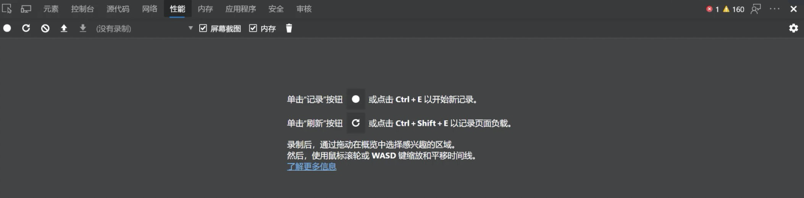
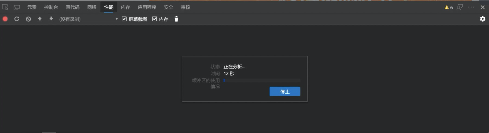
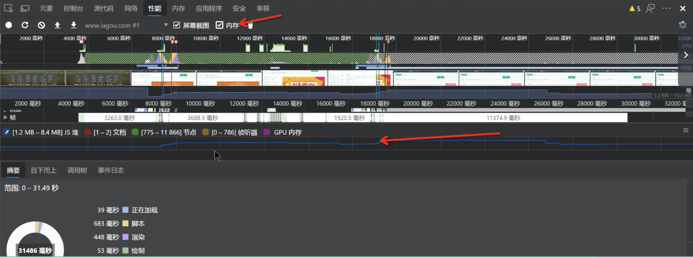
#### 2.内存问题的外在表现
- 网络情况正常，但页面经常出现延迟加载和经常性暂停(可能频繁的GC操作)
- 页面持续出现糟糕的性能(内存膨胀)
- 页面的性能随时间延长越来越差(内存泄漏)

#### 3.界定内存问题的标准
- 内存泄漏：内存使用持续升高
- 内存膨胀：在多数设备上都会存在性能问题(为了提供页面的性能会提供一块内存)
- 频繁的垃圾回收：通过内存变化图进行分析

#### 4.监控内存的几种方式
- 浏览器的任务管理器(shift+esc，右键看选项，其中内存指原生内存，即DOM内存。JS内存指堆内存，可达对象的内存，看是否频繁创建对象)
  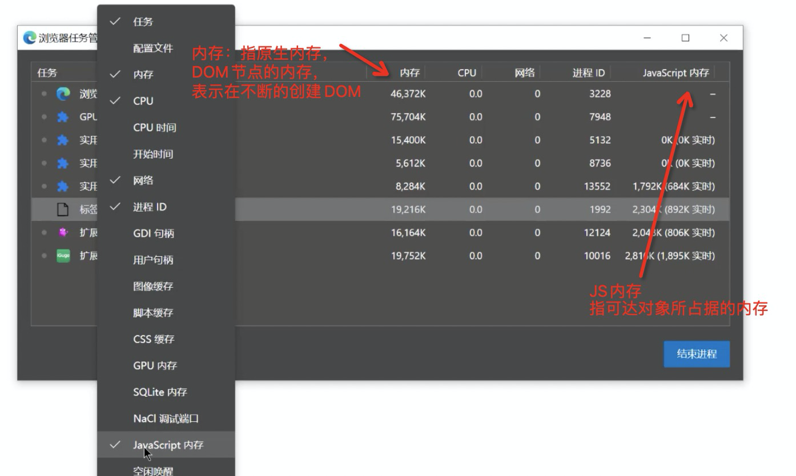
- Timeline时序图记录
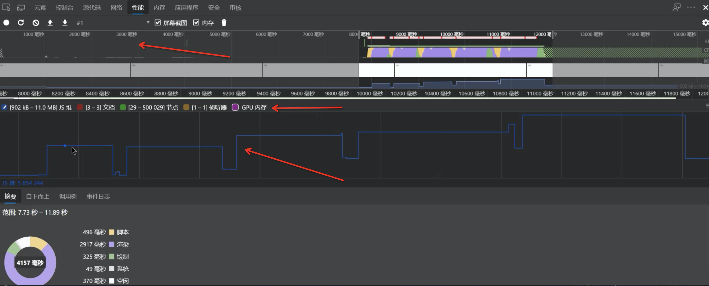
有高有低，说明有增长有回收，如果是持续增长，那说明存在内存泄漏
- 堆快照查找分离的DOM(内存泄漏)
1. 找到JS堆，进行照片的留存
2. DOM节点的三种状态
   - 界面元素存活在DOM树上
   - 垃圾对象时的DOM节点：即不在DOM树上，也没有对象引用(可以回收)
   - 分离状态的DOM节点：不在DOM树上，但是有对象在使用它(内存泄漏，看不见但是存在)
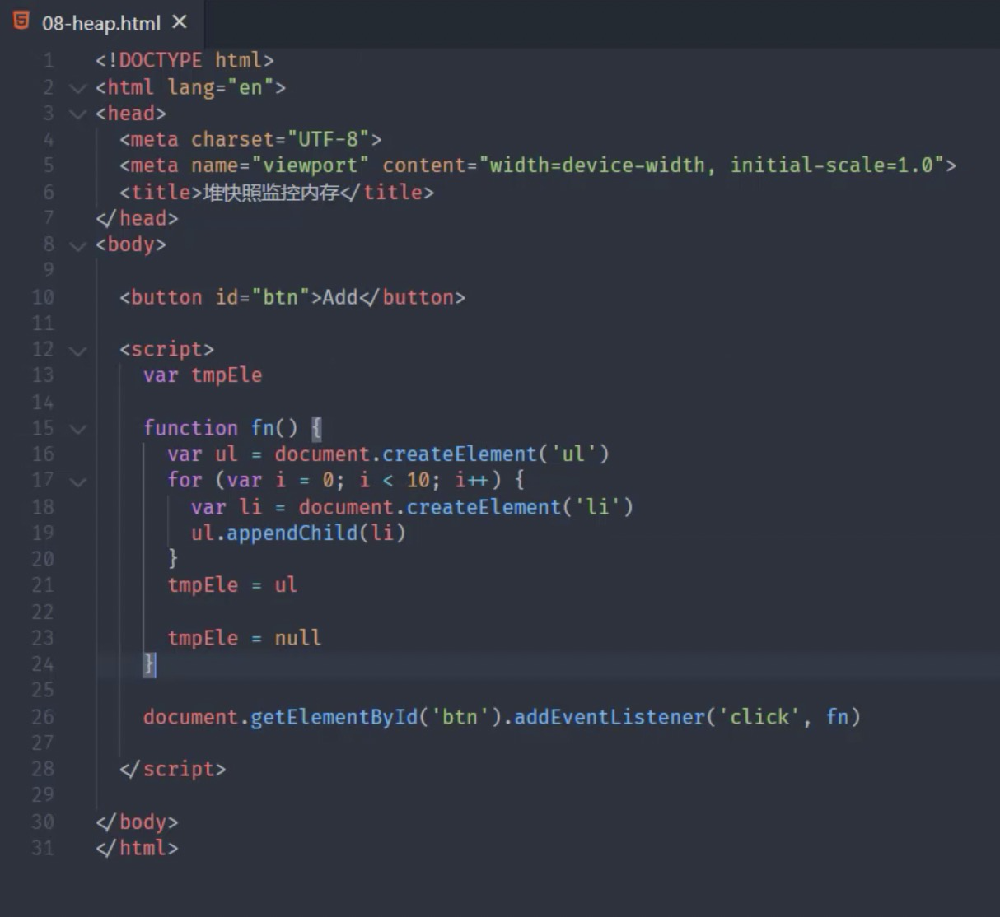
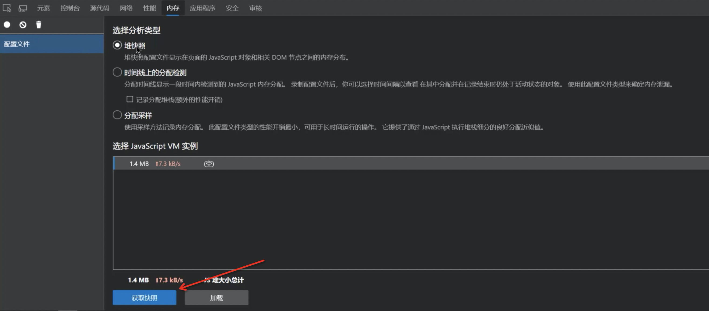
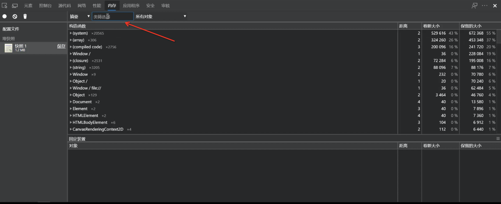
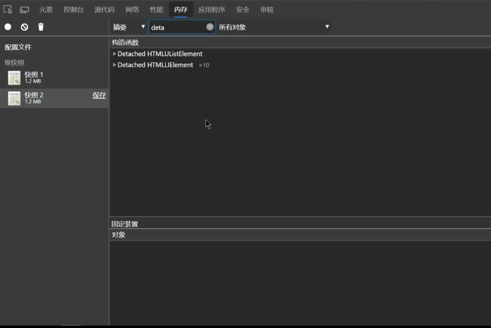
存在分离的DOM
- 判断是否存在频繁的垃圾回收

  1. 频繁GC时出现的问题
  - GC工作的时候应用程序是停止的
  - 频繁且过长的GC会导致应用的假死
  - 用户使用中感知应用卡顿
  2. 确定频繁的GC操作
  - Timeline中的走势图，在频繁的上升和下降
  - 任务管理器中数据频繁的增加和减少
- Performance使用总结
  - Performance使用流程
  - 内存问题的相关分析
  - Performance时序图监控内存变化
  - 任务管理器监控内存变化
  - 堆快照查找分离DOM
#### 5.优化代码介绍
1. 如何精准的测试JavaScript性能
- 本质上就是采集大量的执行样本进行数学统计和分析
- 使用基于[Benchmark.js](https://jsperf.com/)进行性能分析
2. 慎用全局变量进行存储
- 全局变量定义在全局执行上下文，是所有所用域链的顶端
- 全局执行上下文一直存在于上下文的执行栈，直到程序的退出
- 如果某个局部作用域出现了某个同名的变量，则会遮蔽或污染全局
3. 缓存全局变量(将无法避免的全局变量缓存到局部)
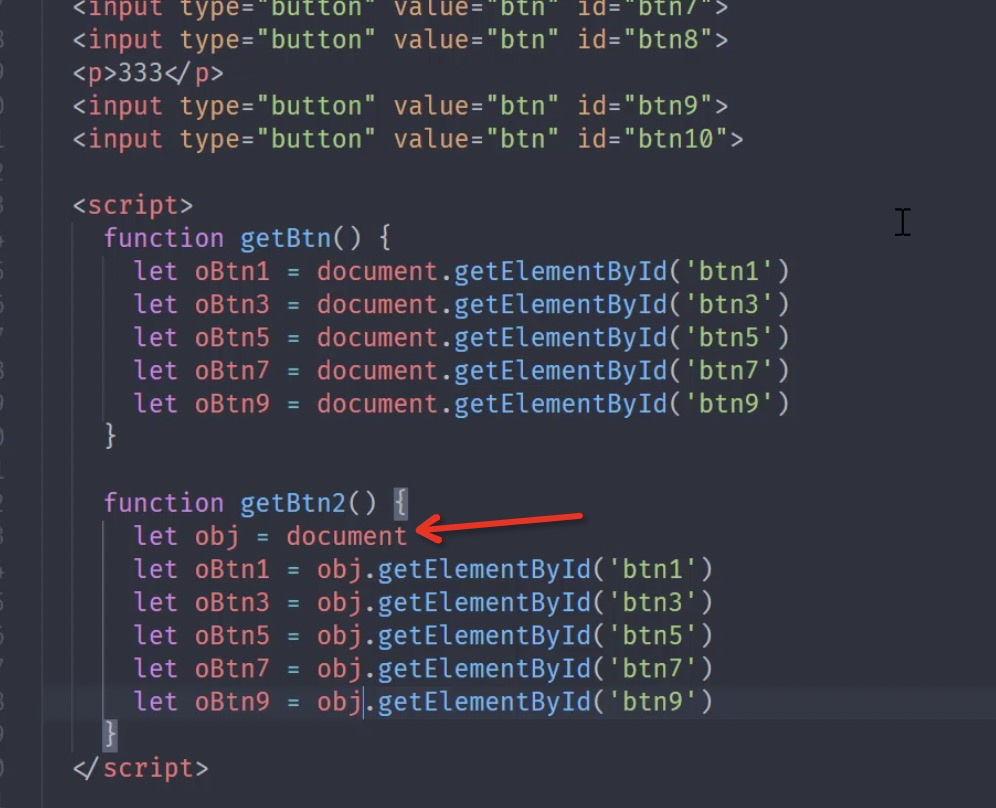
4. 通过原型对象添加附加方法
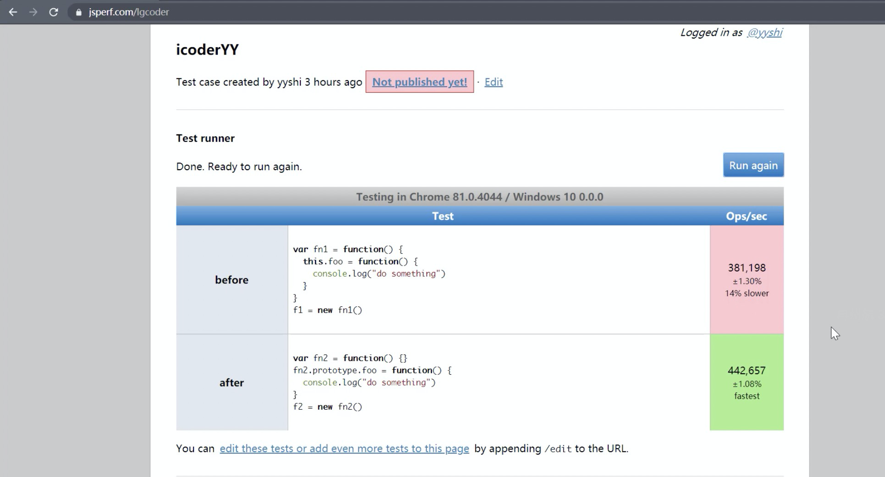
5. 避开闭包陷阱
- 闭包的特点
  - 外部具有指向内部的引用
  - 在**外部作用域**访问**内部作用域**的数据
  ```
  function foo(){
    var name = "name"
    function fn(){
      console.log(name)
    }
    return fn
  }
  var a = foo()
  a()
  ```
  - 闭包是一种强大的语法
  - 闭包使用不当很容易出现内存泄漏
  ```
  <button id="btn">add</button>
  <script>
  function foo(){
    var el = document.getElementById('btn')
    el.onclick = function(){
      console.log('el.id')
    }
    //el = null//清空引用的操作
  }
  foo()
  </script>
  ```
6. 避免属性访问方法的使用
- JS不需要属性的访问方法，所有的属性都是对外部可见的
- 使用属性的访问方法只会增加一层重定义，没有访问的控制力
7. for循环优化
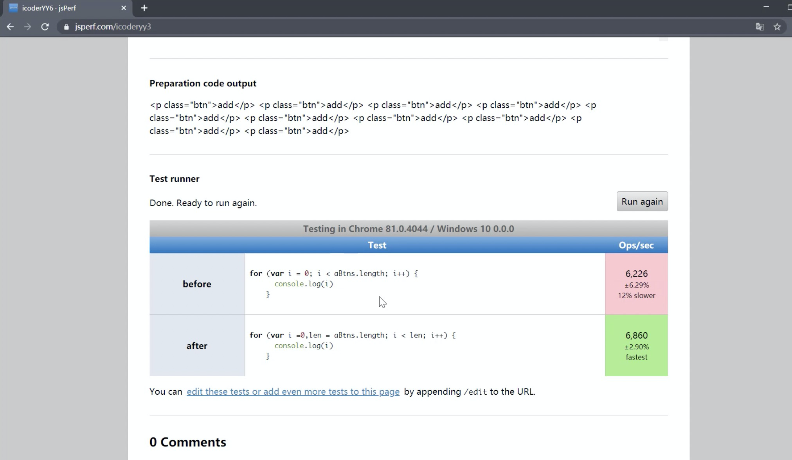
8. 选择最优循环方法
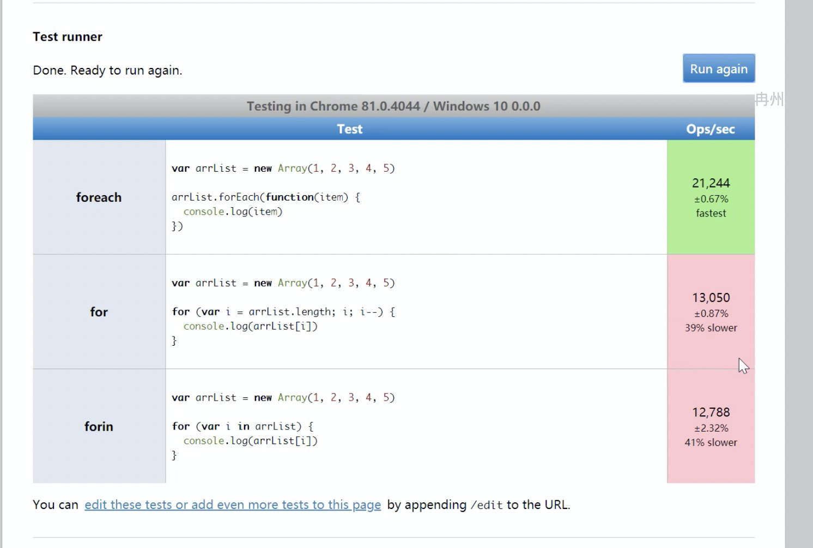
9.  文档碎片优化节点添加
- 节点的添加操作必然存在回流和重绘
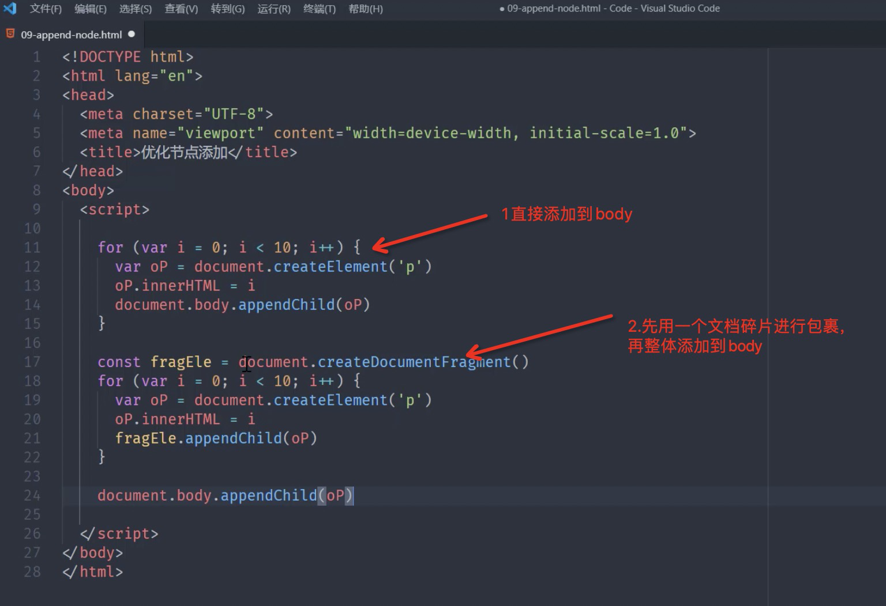
第二种性能更好
10. 克隆优化节点操作
- 当需要新增节点的时候，可以先找到已经存在的相同节点，进行复制然后添加
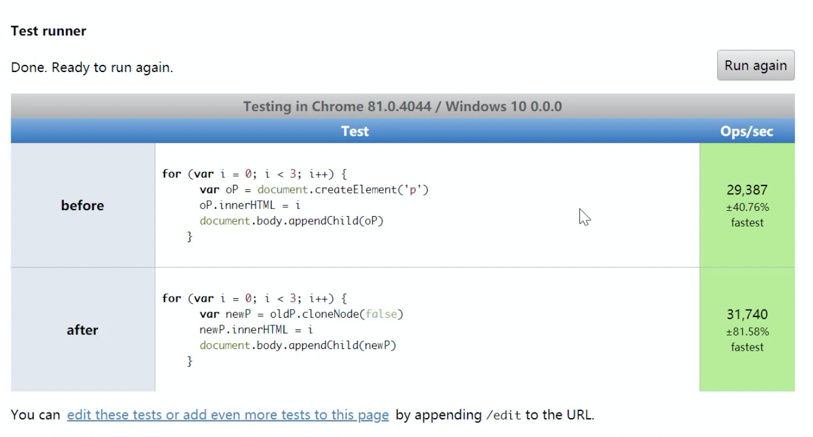
11. 直接量替换new Object
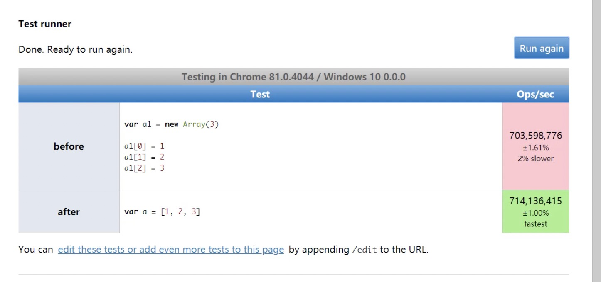
#### 6.JS Bench
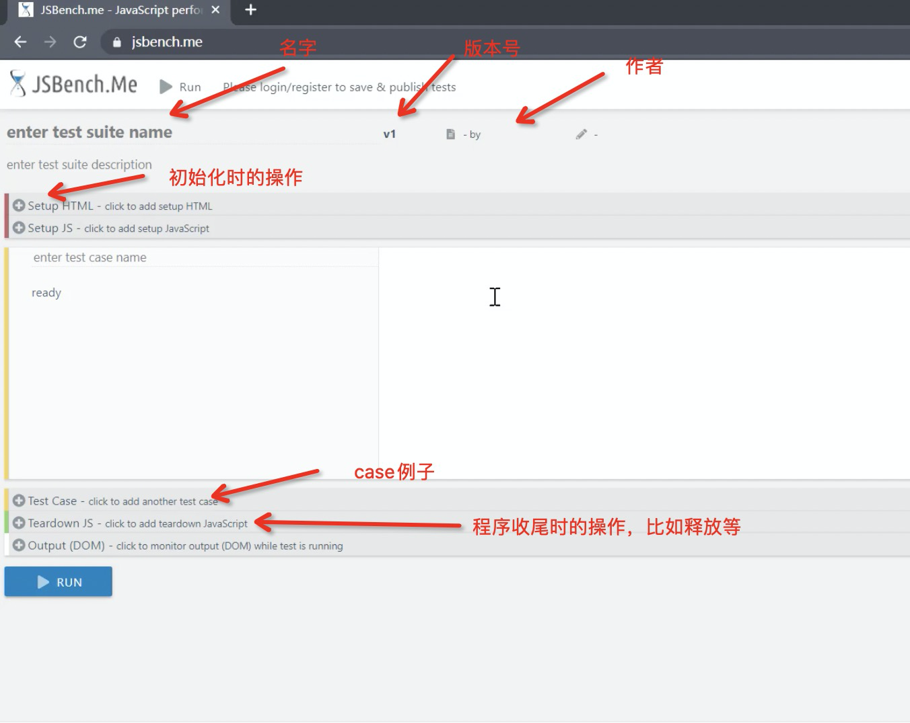
- 堆栈中JS的执行过程
```
let a = 10;
function foo(b){
  let a = 2
  function baz(c){
    console.log(a+b+c)
  }
  return baz
}
let fn = foo(2)
fn(3)
```
- 上面是代码片段
<svg xmlns="http://www.w3.org/2000/svg" xmlns:xlink="http://www.w3.org/1999/xlink" version="1.1" width="621px" viewBox="-0.5 -0.5 621 521" content="&lt;mxfile host=&quot;0d9f3247-41dc-4f30-8427-26af9e338d59&quot; modified=&quot;2020-12-06T10:42:53.387Z&quot; agent=&quot;5.0 (Macintosh; Intel Mac OS X 10_15_6) AppleWebKit/537.36 (KHTML, like Gecko) Code/1.51.1 Chrome/83.0.4103.122 Electron/9.3.3 Safari/537.36&quot; etag=&quot;VZiAn6XfloHs5y2kFIbE&quot; version=&quot;13.10.0&quot; type=&quot;embed&quot;&gt;&lt;diagram id=&quot;eRQsvwLWjOItZQGmFMB6&quot; name=&quot;Page-1&quot;&gt;&lt;mxGraphModel dx=&quot;898&quot; dy=&quot;680&quot; grid=&quot;1&quot; gridSize=&quot;10&quot; guides=&quot;1&quot; tooltips=&quot;1&quot; connect=&quot;1&quot; arrows=&quot;1&quot; fold=&quot;1&quot; page=&quot;1&quot; pageScale=&quot;1&quot; pageWidth=&quot;827&quot; pageHeight=&quot;1169&quot; math=&quot;0&quot; shadow=&quot;0&quot;&gt;&lt;root&gt;&lt;mxCell id=&quot;0&quot;/&gt;&lt;mxCell id=&quot;1&quot; parent=&quot;0&quot;/&gt;&lt;mxCell id=&quot;60&quot; value=&quot;&quot; style=&quot;rounded=1;whiteSpace=wrap;html=1;&quot; vertex=&quot;1&quot; parent=&quot;1&quot;&gt;&lt;mxGeometry y=&quot;170&quot; width=&quot;280&quot; height=&quot;500&quot; as=&quot;geometry&quot;/&gt;&lt;/mxCell&gt;&lt;mxCell id=&quot;61&quot; value=&quot;function foo(b){...}&amp;lt;br&amp;gt;&amp;lt;br&amp;gt;name: foo&amp;lt;br&amp;gt;length:1&quot; style=&quot;rounded=1;whiteSpace=wrap;html=1;align=left;&quot; vertex=&quot;1&quot; parent=&quot;1&quot;&gt;&lt;mxGeometry x=&quot;380&quot; y=&quot;170&quot; width=&quot;240&quot; height=&quot;180&quot; as=&quot;geometry&quot;/&gt;&lt;/mxCell&gt;&lt;mxCell id=&quot;62&quot; value=&quot;&quot; style=&quot;rounded=1;whiteSpace=wrap;html=1;&quot; vertex=&quot;1&quot; parent=&quot;1&quot;&gt;&lt;mxGeometry x=&quot;380&quot; y=&quot;370&quot; width=&quot;240&quot; height=&quot;190&quot; as=&quot;geometry&quot;/&gt;&lt;/mxCell&gt;&lt;mxCell id=&quot;63&quot; value=&quot;&quot; style=&quot;rounded=1;whiteSpace=wrap;html=1;&quot; vertex=&quot;1&quot; parent=&quot;1&quot;&gt;&lt;mxGeometry x=&quot;20&quot; y=&quot;180&quot; width=&quot;240&quot; height=&quot;150&quot; as=&quot;geometry&quot;/&gt;&lt;/mxCell&gt;&lt;mxCell id=&quot;64&quot; value=&quot;&quot; style=&quot;rounded=1;whiteSpace=wrap;html=1;&quot; vertex=&quot;1&quot; parent=&quot;1&quot;&gt;&lt;mxGeometry x=&quot;20&quot; y=&quot;340&quot; width=&quot;240&quot; height=&quot;160&quot; as=&quot;geometry&quot;/&gt;&lt;/mxCell&gt;&lt;mxCell id=&quot;65&quot; value=&quot;&quot; style=&quot;rounded=1;whiteSpace=wrap;html=1;&quot; vertex=&quot;1&quot; parent=&quot;1&quot;&gt;&lt;mxGeometry x=&quot;20&quot; y=&quot;510&quot; width=&quot;240&quot; height=&quot;150&quot; as=&quot;geometry&quot;/&gt;&lt;/mxCell&gt;&lt;mxCell id=&quot;66&quot; value=&quot;EStack 执行环境栈&quot; style=&quot;text;html=1;strokeColor=none;fillColor=none;align=center;verticalAlign=middle;whiteSpace=wrap;rounded=0;&quot; vertex=&quot;1&quot; parent=&quot;1&quot;&gt;&lt;mxGeometry x=&quot;20&quot; y=&quot;150&quot; width=&quot;160&quot; height=&quot;20&quot; as=&quot;geometry&quot;/&gt;&lt;/mxCell&gt;&lt;mxCell id=&quot;67&quot; value=&quot;EC(G全局执行上下文)&quot; style=&quot;text;html=1;strokeColor=none;fillColor=none;align=center;verticalAlign=middle;whiteSpace=wrap;rounded=0;&quot; vertex=&quot;1&quot; parent=&quot;1&quot;&gt;&lt;mxGeometry x=&quot;30&quot; y=&quot;520&quot; width=&quot;140&quot; height=&quot;20&quot; as=&quot;geometry&quot;/&gt;&lt;/mxCell&gt;&lt;mxCell id=&quot;68&quot; value=&quot;VO：&amp;lt;br&amp;gt;&amp;amp;nbsp; &amp;amp;nbsp; &amp;amp;nbsp; &amp;amp;nbsp;a = 10&amp;lt;br&amp;gt;&amp;amp;nbsp; &amp;amp;nbsp; &amp;amp;nbsp; &amp;amp;nbsp;foo = AB1[[scope]] VO&amp;lt;br&amp;gt;&amp;amp;nbsp; &amp;amp;nbsp; &amp;amp;nbsp; &amp;amp;nbsp;fn = AB2&amp;lt;br&amp;gt;fn(3)&quot; style=&quot;text;html=1;strokeColor=none;fillColor=none;align=left;verticalAlign=middle;whiteSpace=wrap;rounded=0;&quot; vertex=&quot;1&quot; parent=&quot;1&quot;&gt;&lt;mxGeometry x=&quot;40&quot; y=&quot;549&quot; width=&quot;200&quot; height=&quot;100&quot; as=&quot;geometry&quot;/&gt;&lt;/mxCell&gt;&lt;mxCell id=&quot;69&quot; value=&quot;EC(foo)&quot; style=&quot;text;html=1;strokeColor=none;fillColor=none;align=center;verticalAlign=middle;whiteSpace=wrap;rounded=0;&quot; vertex=&quot;1&quot; parent=&quot;1&quot;&gt;&lt;mxGeometry x=&quot;40&quot; y=&quot;350&quot; width=&quot;40&quot; height=&quot;20&quot; as=&quot;geometry&quot;/&gt;&lt;/mxCell&gt;&lt;mxCell id=&quot;70&quot; value=&quot;this = window&amp;lt;br&amp;gt;&amp;amp;lt;foo . ao, vo&amp;amp;gt;&amp;lt;br&amp;gt;AO:&amp;lt;br&amp;gt;&amp;amp;nbsp; &amp;amp;nbsp; &amp;amp;nbsp;arguments:[0,2]&amp;lt;br&amp;gt;&amp;amp;nbsp; &amp;amp;nbsp; &amp;amp;nbsp;b = 2&amp;lt;br&amp;gt;&amp;amp;nbsp; &amp;amp;nbsp; &amp;amp;nbsp;a = 2&amp;lt;br&amp;gt;&amp;amp;nbsp; &amp;amp;nbsp; &amp;amp;nbsp;baz = AB2 [[scope]]&amp;amp;nbsp; foo . AO&quot; style=&quot;text;html=1;strokeColor=none;fillColor=none;align=left;verticalAlign=middle;whiteSpace=wrap;rounded=0;&quot; vertex=&quot;1&quot; parent=&quot;1&quot;&gt;&lt;mxGeometry x=&quot;40&quot; y=&quot;380&quot; width=&quot;200&quot; height=&quot;100&quot; as=&quot;geometry&quot;/&gt;&lt;/mxCell&gt;&lt;mxCell id=&quot;71&quot; value=&quot;EC(baz)&quot; style=&quot;text;html=1;strokeColor=none;fillColor=none;align=center;verticalAlign=middle;whiteSpace=wrap;rounded=0;&quot; vertex=&quot;1&quot; parent=&quot;1&quot;&gt;&lt;mxGeometry x=&quot;30&quot; y=&quot;190&quot; width=&quot;80&quot; height=&quot;20&quot; as=&quot;geometry&quot;/&gt;&lt;/mxCell&gt;&lt;mxCell id=&quot;72&quot; value=&quot;this window&amp;lt;br&amp;gt;&amp;amp;lt;baz . ao, foo . ao, vo&amp;amp;gt;&amp;lt;br&amp;gt;AO:&amp;lt;br&amp;gt;&amp;amp;nbsp; &amp;amp;nbsp; &amp;amp;nbsp; arguments:[0,3]&amp;lt;br&amp;gt;&amp;amp;nbsp; &amp;amp;nbsp; &amp;amp;nbsp; c = 3&amp;lt;br&amp;gt;&amp;amp;nbsp; &amp;amp;nbsp; &amp;amp;nbsp; console.log(a+b+c)&amp;lt;br&amp;gt;&amp;amp;nbsp; &amp;amp;nbsp; &amp;amp;nbsp;3+2+2 = 7&quot; style=&quot;text;html=1;strokeColor=none;fillColor=none;align=left;verticalAlign=middle;whiteSpace=wrap;rounded=0;&quot; vertex=&quot;1&quot; parent=&quot;1&quot;&gt;&lt;mxGeometry x=&quot;40&quot; y=&quot;220&quot; width=&quot;200&quot; height=&quot;90&quot; as=&quot;geometry&quot;/&gt;&lt;/mxCell&gt;&lt;mxCell id=&quot;73&quot; value=&quot;AB1&quot; style=&quot;text;html=1;strokeColor=none;fillColor=none;align=center;verticalAlign=middle;whiteSpace=wrap;rounded=0;&quot; vertex=&quot;1&quot; parent=&quot;1&quot;&gt;&lt;mxGeometry x=&quot;380&quot; y=&quot;180&quot; width=&quot;40&quot; height=&quot;20&quot; as=&quot;geometry&quot;/&gt;&lt;/mxCell&gt;&lt;mxCell id=&quot;76&quot; value=&quot;AB2&quot; style=&quot;text;html=1;strokeColor=none;fillColor=none;align=center;verticalAlign=middle;whiteSpace=wrap;rounded=0;&quot; vertex=&quot;1&quot; parent=&quot;1&quot;&gt;&lt;mxGeometry x=&quot;400&quot; y=&quot;380&quot; width=&quot;40&quot; height=&quot;20&quot; as=&quot;geometry&quot;/&gt;&lt;/mxCell&gt;&lt;mxCell id=&quot;77&quot; value=&quot;&amp;lt;div style=&amp;quot;text-align: left&amp;quot;&amp;gt;&amp;lt;span&amp;gt;function baz(c){...}&amp;lt;/span&amp;gt;&amp;lt;/div&amp;gt;&amp;lt;div style=&amp;quot;text-align: left&amp;quot;&amp;gt;&amp;lt;span&amp;gt;return baz&amp;lt;/span&amp;gt;&amp;lt;/div&amp;gt;&amp;lt;div style=&amp;quot;text-align: left&amp;quot;&amp;gt;&amp;lt;span&amp;gt;length: 1&amp;lt;/span&amp;gt;&amp;lt;/div&amp;gt;&quot; style=&quot;text;html=1;strokeColor=none;fillColor=none;align=center;verticalAlign=middle;whiteSpace=wrap;rounded=0;&quot; vertex=&quot;1&quot; parent=&quot;1&quot;&gt;&lt;mxGeometry x=&quot;370&quot; y=&quot;380&quot; width=&quot;180&quot; height=&quot;130&quot; as=&quot;geometry&quot;/&gt;&lt;/mxCell&gt;&lt;/root&gt;&lt;/mxGraphModel&gt;&lt;/diagram&gt;&lt;/mxfile&gt;" onclick="(function(svg){var src=window.event.target||window.event.srcElement;while (src!=null&amp;&amp;src.nodeName.toLowerCase()!='a'){src=src.parentNode;}if(src==null){if(svg.wnd!=null&amp;&amp;!svg.wnd.closed){svg.wnd.focus();}else{var r=function(evt){if(evt.data=='ready'&amp;&amp;evt.source==svg.wnd){svg.wnd.postMessage(decodeURIComponent(svg.getAttribute('content')),'*');window.removeEventListener('message',r);}};window.addEventListener('message',r);svg.wnd=window.open('https://viewer.diagrams.net/?client=1&amp;page=0&amp;edit=_blank');}}})(this);" style="cursor:pointer;max-width:100%;max-height:521px;"><defs/><g><rect x="0" y="20" width="280" height="500" rx="42" ry="42" fill="#ffffff" stroke="#000000" pointer-events="all"/><rect x="380" y="20" width="240" height="180" rx="27" ry="27" fill="#ffffff" stroke="#000000" pointer-events="all"/><g transform="translate(-0.5 -0.5)"><switch><foreignObject style="overflow: visible; text-align: left;" pointer-events="none" width="100%" height="100%" requiredFeatures="http://www.w3.org/TR/SVG11/feature#Extensibility"><div xmlns="http://www.w3.org/1999/xhtml" style="display: flex; align-items: unsafe center; justify-content: unsafe flex-start; width: 238px; height: 1px; padding-top: 110px; margin-left: 382px;"><div style="box-sizing: border-box; font-size: 0; text-align: left; "><div style="display: inline-block; font-size: 12px; font-family: Helvetica; color: #000000; line-height: 1.2; pointer-events: all; white-space: normal; word-wrap: normal; ">function foo(b){...}<br /><br />name: foo<br />length:1</div></div></div></foreignObject><text x="382" y="114" fill="#000000" font-family="Helvetica" font-size="12px">function foo(b){...}...</text></switch></g><rect x="380" y="220" width="240" height="190" rx="28.5" ry="28.5" fill="#ffffff" stroke="#000000" pointer-events="all"/><rect x="20" y="30" width="240" height="150" rx="22.5" ry="22.5" fill="#ffffff" stroke="#000000" pointer-events="all"/><rect x="20" y="190" width="240" height="160" rx="24" ry="24" fill="#ffffff" stroke="#000000" pointer-events="all"/><rect x="20" y="360" width="240" height="150" rx="22.5" ry="22.5" fill="#ffffff" stroke="#000000" pointer-events="all"/><rect x="20" y="0" width="160" height="20" fill="none" stroke="none" pointer-events="all"/><g transform="translate(-0.5 -0.5)"><switch><foreignObject style="overflow: visible; text-align: left;" pointer-events="none" width="100%" height="100%" requiredFeatures="http://www.w3.org/TR/SVG11/feature#Extensibility"><div xmlns="http://www.w3.org/1999/xhtml" style="display: flex; align-items: unsafe center; justify-content: unsafe center; width: 158px; height: 1px; padding-top: 10px; margin-left: 21px;"><div style="box-sizing: border-box; font-size: 0; text-align: center; "><div style="display: inline-block; font-size: 12px; font-family: Helvetica; color: #000000; line-height: 1.2; pointer-events: all; white-space: normal; word-wrap: normal; ">EStack 执行环境栈</div></div></div></foreignObject><text x="100" y="14" fill="#000000" font-family="Helvetica" font-size="12px" text-anchor="middle">EStack 执行环境栈</text></switch></g><rect x="30" y="370" width="140" height="20" fill="none" stroke="none" pointer-events="all"/><g transform="translate(-0.5 -0.5)"><switch><foreignObject style="overflow: visible; text-align: left;" pointer-events="none" width="100%" height="100%" requiredFeatures="http://www.w3.org/TR/SVG11/feature#Extensibility"><div xmlns="http://www.w3.org/1999/xhtml" style="display: flex; align-items: unsafe center; justify-content: unsafe center; width: 138px; height: 1px; padding-top: 380px; margin-left: 31px;"><div style="box-sizing: border-box; font-size: 0; text-align: center; "><div style="display: inline-block; font-size: 12px; font-family: Helvetica; color: #000000; line-height: 1.2; pointer-events: all; white-space: normal; word-wrap: normal; ">EC(G全局执行上下文)</div></div></div></foreignObject><text x="100" y="384" fill="#000000" font-family="Helvetica" font-size="12px" text-anchor="middle">EC(G全局执行上下文)</text></switch></g><rect x="40" y="399" width="200" height="100" fill="none" stroke="none" pointer-events="all"/><g transform="translate(-0.5 -0.5)"><switch><foreignObject style="overflow: visible; text-align: left;" pointer-events="none" width="100%" height="100%" requiredFeatures="http://www.w3.org/TR/SVG11/feature#Extensibility"><div xmlns="http://www.w3.org/1999/xhtml" style="display: flex; align-items: unsafe center; justify-content: unsafe flex-start; width: 198px; height: 1px; padding-top: 449px; margin-left: 42px;"><div style="box-sizing: border-box; font-size: 0; text-align: left; "><div style="display: inline-block; font-size: 12px; font-family: Helvetica; color: #000000; line-height: 1.2; pointer-events: all; white-space: normal; word-wrap: normal; ">VO：<br />       a = 10<br />       foo = AB1[[scope]] VO<br />       fn = AB2<br />fn(3)</div></div></div></foreignObject><text x="42" y="453" fill="#000000" font-family="Helvetica" font-size="12px">VO：...</text></switch></g><rect x="40" y="200" width="40" height="20" fill="none" stroke="none" pointer-events="all"/><g transform="translate(-0.5 -0.5)"><switch><foreignObject style="overflow: visible; text-align: left;" pointer-events="none" width="100%" height="100%" requiredFeatures="http://www.w3.org/TR/SVG11/feature#Extensibility"><div xmlns="http://www.w3.org/1999/xhtml" style="display: flex; align-items: unsafe center; justify-content: unsafe center; width: 38px; height: 1px; padding-top: 210px; margin-left: 41px;"><div style="box-sizing: border-box; font-size: 0; text-align: center; "><div style="display: inline-block; font-size: 12px; font-family: Helvetica; color: #000000; line-height: 1.2; pointer-events: all; white-space: normal; word-wrap: normal; ">EC(foo)</div></div></div></foreignObject><text x="60" y="214" fill="#000000" font-family="Helvetica" font-size="12px" text-anchor="middle">EC(foo)</text></switch></g><rect x="40" y="230" width="200" height="100" fill="none" stroke="none" pointer-events="all"/><g transform="translate(-0.5 -0.5)"><switch><foreignObject style="overflow: visible; text-align: left;" pointer-events="none" width="100%" height="100%" requiredFeatures="http://www.w3.org/TR/SVG11/feature#Extensibility"><div xmlns="http://www.w3.org/1999/xhtml" style="display: flex; align-items: unsafe center; justify-content: unsafe flex-start; width: 198px; height: 1px; padding-top: 280px; margin-left: 42px;"><div style="box-sizing: border-box; font-size: 0; text-align: left; "><div style="display: inline-block; font-size: 12px; font-family: Helvetica; color: #000000; line-height: 1.2; pointer-events: all; white-space: normal; word-wrap: normal; ">this = window<br />&lt;foo . ao, vo&gt;<br />AO:<br />     arguments:[0,2]<br />     b = 2<br />     a = 2<br />     baz = AB2 [[scope]]  foo . AO</div></div></div></foreignObject><text x="42" y="284" fill="#000000" font-family="Helvetica" font-size="12px">this = window...</text></switch></g><rect x="30" y="40" width="80" height="20" fill="none" stroke="none" pointer-events="all"/><g transform="translate(-0.5 -0.5)"><switch><foreignObject style="overflow: visible; text-align: left;" pointer-events="none" width="100%" height="100%" requiredFeatures="http://www.w3.org/TR/SVG11/feature#Extensibility"><div xmlns="http://www.w3.org/1999/xhtml" style="display: flex; align-items: unsafe center; justify-content: unsafe center; width: 78px; height: 1px; padding-top: 50px; margin-left: 31px;"><div style="box-sizing: border-box; font-size: 0; text-align: center; "><div style="display: inline-block; font-size: 12px; font-family: Helvetica; color: #000000; line-height: 1.2; pointer-events: all; white-space: normal; word-wrap: normal; ">EC(baz)</div></div></div></foreignObject><text x="70" y="54" fill="#000000" font-family="Helvetica" font-size="12px" text-anchor="middle">EC(baz)</text></switch></g><rect x="40" y="70" width="200" height="90" fill="none" stroke="none" pointer-events="all"/><g transform="translate(-0.5 -0.5)"><switch><foreignObject style="overflow: visible; text-align: left;" pointer-events="none" width="100%" height="100%" requiredFeatures="http://www.w3.org/TR/SVG11/feature#Extensibility"><div xmlns="http://www.w3.org/1999/xhtml" style="display: flex; align-items: unsafe center; justify-content: unsafe flex-start; width: 198px; height: 1px; padding-top: 115px; margin-left: 42px;"><div style="box-sizing: border-box; font-size: 0; text-align: left; "><div style="display: inline-block; font-size: 12px; font-family: Helvetica; color: #000000; line-height: 1.2; pointer-events: all; white-space: normal; word-wrap: normal; ">this window<br />&lt;baz . ao, foo . ao, vo&gt;<br />AO:<br />      arguments:[0,3]<br />      c = 3<br />      console.log(a+b+c)<br />     3+2+2 = 7</div></div></div></foreignObject><text x="42" y="119" fill="#000000" font-family="Helvetica" font-size="12px">this window...</text></switch></g><rect x="380" y="30" width="40" height="20" fill="none" stroke="none" pointer-events="all"/><g transform="translate(-0.5 -0.5)"><switch><foreignObject style="overflow: visible; text-align: left;" pointer-events="none" width="100%" height="100%" requiredFeatures="http://www.w3.org/TR/SVG11/feature#Extensibility"><div xmlns="http://www.w3.org/1999/xhtml" style="display: flex; align-items: unsafe center; justify-content: unsafe center; width: 38px; height: 1px; padding-top: 40px; margin-left: 381px;"><div style="box-sizing: border-box; font-size: 0; text-align: center; "><div style="display: inline-block; font-size: 12px; font-family: Helvetica; color: #000000; line-height: 1.2; pointer-events: all; white-space: normal; word-wrap: normal; ">AB1</div></div></div></foreignObject><text x="400" y="44" fill="#000000" font-family="Helvetica" font-size="12px" text-anchor="middle">AB1</text></switch></g><rect x="400" y="230" width="40" height="20" fill="none" stroke="none" pointer-events="all"/><g transform="translate(-0.5 -0.5)"><switch><foreignObject style="overflow: visible; text-align: left;" pointer-events="none" width="100%" height="100%" requiredFeatures="http://www.w3.org/TR/SVG11/feature#Extensibility"><div xmlns="http://www.w3.org/1999/xhtml" style="display: flex; align-items: unsafe center; justify-content: unsafe center; width: 38px; height: 1px; padding-top: 240px; margin-left: 401px;"><div style="box-sizing: border-box; font-size: 0; text-align: center; "><div style="display: inline-block; font-size: 12px; font-family: Helvetica; color: #000000; line-height: 1.2; pointer-events: all; white-space: normal; word-wrap: normal; ">AB2</div></div></div></foreignObject><text x="420" y="244" fill="#000000" font-family="Helvetica" font-size="12px" text-anchor="middle">AB2</text></switch></g><rect x="370" y="230" width="180" height="130" fill="none" stroke="none" pointer-events="all"/><g transform="translate(-0.5 -0.5)"><switch><foreignObject style="overflow: visible; text-align: left;" pointer-events="none" width="100%" height="100%" requiredFeatures="http://www.w3.org/TR/SVG11/feature#Extensibility"><div xmlns="http://www.w3.org/1999/xhtml" style="display: flex; align-items: unsafe center; justify-content: unsafe center; width: 178px; height: 1px; padding-top: 295px; margin-left: 371px;"><div style="box-sizing: border-box; font-size: 0; text-align: center; "><div style="display: inline-block; font-size: 12px; font-family: Helvetica; color: #000000; line-height: 1.2; pointer-events: all; white-space: normal; word-wrap: normal; "><div style="text-align: left"><span>function baz(c){...}</span></div><div style="text-align: left"><span>return baz</span></div><div style="text-align: left"><span>length: 1</span></div></div></div></div></foreignObject><text x="460" y="299" fill="#000000" font-family="Helvetica" font-size="12px" text-anchor="middle">function baz(c){...}...</text></switch></g></g><switch><g requiredFeatures="http://www.w3.org/TR/SVG11/feature#Extensibility"/><a transform="translate(0,-5)" xlink:href="https://desk.draw.io/support/solutions/articles/16000042487" target="_blank"><text text-anchor="middle" font-size="10px" x="50%" y="100%">Viewer does not support full SVG 1.1</text></a></switch></svg>
- 减少判断层级
- 减少作用域链查找层级
- 减少数据读取次数
- 字面量与构造式
- 减少循环体中的活动
- 减少声明和语句数
- 惰性函数和性能
- 采用事件绑定