## 面临的问题
1. 在开发过程中想使用es6的语法，但兼容性有问题
2. 想使用less/sass/postCss/去提高css的编程性，但运行环境不能直接支持
3. 想用模块化和组件化的方式提高项目的可维护性，但运行环境不能直接支持
4. 部署上线前需要手动压缩代码及资源文件
5. 部署过程需要手动上传代码到服务器
6. 多人协作开发，无法硬性统一大家的代码风格，从仓库pull回来的代码质量无法保证
7. 部分功能开发时需要后端服务接口提前完成
## 解决的问题
1. 传统语言或语法的弊端
2. 无法使用模块化和组件化
3. 重复机械的操作
4. 代码风格统一，质量保证
5. 依赖后端服务接口支持
6. 整体依赖后端项目

### 一 工程化的表现
- 一切以提高效率，降低成本，质量保证为目的的手段都属于**工程化**
- 一切重复的功能都应该被自动化
<svg xmlns="http://www.w3.org/2000/svg" xmlns:xlink="http://www.w3.org/1999/xlink" version="1.1" width="791px" viewBox="-0.5 -0.5 791 149" content="&lt;mxfile host=&quot;0f414681-93f2-4c83-95a9-7bcfcbf002ae&quot; modified=&quot;2020-12-07T15:12:50.050Z&quot; agent=&quot;5.0 (Windows NT 10.0; Win64; x64) AppleWebKit/537.36 (KHTML, like Gecko) Code/1.51.1 Chrome/83.0.4103.122 Electron/9.3.3 Safari/537.36&quot; version=&quot;13.6.5&quot; etag=&quot;zo3xOJErtO6vcY5LoF9T&quot;&gt;&lt;diagram id=&quot;L-aaouKZTK3FSp3iu08A&quot; name=&quot;Page-1&quot;&gt;&lt;mxGraphModel dx=&quot;822&quot; dy=&quot;661&quot; grid=&quot;1&quot; gridSize=&quot;10&quot; guides=&quot;1&quot; tooltips=&quot;1&quot; connect=&quot;1&quot; arrows=&quot;1&quot; fold=&quot;1&quot; page=&quot;1&quot; pageScale=&quot;1&quot; pageWidth=&quot;827&quot; pageHeight=&quot;1169&quot; math=&quot;0&quot; shadow=&quot;0&quot;&gt;&lt;root&gt;&lt;mxCell id=&quot;0&quot;/&gt;&lt;mxCell id=&quot;1&quot; parent=&quot;0&quot;/&gt;&lt;mxCell id=&quot;7&quot; style=&quot;edgeStyle=orthogonalEdgeStyle;rounded=0;orthogonalLoop=1;jettySize=auto;html=1;exitX=1;exitY=0.5;exitDx=0;exitDy=0;entryX=0;entryY=0.5;entryDx=0;entryDy=0;&quot; edge=&quot;1&quot; parent=&quot;1&quot; source=&quot;2&quot; target=&quot;3&quot;&gt;&lt;mxGeometry relative=&quot;1&quot; as=&quot;geometry&quot;/&gt;&lt;/mxCell&gt;&lt;mxCell id=&quot;2&quot; value=&quot;创建项目&quot; style=&quot;rounded=1;whiteSpace=wrap;html=1;&quot; vertex=&quot;1&quot; parent=&quot;1&quot;&gt;&lt;mxGeometry x=&quot;20&quot; y=&quot;310&quot; width=&quot;120&quot; height=&quot;60&quot; as=&quot;geometry&quot;/&gt;&lt;/mxCell&gt;&lt;mxCell id=&quot;8&quot; style=&quot;edgeStyle=orthogonalEdgeStyle;rounded=0;orthogonalLoop=1;jettySize=auto;html=1;exitX=1;exitY=0.5;exitDx=0;exitDy=0;entryX=0;entryY=0.5;entryDx=0;entryDy=0;&quot; edge=&quot;1&quot; parent=&quot;1&quot; source=&quot;3&quot; target=&quot;4&quot;&gt;&lt;mxGeometry relative=&quot;1&quot; as=&quot;geometry&quot;/&gt;&lt;/mxCell&gt;&lt;mxCell id=&quot;3&quot; value=&quot;编码&quot; style=&quot;rounded=1;whiteSpace=wrap;html=1;&quot; vertex=&quot;1&quot; parent=&quot;1&quot;&gt;&lt;mxGeometry x=&quot;180&quot; y=&quot;310&quot; width=&quot;120&quot; height=&quot;60&quot; as=&quot;geometry&quot;/&gt;&lt;/mxCell&gt;&lt;mxCell id=&quot;9&quot; style=&quot;edgeStyle=orthogonalEdgeStyle;rounded=0;orthogonalLoop=1;jettySize=auto;html=1;exitX=1;exitY=0.5;exitDx=0;exitDy=0;entryX=0;entryY=0.5;entryDx=0;entryDy=0;&quot; edge=&quot;1&quot; parent=&quot;1&quot; source=&quot;4&quot; target=&quot;5&quot;&gt;&lt;mxGeometry relative=&quot;1&quot; as=&quot;geometry&quot;/&gt;&lt;/mxCell&gt;&lt;mxCell id=&quot;4&quot; value=&quot;预览、测试&quot; style=&quot;rounded=1;whiteSpace=wrap;html=1;&quot; vertex=&quot;1&quot; parent=&quot;1&quot;&gt;&lt;mxGeometry x=&quot;354&quot; y=&quot;310&quot; width=&quot;120&quot; height=&quot;60&quot; as=&quot;geometry&quot;/&gt;&lt;/mxCell&gt;&lt;mxCell id=&quot;10&quot; style=&quot;edgeStyle=orthogonalEdgeStyle;rounded=0;orthogonalLoop=1;jettySize=auto;html=1;exitX=1;exitY=0.5;exitDx=0;exitDy=0;entryX=0;entryY=0.5;entryDx=0;entryDy=0;&quot; edge=&quot;1&quot; parent=&quot;1&quot; source=&quot;5&quot; target=&quot;6&quot;&gt;&lt;mxGeometry relative=&quot;1&quot; as=&quot;geometry&quot;/&gt;&lt;/mxCell&gt;&lt;mxCell id=&quot;5&quot; value=&quot;提交&quot; style=&quot;rounded=1;whiteSpace=wrap;html=1;&quot; vertex=&quot;1&quot; parent=&quot;1&quot;&gt;&lt;mxGeometry x=&quot;530&quot; y=&quot;310&quot; width=&quot;110&quot; height=&quot;60&quot; as=&quot;geometry&quot;/&gt;&lt;/mxCell&gt;&lt;mxCell id=&quot;12&quot; style=&quot;edgeStyle=orthogonalEdgeStyle;rounded=0;orthogonalLoop=1;jettySize=auto;html=1;exitX=0.5;exitY=1;exitDx=0;exitDy=0;entryX=0.425;entryY=1.058;entryDx=0;entryDy=0;entryPerimeter=0;&quot; edge=&quot;1&quot; parent=&quot;1&quot; source=&quot;6&quot; target=&quot;3&quot;&gt;&lt;mxGeometry relative=&quot;1&quot; as=&quot;geometry&quot;&gt;&lt;Array as=&quot;points&quot;&gt;&lt;mxPoint x=&quot;750&quot; y=&quot;450&quot;/&gt;&lt;mxPoint x=&quot;231&quot; y=&quot;450&quot;/&gt;&lt;/Array&gt;&lt;/mxGeometry&gt;&lt;/mxCell&gt;&lt;mxCell id=&quot;6&quot; value=&quot;部署&quot; style=&quot;rounded=1;whiteSpace=wrap;html=1;&quot; vertex=&quot;1&quot; parent=&quot;1&quot;&gt;&lt;mxGeometry x=&quot;690&quot; y=&quot;310&quot; width=&quot;120&quot; height=&quot;60&quot; as=&quot;geometry&quot;/&gt;&lt;/mxCell&gt;&lt;/root&gt;&lt;/mxGraphModel&gt;&lt;/diagram&gt;&lt;/mxfile&gt;" onclick="(function(svg){var src=window.event.target||window.event.srcElement;while (src!=null&amp;&amp;src.nodeName.toLowerCase()!='a'){src=src.parentNode;}if(src==null){if(svg.wnd!=null&amp;&amp;!svg.wnd.closed){svg.wnd.focus();}else{var r=function(evt){if(evt.data=='ready'&amp;&amp;evt.source==svg.wnd){svg.wnd.postMessage(decodeURIComponent(svg.getAttribute('content')),'*');window.removeEventListener('message',r);}};window.addEventListener('message',r);svg.wnd=window.open('https://viewer.diagrams.net/?client=1&amp;edit=_blank');}}})(this);" style="cursor:pointer;max-width:100%;max-height:149px;"><defs/><g><path d="M 120 30 L 153.63 30" fill="none" stroke="#000000" stroke-miterlimit="10" pointer-events="stroke"/><path d="M 158.88 30 L 151.88 33.5 L 153.63 30 L 151.88 26.5 Z" fill="#000000" stroke="#000000" stroke-miterlimit="10" pointer-events="all"/><rect x="0" y="0" width="120" height="60" rx="9" ry="9" fill="#ffffff" stroke="#000000" pointer-events="all"/><g transform="translate(-0.5 -0.5)"><switch><foreignObject style="overflow: visible; text-align: left;" pointer-events="none" width="100%" height="100%" requiredFeatures="http://www.w3.org/TR/SVG11/feature#Extensibility"><div xmlns="http://www.w3.org/1999/xhtml" style="display: flex; align-items: unsafe center; justify-content: unsafe center; width: 118px; height: 1px; padding-top: 30px; margin-left: 1px;"><div style="box-sizing: border-box; font-size: 0; text-align: center; "><div style="display: inline-block; font-size: 12px; font-family: Helvetica; color: #000000; line-height: 1.2; pointer-events: all; white-space: normal; word-wrap: normal; ">创建项目</div></div></div></foreignObject><text x="60" y="34" fill="#000000" font-family="Helvetica" font-size="12px" text-anchor="middle">创建项目</text></switch></g><path d="M 280 30 L 327.63 30" fill="none" stroke="#000000" stroke-miterlimit="10" pointer-events="stroke"/><path d="M 332.88 30 L 325.88 33.5 L 327.63 30 L 325.88 26.5 Z" fill="#000000" stroke="#000000" stroke-miterlimit="10" pointer-events="all"/><rect x="160" y="0" width="120" height="60" rx="9" ry="9" fill="#ffffff" stroke="#000000" pointer-events="all"/><g transform="translate(-0.5 -0.5)"><switch><foreignObject style="overflow: visible; text-align: left;" pointer-events="none" width="100%" height="100%" requiredFeatures="http://www.w3.org/TR/SVG11/feature#Extensibility"><div xmlns="http://www.w3.org/1999/xhtml" style="display: flex; align-items: unsafe center; justify-content: unsafe center; width: 118px; height: 1px; padding-top: 30px; margin-left: 161px;"><div style="box-sizing: border-box; font-size: 0; text-align: center; "><div style="display: inline-block; font-size: 12px; font-family: Helvetica; color: #000000; line-height: 1.2; pointer-events: all; white-space: normal; word-wrap: normal; ">编码</div></div></div></foreignObject><text x="220" y="34" fill="#000000" font-family="Helvetica" font-size="12px" text-anchor="middle">编码</text></switch></g><path d="M 454 30 L 503.63 30" fill="none" stroke="#000000" stroke-miterlimit="10" pointer-events="stroke"/><path d="M 508.88 30 L 501.88 33.5 L 503.63 30 L 501.88 26.5 Z" fill="#000000" stroke="#000000" stroke-miterlimit="10" pointer-events="all"/><rect x="334" y="0" width="120" height="60" rx="9" ry="9" fill="#ffffff" stroke="#000000" pointer-events="all"/><g transform="translate(-0.5 -0.5)"><switch><foreignObject style="overflow: visible; text-align: left;" pointer-events="none" width="100%" height="100%" requiredFeatures="http://www.w3.org/TR/SVG11/feature#Extensibility"><div xmlns="http://www.w3.org/1999/xhtml" style="display: flex; align-items: unsafe center; justify-content: unsafe center; width: 118px; height: 1px; padding-top: 30px; margin-left: 335px;"><div style="box-sizing: border-box; font-size: 0; text-align: center; "><div style="display: inline-block; font-size: 12px; font-family: Helvetica; color: #000000; line-height: 1.2; pointer-events: all; white-space: normal; word-wrap: normal; ">预览、测试</div></div></div></foreignObject><text x="394" y="34" fill="#000000" font-family="Helvetica" font-size="12px" text-anchor="middle">预览、测试</text></switch></g><path d="M 620 30 L 663.63 30" fill="none" stroke="#000000" stroke-miterlimit="10" pointer-events="stroke"/><path d="M 668.88 30 L 661.88 33.5 L 663.63 30 L 661.88 26.5 Z" fill="#000000" stroke="#000000" stroke-miterlimit="10" pointer-events="all"/><rect x="510" y="0" width="110" height="60" rx="9" ry="9" fill="#ffffff" stroke="#000000" pointer-events="all"/><g transform="translate(-0.5 -0.5)"><switch><foreignObject style="overflow: visible; text-align: left;" pointer-events="none" width="100%" height="100%" requiredFeatures="http://www.w3.org/TR/SVG11/feature#Extensibility"><div xmlns="http://www.w3.org/1999/xhtml" style="display: flex; align-items: unsafe center; justify-content: unsafe center; width: 108px; height: 1px; padding-top: 30px; margin-left: 511px;"><div style="box-sizing: border-box; font-size: 0; text-align: center; "><div style="display: inline-block; font-size: 12px; font-family: Helvetica; color: #000000; line-height: 1.2; pointer-events: all; white-space: normal; word-wrap: normal; ">提交</div></div></div></foreignObject><text x="565" y="34" fill="#000000" font-family="Helvetica" font-size="12px" text-anchor="middle">提交</text></switch></g><path d="M 730 60 L 730 140 L 211 140 L 211 69.85" fill="none" stroke="#000000" stroke-miterlimit="10" pointer-events="stroke"/><path d="M 211 64.6 L 214.5 71.6 L 211 69.85 L 207.5 71.6 Z" fill="#000000" stroke="#000000" stroke-miterlimit="10" pointer-events="all"/><rect x="670" y="0" width="120" height="60" rx="9" ry="9" fill="#ffffff" stroke="#000000" pointer-events="all"/><g transform="translate(-0.5 -0.5)"><switch><foreignObject style="overflow: visible; text-align: left;" pointer-events="none" width="100%" height="100%" requiredFeatures="http://www.w3.org/TR/SVG11/feature#Extensibility"><div xmlns="http://www.w3.org/1999/xhtml" style="display: flex; align-items: unsafe center; justify-content: unsafe center; width: 118px; height: 1px; padding-top: 30px; margin-left: 671px;"><div style="box-sizing: border-box; font-size: 0; text-align: center; "><div style="display: inline-block; font-size: 12px; font-family: Helvetica; color: #000000; line-height: 1.2; pointer-events: all; white-space: normal; word-wrap: normal; ">部署</div></div></div></foreignObject><text x="730" y="34" fill="#000000" font-family="Helvetica" font-size="12px" text-anchor="middle">部署</text></switch></g></g><switch><g requiredFeatures="http://www.w3.org/TR/SVG11/feature#Extensibility"/><a transform="translate(0,-5)" xlink:href="https://desk.draw.io/support/solutions/articles/16000042487" target="_blank"><text text-anchor="middle" font-size="10px" x="50%" y="100%">Viewer does not support full SVG 1.1</text></a></switch></svg>
- 创建项目：利用脚手架工具，自动的创建
  - 创建项目结构
  - 创建特定类型的文件
- 编码：利用工程化工具，自动的
  - 格式化代码
  - 校验代码风格，让开发人员写出统一风格的代码
  - 编译/构建/打包，利用编译工具，直接使用一些新的特性，提升效率
- 预览/测试
  - 利用apache或者nginx提供一个基础的web服务，让web应用可以在上面运行起来，但这种传统的web服务，是没法提供给热更新的体验
  - 利用现代化的web serve/Mock Live Reloading/HMR Source Map(实际编译的代码和生产环境的代码映射)
- 提交：
  - 利用git hooks在项目提交之前，做项目的整体检查。包括项目质量的检查和代码风格的检查，确保不会把有问题的代码提交到仓库之中。
  - Lint-staged
  - 持续集成
- 部署：
  - CI/CD 自动发布，一行命令去代替传统的ftp上传，实现在代码提交过后，自动的持续集成持续部署的方式，将代码部署到服务器。避免了手动操作带来的问题。

### 二 工程化不等于某个工具
- 工具并不是工程化的核心，工程化对项目整体的规划和架构，工具只是帮助我们去实现，去落地这种架构的手段。
- 需要规划文件的组织结构，文件的开发范式，什么样的语法，标准，规范等。
- 什么样的方式去做前后端分离。基于ajax去做分离，还是基于中间层去做分离
- 这些都是一开始的时候，要明确的规划，有了具体的规划之后，再去考虑，去搭配某些具体的工具，做某些具体的配置选项来去实现工程化整体的规划。
- 一些成熟的工程化集成：
  - create-react-app
  - vue-cli
  - angular-cli
  - gatsby-cli

### 三 Powered by Node.js
- 脚手架工具开发
- 自动构建系统
- 模块化打包
- 项目代码规范化
- 自动化部署

### 四 脚手架工具
- 脚手架工具就是创建项目基础结构，提供项目规范和约定
- 开发过程中，可能会遇到
  - 相同的组织结构
  - 相同的开发范式
  - 相同的模块依赖
  - 相同的工具配置
  - 相同的基础代码
- 脚手架就是用来解决这些问题，IDE创建项目的过程就是一个脚手架的工作流程
- 常用的脚手架工具
  - Yeoman通用型脚手架工具，根据一套模板，生成一个对应的项目结构
  - Plop用来项目开发过程中，创建特定类型的文件，例如创建一个新的组件/模块化开发中创建一个新的模块，内含特定类型的文件和固定代码结构
### 五 Yeoman介绍
#### 1.Yeoman的基本使用
- npm i yo -g 或者yarn global add yo
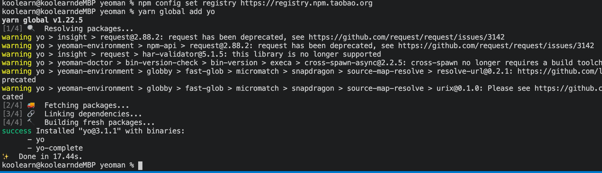
还需要generator
- yarn global add generator-node
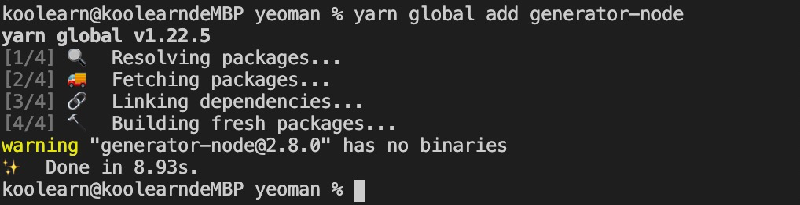
- yo node
安装刚刚的node generator，安装方法就是去掉generator-，`yo [name]`

生成的目录

#### 2.sub generator
- 如果我们需要在一个已有的项目之上去创建/添加一个新的文件类型/配置文件
- 可以使用sub generator
- 运行sub generator的方式就是在原有的generator后面跟上`: sub generator`
- yo node:cli
通过这个命令，可以生成一个node下的cli应用
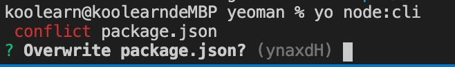
运行这个命令会询问我们是否要重写package.json文件
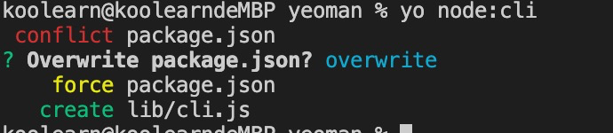
创建了一个lib/cli.js，查看文件内容
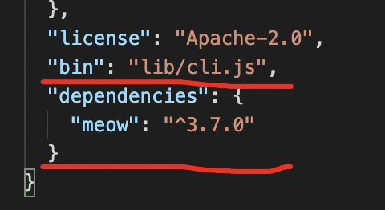
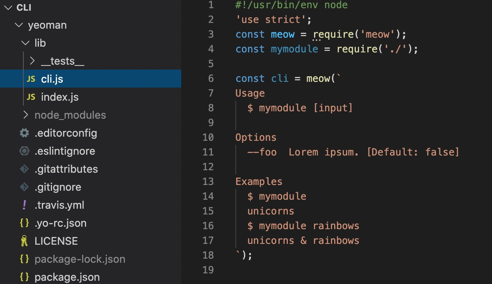
可以通过`yarn link`到全局进行使用
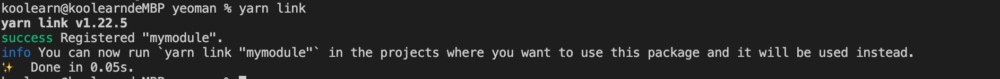
然后mymodule --help,发现刚刚创建的模块正常工作了，另外不是每一个generator都有一个sub generator，需要查询
- 总结：
  - 明确需求
  - 找到合适的generator
  - 全局范围安装找到的generator
  - 通过yo运行对应的generator
  - 通过命令行交互填写选项
  - 生成你所需要的项目结构
- [yeoman官网](https://yeoman.io/generators/)可以查找需要的generator
在使用这个生成器的时候，可能依赖一些c++的模块，这些模块需要在安装的时候去下载一些二进制的文件，而这些文件并不能通过npm镜像去加速。但可以配置对应的镜像去提高下载速度，比如配置淘宝的镜像
#### 3.自定义的generator
1. 创建Generator模块
Generator本质上就是一个NPM模块
- Generator基本结构
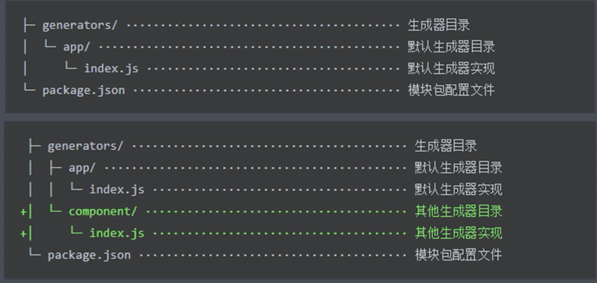
app目录下是生成器的实现代码
同级的component指sub generator
- `generator-<name>`Yeoman的生成器名称必须这个形式 
2. 创建generator-sample目录
- yarn init创建package.json
- yarn add yeoman-generator提供一个生成器的基类，基类中提供一些生成器的函数，让我们创建生成器更加便捷
- 按照Generator基本结构，创建generators/app/index.js
  - 此文件作为Generator的核心入口，导出一个继承Yeoman Generator的类型
  - Yeoman Generator在工作的时候会自动调用我们在此类型中定义的一些生命周期的方法
  - 我们可以在这些方法中调用父类提供的一些工具方法实现一些功能，例如文件写入
```
//generators/app/index.js
const Generator = require('yeoman-generator')
module.exports = class extends Generator {
  writing () {
    //Yeoman会在自动生成文件阶段调用此方法
    //因此可以通过文件读写的方法在这个目录下写入文件
     this.fs.write(
       //两个参数，文件的绝对路径，文件的内容
       this.destinationPath('temp.txt')
       Math.random().toString()
     )
  }
}
```
- yarn link先链接到全局
- yo sample
- 就可以看到创建类temp.txt文件，内容是一串随机数
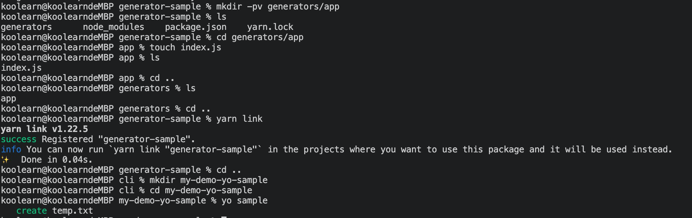
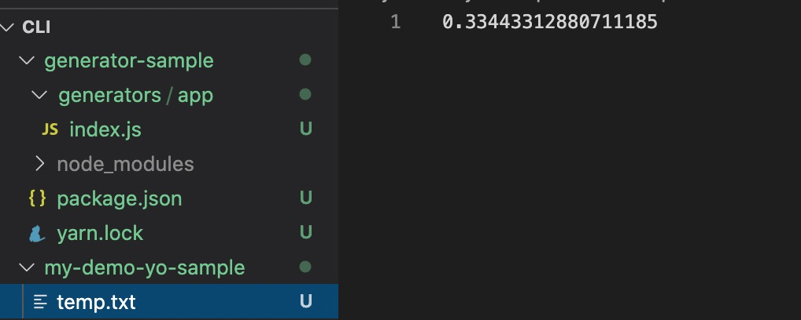
#### 4.根据模板去创建文件
- 需要自动创建的文件有很多，且文件类型也很复杂，就可以使用模板去创建
- 在app目录下新建一个templates目录，将需要生成的文件都放在templates目录下，作为模板
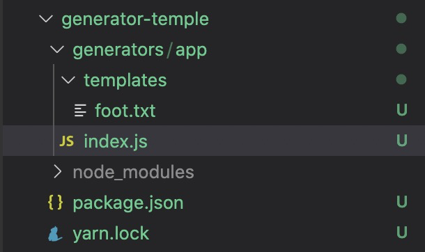
- 文件内容
```
//foot.txt
这是一个模板文件
内部可以使用 EJS 模板标记数据（模板内部完全遵循EJS语法）
例如，<%= title %>去动态的去输出一些数据，也可以做判断循环等操作
//index.js
    //此文件作为Generator的核心入口
//需要导出一个继承自Yeoman Generator的类型
//Yeoman Generator在工作时会自动调用我们在此类型中定义的一些生命周期方法
//我们在这些方法中可以调用父类提供的一些工具方法，实现一些功能，比如文件的写入等

const Genertator = require('yeoman-generator')

module.exports = class extends Genertator {
    writing() {
        // //Yeoman在自动生成文件阶段调用此方法
        // //这里尝试向项目目录中写入文件
        // this.fs.write(
        //     //两个参数，文件的绝对路径，文件的内容
        //     this.destinationPath('temp.txt'),
        //     Math.random().toString()
        // )

        //那么在生成文件的时候，就不用fs.write方法去写入文件
        //而是使用fs中专门使用模板引擎的方法，通过模板方式写入文件到目录
        //分别有三个参数，模板文件的路径，生成文件的路径，模板文件内容的上下文
        //模板文件路径
        const tmpl = this.templatePath('foo.txt')//自动获取当前文件的路径
        //输出目标路径
        const output = this.destinationPath()
        //模板数据上下文
        const context = {title :"Hello",success:false}
        //传入参数
        this.fs.copyTpl(tmpl,output,context)//这个方法会自动的把模板文件，映射到生成的输出文件上
    }
}
//1.yarn link
//2.mkdir my-demo
//3.yo sample
```
- 最后执行步骤
- yarn link
- mkdir my-demo
- yo sample(package.json中文件名字，去掉generator)
#### 5.接受用户的输入数据
- 可以调用prompting()方法
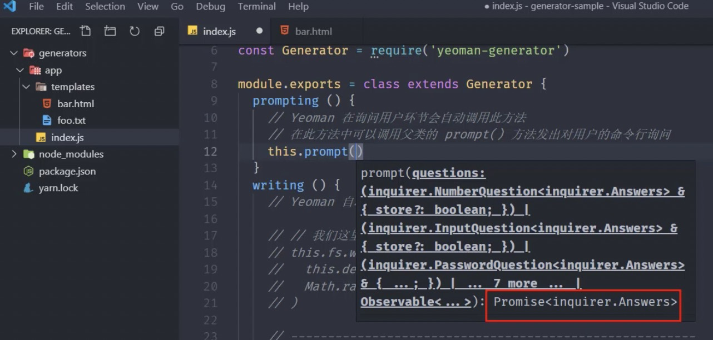
Yeoman在询问用户环节调用此方法
此方法中可以调用父类的prompt()方法发出对用户的命令行询问
```
prompting(){
  //方法接受一个数组参数，数组每一项都是一个问题对象，具体有类型type，名字name，默认值default，message信息
  this.prompt([
    {
      type:'input',//input指用户输入的方式，提交结果
      name:'name',//name是最终得到结果的一个键
      message:'your project name',//message是给用户的一个提示，即问题
      default:this.appname//appname是指为项目生成目录文件夹的名字，它会作为这个问题的默认值
    }
  ]).then(answers=>{
    //这个promise执行完之后可以得到一个answers，就是用户输入完问题后的结果，会以一个对象的形式出现
    //{name:'user input value'}
    //key是指刚刚设置的name，value是指用户输入的值
    //把这个值挂载到this对象上，以方便writing时使用它
    this.answers = answers

  })
}
 writing() {
       
        const tmpl = this.templatePath('bar.html')//自动获取当前文件的路径
       
        const output = this.destinationPath('bar.html')
        //模板数据上下文
        const context = this.answers//writing的时候使用answers作为模板的上下文
        //传入参数
        this.fs.copyTpl(tmpl,output,context)//这个方法会自动的把模板文件，映射到生成的输出文件上
    }
```
- 最后执行步骤
- yarn link
- mkdir my-demo
- yo sample(package.json中文件名字，去掉generator)
- 最后会创建文件bar.html

#### 6.Vue Generator
1. 创建一个基本结构，包含所需要的基础文件/代码，再去封装一个Generator去生成一个理想的项目结构
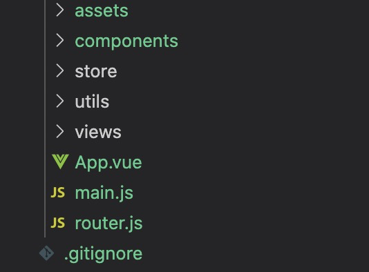
2. mkdir generator-test-vue
3. yarn init创建一个package.json
4. yarn add yeoman-generator
5. 添加generator/app/index.js
6. 跟以前一样添加代码
```
const Generator = require('yeoman-generator')

module.exports = Class extands  Generator {
  prompting () {
    //用于以命令行形式询问用户一些问题
  return this.prompt([
    {
      type:'input',
      name:'name',
      message:'your project name',
      default:this.appname,
    }
  ]).then(answers => {
    this.answers = answers
  })
  }
  writing(){
    //这里的writing不在是写入单个文件，需要把我们刚刚准备好的文件结构批量生成
    //所以需要一个templates目录，把需要生成的文件拷贝到tenplates目录中，作为模板
  }
}
```
7. 创建templates目录，把需要生成的文件拷贝到tenplates目录中，作为模板
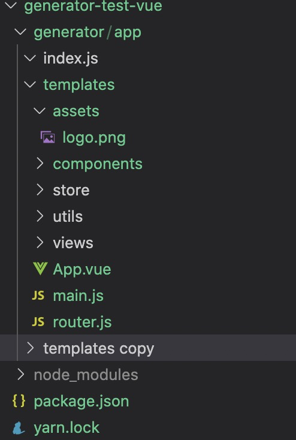
8. 通过esj语法，对某些文件进行挖坑，这里只需要替换名字
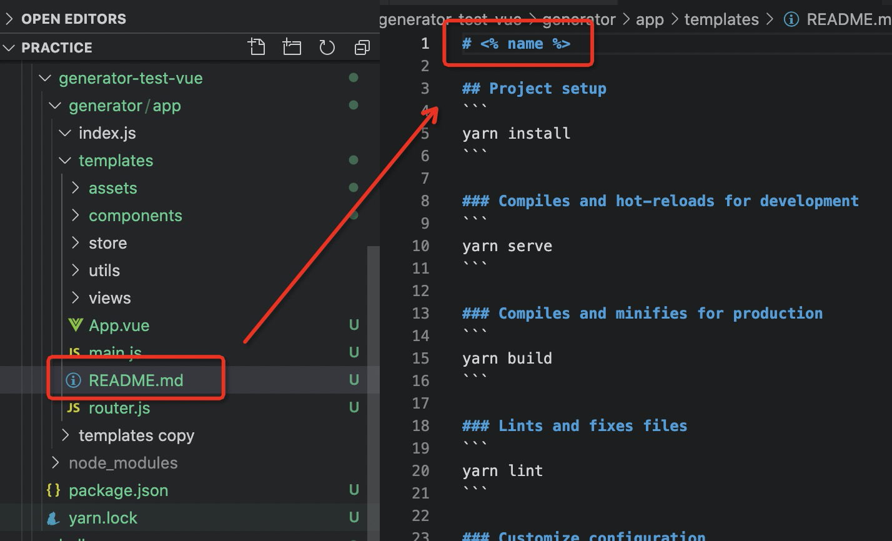
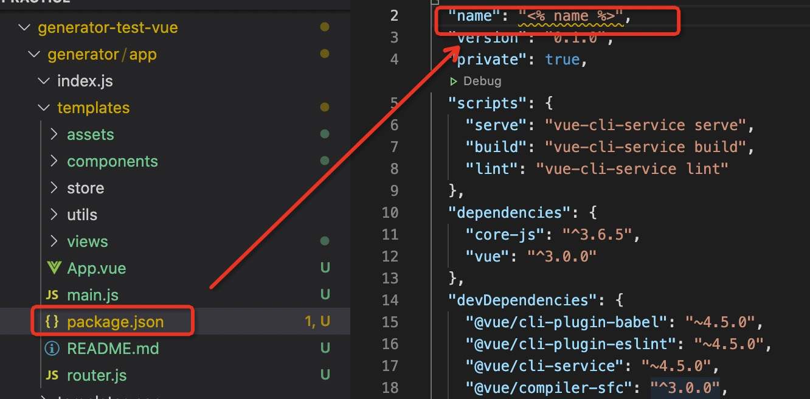
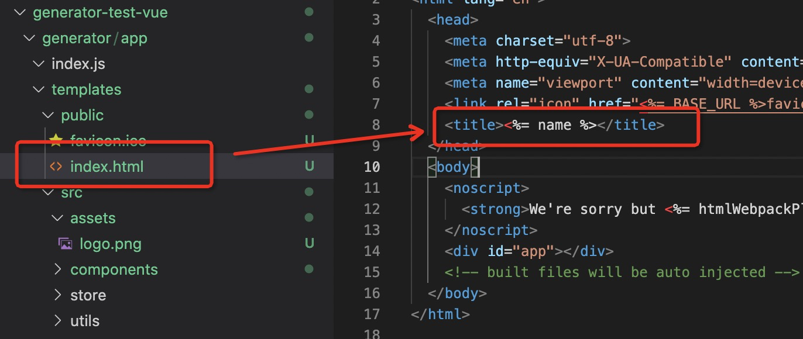
9. 重写编写writing内容
```
writing(){
  //把每一个文件都通过模板转换到目标路径 
  //这里通过一个数组循环的方式，批量的去添加
  const templates = [
    'src/App.vue',
    'src/router.js',
    'src/main.js',
    'package.json',
    '.gitignore',
    'public/index.html'
  ]
  //这是实际就是templates目录下的，每一个文件的相对路径 
  //然后就可以通过forEach去遍历每个路径，去生成目标目录的对应文件
  templates.forEach(item=>{
    //item => 每个文件的路径
    this.fs.copyTpl(
      this.templatePath(item),
      this.destinationPath(item),
      this.answers
    )
  })
}
```
10. yarn link
11. mkdir my-demo
12. yo test-vue(package.json中文件名字，去掉generator)
13. 出现的问题
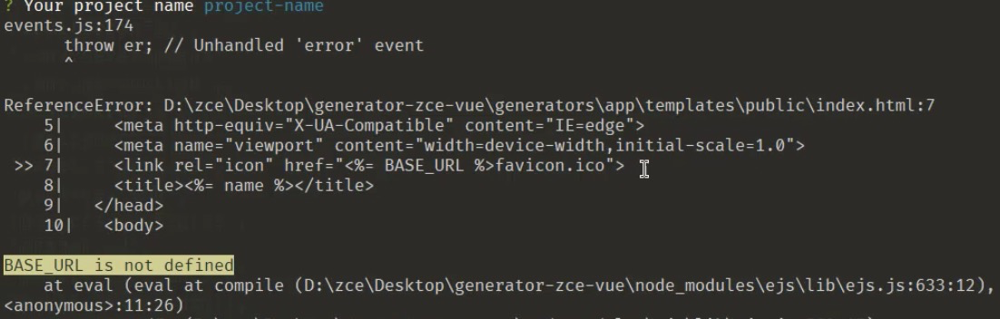
BASE_URL是模板语法但是未定义，这里需要转义，在百分号后面再加一个百分号即可
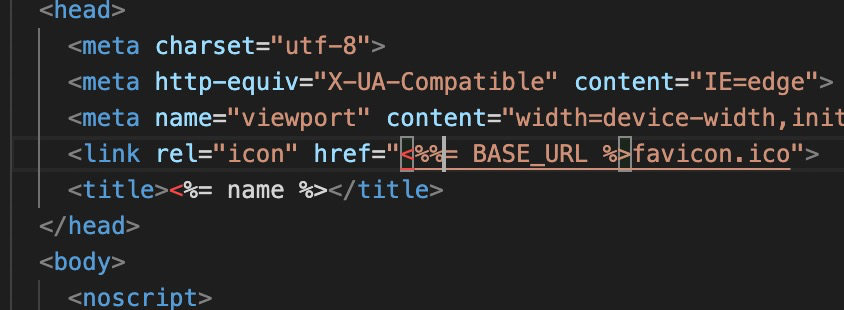
#### 7.发布generator
- 和发布一个npm包过程一样，npm add，npm publish/yarn publish(第一次使用的话会要求输入用户名密码，记得换镜像源，淘宝镜像是只读镜像)
- 如果需要generator在官方出现，需要添加一个Yeoman-generator的关键词，这时候yeoman官方就会发现到你这个项目
### 六 Plop介绍
- 一个小而美的脚手架工具
- 主要去创建项目中特定类型文件的小工具，类似subGenerator
- 主要解决的问题
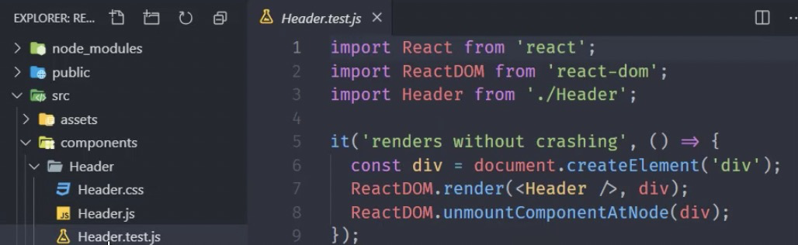
1. 每一个组件中都有三个文件，js，css，test.js,且都有部分重复代码
2. 再创建一个的时候，需要添加三次
3. 如果有plop的话
4. 只需要在命令行中去运行plop：yarn plop component 
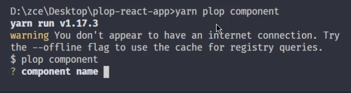
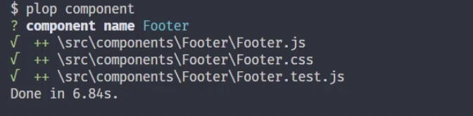
通过询问我们一些信息，去自动的创建一些文件，
这样就大大提高了创建重复文件的效率
#### 1.plop的基本使用
1. yarn add plop --dev作为开发依赖添加到项目之中
2. 项目的根目录新建一个plopfile.js的文件
```
//plopfile.js
//Plop的入口文件，需要导出一个函数
//此函数接受一个plop对象，这个对象里面提供了一系列的工具函数，用于创建生成器的任务
module.exports = plop => {
  //setGenerator接收两个参数，一个是生成器的名字，一个是配置参数
  plop.setGenerator('component',{
  //配置选项中，需要去指定下生成器的描述
  description:'create a component',
  //指定命令行要发出的问题，出现在交互环节
  prompts:[
    {
      type:'input',//type定义交付的方式
      name:'name',//本次交互的key值
      message:'component name',//交互的提示信息
      default:'MyComponent'//本次交互的默认答案
    }
  ],
  //actions顾名思义，完成命令行交互后，执行的动作，可以是一个数组，其中每一个对象就是一个动作
  actions:[
    {
      type:'add',//type指定动作的类型，add指添加一个全新的文件
      path:'src/components{{name}}/{{name}}.js',//指定添加文件所在的路径，可以使用双花括号替换刚刚在命令行中指定的数据
      templateFile:'plop-templates/component.hbs',//还需要指定本次添加文件的模板文件是什么
    }
  ]
  })
}
```
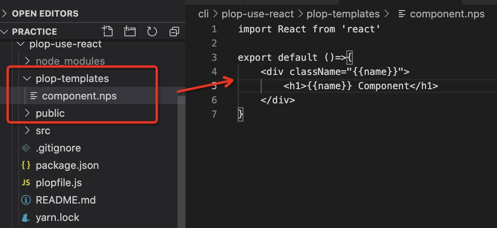

3. 因为在安装plop的时候，plop提供了一个cli程序，可以通过yarn去启动这个程序

4. 通过yarn plop componet执行,component是在plopfile.js中定义的名字

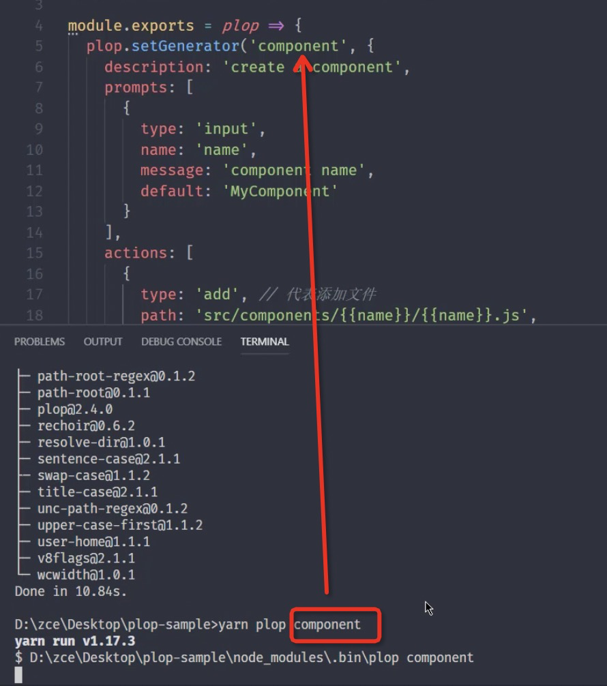
5. 然后就可以在模板文件中添加更多的文件和actions
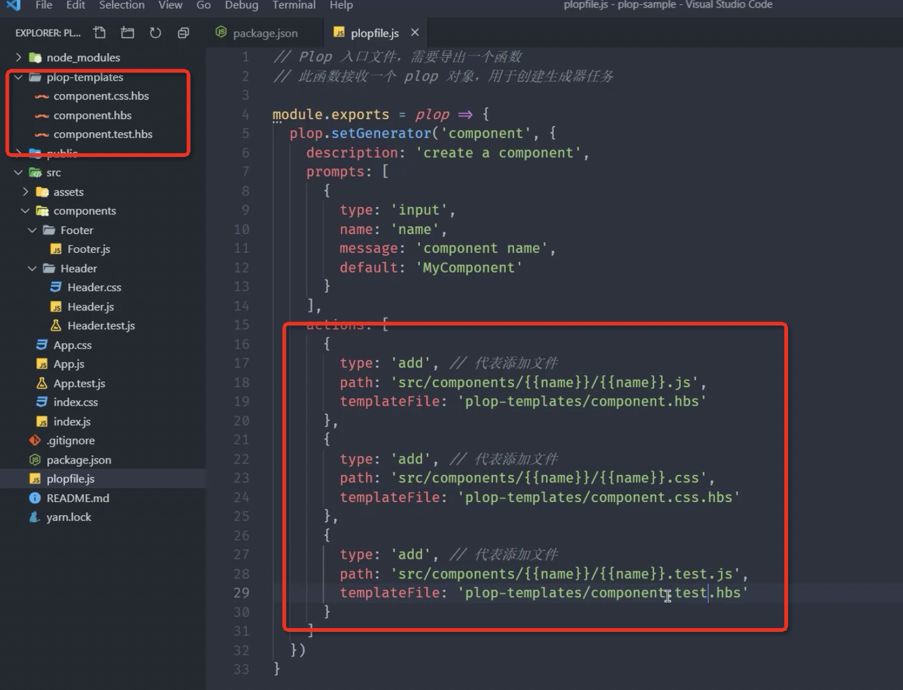
- **总结**：
1. 将plop模块作为开发依赖安装
2. 在项目根目录下创建一个plopfile.js文件
3. 在plopfile.js中定义脚手架的任务
4. 编写用于生成特定类型文件的模版
5. 通过plop提供的cli运行脚手架任务

### 七 自动化构建
- 一切重复工作本应自动化
- 自动化：指机器去代替手工去完成一些工作
- 构建：指把一些东西转换成另一些东西
- 源代码->自动化构建->生产代码（自动化构建工作流）
- 作用是脱离运行环境兼容所带来的种种问题，在开发阶段，使用一些提高效率的语法，标准规范
  - ECMAScript Next使用最新的标准去提高编码效率和质量
  - Sass增强css的可编程性 
  - 模板引擎  去抽象页面中重复的HTML

- 通过自动化构建，将那些不被支持的特性，转化为能够直接运行的代码，就能够通过这些方式提高编码效率

#### 1.自动化构建初体验
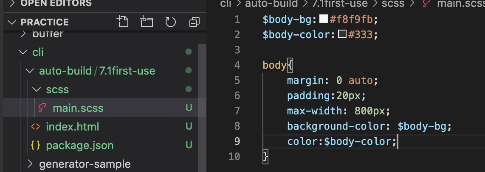
1. 使用scss增强css的编程性
2. yarn add sass --dev
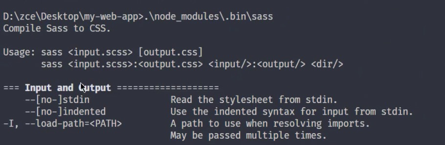
3. 装完之后，可以看到
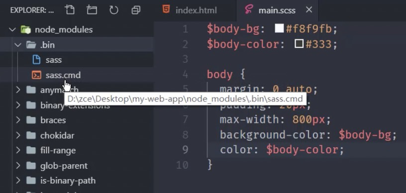
`node_modules`下有一个bin目录，里面有`sass.cmd`命令，
然后可以通过路径找到这个命令`./node_modules/.bin/sass`，执行后可以看到帮助信息
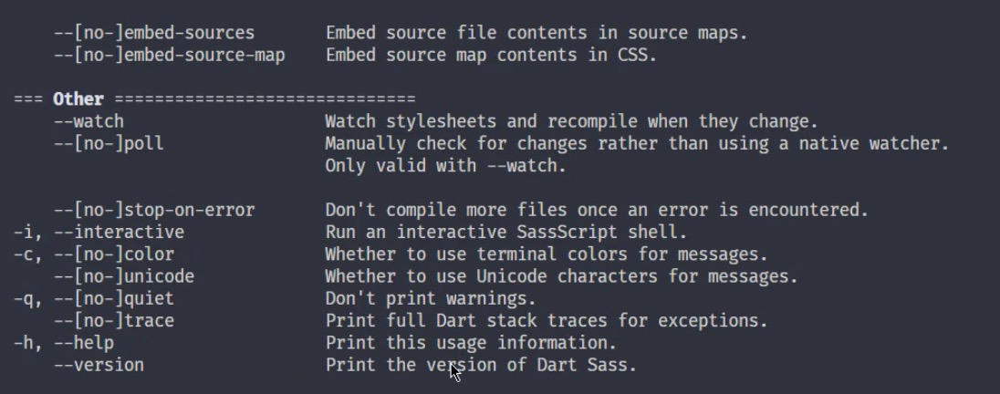
执行命令进行编译,写好输入路径和输出路径
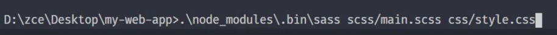
- 可以在npm script中定义一些与这个项目有关的脚本命令。
- script能自动发现node_modules里面的命令
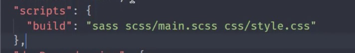
- 启动一个测试服务器，去运行测试项目
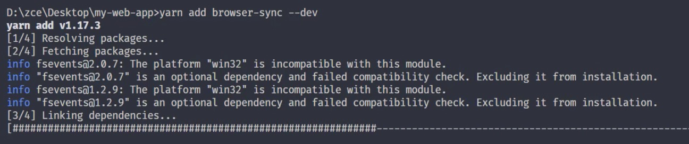
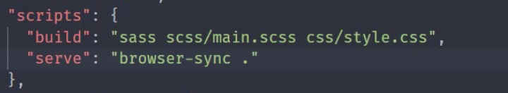
但问题是，启动serve之前，必须先build，否则就没有样式文件，
所以可以借助npm script的钩子机制，定义一个preserve，这样就能在启动serve之前，自动构建sass文件
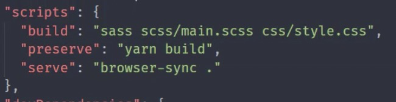
- 还可以添加一个`--watch`的参数，当文件被改变，就会自动去编译
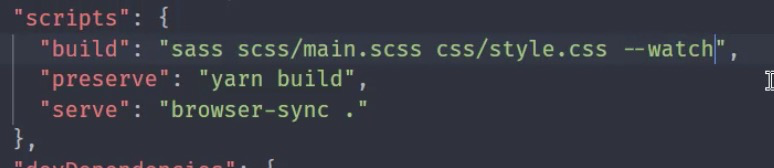
但这样做了之后
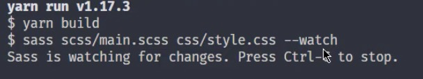
命令行会阻塞在这里进行watch，不会执行后续的serve
- 这个时候，就需要同时执行多个script，可以借助`npm-run-all`模块
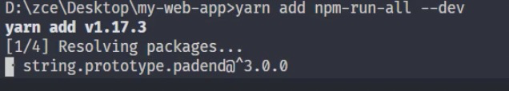
- 借助模块同时执行build和serve
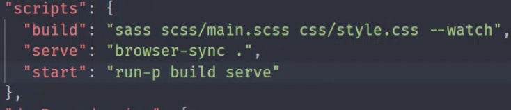
- 再次执行start命令，这时候build任务和serve任务同时被执行了
- 还可以添加--file，去监听文件下的变化，就避免了修改代码之后需要手动刷新页面的问题
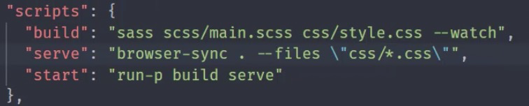
#### 2.常用的自动化构建工具
- `npm script`能解决一些普通的问题，但在复杂的项目中，就需要更为专业的自动化构建工具
- 常用的自动化工具，通过一些简单的代码去组织一些插件的使用，然后就能使用这些工具去执行一些重复的工作了
  - Grunt
    - 最早的前端构建系统，插件系统非常完善
    - 但由于工作过程是基于临时文件去实现的，所以它的构建速度相对较慢
    - 比如刚刚的sass，会先对sass进行编译操作，再去添加一些私有属性的前缀，最后再去压缩代码，在这个过程中，grunt每一步都有磁盘的读写操作。比如sass编译完之后，就会写入一个临时文件，然后插件再去读写文件。
  - Gulp
    - 基于内存去实现的，相对于磁盘读写操作更快，解决了grunt速度慢的问题
  - FIS
    - 百度的前端团队推出的，集中了一些典型的需求，比如性能优化，代码部署，资源加载，模块开发，更适合新手，方便操作
  - webpack(模块打包工具)
#### 3.Grunt的基本使用
- yarn add grunt
- touch gruntfile.js
  ```
  //Grunt的入口文件
  //用于定义一些需要grunt自动执行的一些任务
  //需要导出一个函数
  //这个函数接受一个grunt的形式参数，grunt是一个对象，对象内部就是一些api，可以借助这些api去快速的创建一些任务
  module.exports = grunt => {
    //注册一个任务
    grunt.registerTask('foo','任务描述',()=>{
      //第一个参数是任务的名字，第二个参数可选，属于任务的描述，会出现在grunt的帮助信息当中。第三个参数是一个回调函数，也就是当任务发生时，自动去执行的函数
    })
  }
  ```
  - yarn grunt foo
    - yarn 会自动的找到node_modules下的命令，再加上foo，刚刚注册的名字
  - yarn grunt --help
    - 得到grunt的帮助信息，其中available task中的描述就是自定义的描述了
    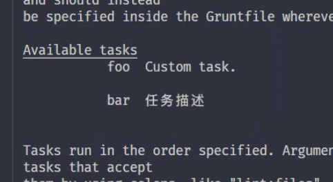
  - 如果在注册任务的时候，取名叫default，那么执行的时候就不需要加上任务的名称，直接yarn grunt即可，一般会用来映射一些其他的任务
  ```
  grunt.registerTask('default',['foo','bar'])
  ```
  - 那么执行yarn grunt 的时候，grunt就会依次执行数组中的任务
  - 异步任务
    - 默认支持同步模式，如果需要异步模式，需要使用this.async方法，得到一个回调函数，在异步操作完成之后，调用这个回调函数，标示这个任务已经被完成
    ```
    grunt.registerTask('async-task',function(){
      //如果需要用到this,就不能使用箭头函数了
      const done = this.async()
      setTimeout(()=>{
        console.log("async workinh")
        done()
        //这时候grunt就知道这是一个异步的任务，那么就会等到done的执行，直到done被执行，grunt才会结束这个任务的执行，console才会被顺利打印出来
      },1000)
    })
    ```
- **grunt标记失败**：
如果在构建代码的逻辑中发现了错误，那么就可以把这个任务标记成一个失败的任务，具体操作是在函数体中return false来实现
```
module.exports = grunt => {
  grunt.registerTask('bad',()=>{
    console.log("bad work")
    return false
  })
}
```
- 如果这个任务是在任务列表之中，这个任务的失败，会导致后续的所有任务不再被执行
- 异步任务的标记失败，参数传一个false
```
grunt.registerTask('bad-async',function(){
  const done = this.async()
  setTimeout(()=>{
    console.log('bad async')
    done(false)
  },1000)
})
```
**grunt配置选项**：
```
grunt.initConfig({
  //接受一个对象，对象的key与任务的名字保持一致，对象的值可以是任意类型的数据
  foo:'bar',
  foo2:{
    bar:123
  }
})
grunt.registerTask('foo',()=>{
  //然后在其他任务里面就可以使用这个对象
  console.log(grunt.config('foo'))
  console.log(grunt.config('foo2.bar'))//如果值是对象的话
})
```
**grunt多目标任务**：

```
module.exports = grunt => {
  //多目标模式，可以让任务根据配置形成多个子任务
  //使用registerMultiTask之前，需要先配置多个目标，否则会报错
  grunt.initConfig({
    //指定一个与任务同名的属性
    build:{
      //指定任务的目标,这里相当于为build的任务添加了两个目标
      //在这里添加的所有属性都会成为一个目标，除来options属性
      //options会成为配置选项属性
      options:{
        foo:'bar'
      },
      //也可以在目标中添加options，会覆盖最上面的options
      css:'1',
      js:'2'
    }
  })
  //第一个参数任务的名字，第二个参数回调函数
  grunt.registerMultiTask('build',function(){
    console.log('build task')
  })
}
```
- 执行结果，可以看到有两个目标
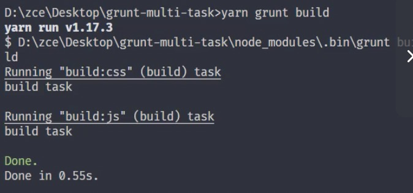
- 可以通过`yarn grunt build:css`冒号来指定任务的目标
- 可以通过this来拿到目标名称和值
```
 grunt.registerMultiTask('build',function(){
    console.log(`target:${this.target},data:${this.data}`)
  })

```
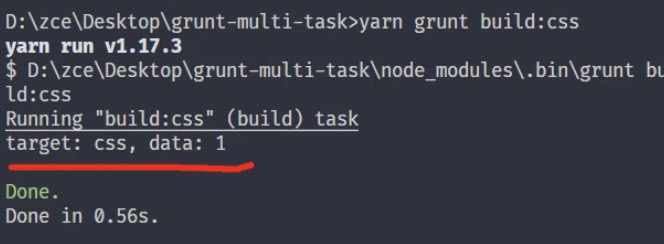
- 获取配置选项的信息
```
 grunt.registerMultiTask('build',function(){
    console.log(this.options())
    //打印出{foo:'bar'}
  })

```
**grunt插件的使用**：
1. 清除临时文件插件`grunt-contrib-clean`
- `yarn add grunt-contrib-clean`
```
//gruntfile.js
modules.exports = grunt => {
  //加载任务及插件
  grunt.loadNpmTasks('grunt-contrib-clean')
}
```
- 执行命令`yarn grunt clean`
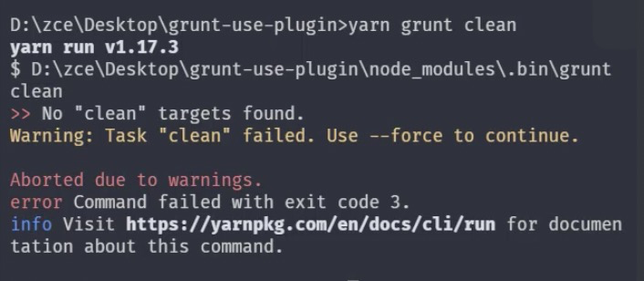
No 'clean' targets found.
- 说明这也是一个多目标任务，需要initConfig配置目标
```
//gruntfile.js
modules.exports = grunt => {
  grunt.initConfig({
    clean:{
      //需要清除的文件路径
      temp:'temp/app.js'
      //temp/*.txt
      //temp下所有txt文件
      //temp/**
      //temp下所有子目录和子目录下所有文件
    }
  })
  grunt.loadNpmTasks('grunt-contrib-clean')
}
```
- 执行命令`yarn grunt clean`
temp下的app.js就会被删除
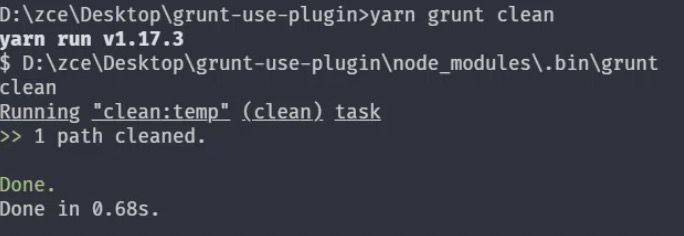
2. `grunt-sass`
- `yarn add grunt-sass sass --dev`
安装grunt-sass的时候，同时也需要安装sass到开发依赖当中
```
//gruntfile.js
modules.exports = grunt => {
  grunt.initConfig({
     sass:{
       main:{
         //指定css输出文件路径和输入sass文件的路径
         files:{
           'dist/css/main.css':'src/scss/main.scss'
         }
       }
     }
  })
  //加载任务及插件
  grunt.loadNpmTasks('grunt-sass')
}
```
- `yarn grunt sass`
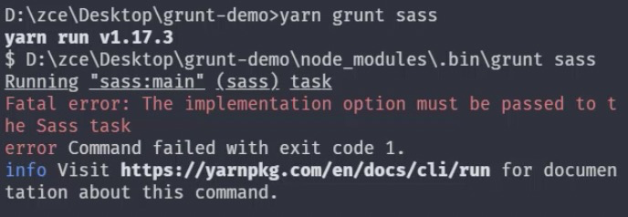
implementation option指定在grunt-sass中，指定用那个模块去编译sass文件
```
//gruntfile.js
const sass = require('sass')
modules.exports = grunt => {
  grunt.initConfig({
     sass:{
       options:{
         implementation:sass,
         sourceMap:true//自动生成对应的sourceMap文件
       },
       main:{
         //指定css输出文件路径和输入sass文件的路径
         files:{
           'dist/css/main.css':'src/scss/main.scss'
         }
       }
     }
  })
  //加载任务及插件
  grunt.loadNpmTasks('grunt-sass')
}
```
- `yarn grunt sass`
就能正确执行
3. `load-grunt-tasks`
- yarn add load-grunt-tasks --dev
```
const loadGruntTasks = require('load-grunt-tasks')
modules.exports = grunt => {
  //自动加载所有的grunt插件中的任务
  loadGruntTasks(grunt)
}
```
4. `grunt-babel`
- `yarn add grunt-babel @babel/core @babel/preset-env --dev`
```
//gruntfile.js
const loadGruntTasks = require('load-grunt-tasks')
modules.exports = grunt => {
  grunt.initConfig({
     babel:{
       options:{
         //babel转换es部分特性，把一系列的特性打一个包，presets去设置具体转换那些特性，env是指最新的特性
         presets:['@babel/preset-env'],
         sourceMap:true
       },
       main:{
         //指定css输出文件路径和输入sass文件的路径
         files:{
           'dist/js/app.js':'src/js/app.js'
         }
       }
     }
  })
  //自动加载所有的grunt插件中的任务
 loadGruntTasks(grunt)
}
```
5. `grunt-contrib-watch`开发过程中代码更新后自动更新视图
- `yarn add grunt-contrib-watch --dev `
```
//gruntfile.js
const loadGruntTasks = require('load-grunt-tasks')
modules.exports = grunt => {
  grunt.initConfig({
    watch:{
      js:{
        //这里不需要输出任何文件，只需要监视源文件就好来
        files:['src/js/*.js'],
        //这里是说明发现文件发生来变化，需要执行的任务
        tasks:['babel']
      },
      //样式文件
      css:{
        files:['src/scss/*.scss'],
        tasks:['sass']
      }
    }
  })
  //yarn grunt先把sass和babel先编译一遍，再执行watch
  grunt.registerTask('default',['sass','babel','watch'])
  //自动加载所有的grunt插件中的任务
 loadGruntTasks(grunt)
}
```
- `yarn grunt watch `
它只会去监视文件，需要等到js或者scss发生改变后，才去执行，所以可以先添加一个默认的任务
#### 4.Gulp的基本使用
先在项目中安装一个gulp的开发依赖，然后在根目录添加一个gulpfile.js的配置文件，用于编写需要glup执行的编译任务，之后就可以用gulp提供的cli去运行这个任务
- `yarn init --yes`先初始化目录
- `yarn add gulp --dev `
- `code gulpfile.js`//定义gulp的配置入口文件
```
//gulpfile.js
export.foo = () => {
  console.log('foo task working')
}
```
- `yarn gulp foo`
执行结果
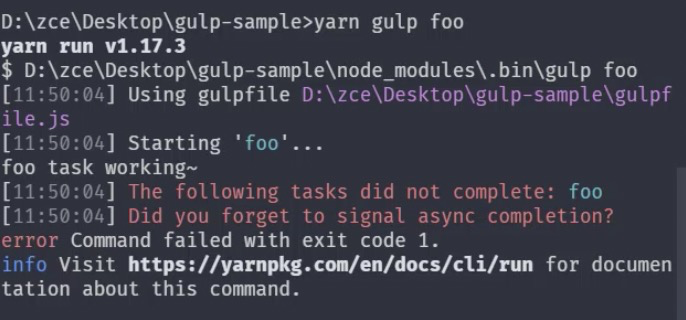
显示需要标记任务的结束
```
//gulpfile.js
export.foo = done => {
  console.log('foo task working')
  done()//标示任务完成
}
```
- `yarn gulp foo`
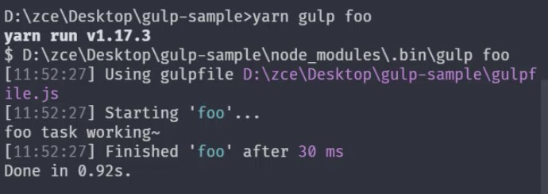
- 可以设置default任务
```
//gulpfile.js
export.foo = done => {
  console.log('foo task working')
  done()//标示任务完成
}
export.default = done => {
  console.log('default done')
  done()
}
```
- `yarn grunt`任务名是default即可
- gulp4.0之前
```
gulp.task('bar',done=>{
  console.log('bar')
  done()
})
```
1. **gulp组合任务**：

可以用来创建并行任务和串行任务
```
const {series, parallel} = require('gulp')
//series会按照顺序，依次执行这些任务
const task1 = done => {
  setTimeout(()=>{
    console.log('task1 working')
    done()
  },1000)
}
const task2 = done => {
  setTimeout(()=>{
    console.log('task2 working')
    done()
  },1000)
}
const task3 = done => {
  setTimeout(()=>{
    console.log('task3 working')
    done()
  },1000)
}
export.foo = series(task1,task2,task3)
export.bar = parallel(task1,task2,task3)
```
- `yarn gulp foo`或`yarn gulp bar`
执行结果
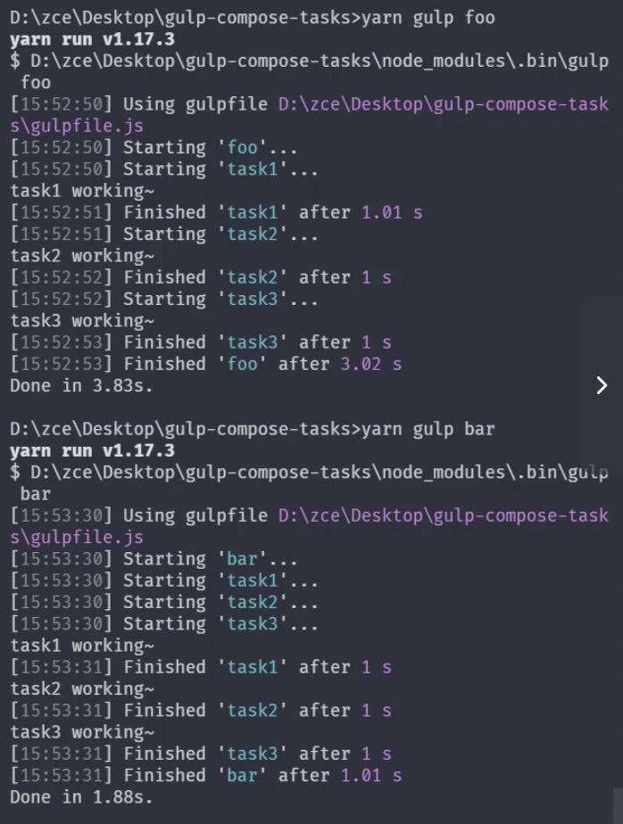
串行任务适合那些需要按顺序执行的任务，比如编译，部署
并行任务适合处理那些不需要顺序的任务，比如编译js和css
2. **gulp异步任务**：

当直接去调用一个异步函数的时候，是没法确定这个异步函数是否完成，都是通过回调或者函数内部事件去通知外部，异步函数执行完成，所以这里也会存在，如何通知gulp异步函数的问题

- 通过回调的方式去解决
```
exports.callback = done => {
  console.log('callback task')
  done()
}
//这种回调函数和node中的回调函数相同，都是错误优先的回调函数
//给回调函数第一个参数指定一个错误对象，去阻止任务的执行，后续的任务也不会工作
export.callback_error = done => {
  console.log('callback task_error')
  done(new Error('task fail'))
}

```
- 通过promise的方式去解决，避免回调函数嵌入过深的问题
```
//所以可以联想到用promise来解决
export.promise = () => {
  console.log('promise ')
  return Promise.resolve()
 //返回Promise resolve说明任务结束来，gulp会忽略resolve中传的值
}
export.promise_error = () => {
  console.log('promise error')
  return Promise.reject(new Error('task fail))
}
```
- 通过async的方式去解决，避免回调函数嵌入过深的问题
```
//node 8 以上的版本，可以使用async和await
const timeout => time => {
  return new Promise(resolve => {
    setTimeout(resolve, time)
  })
}
exports.async = async()=>{
  await timeout(1000)
  console.log('task async')
}
//这些都是js中处理异步的常用方式，在gulp中都支持
```
- 通过stream的方式，因为构建系统大都是在处理文件
```
//处理文件时用到的stream处理异步的方式
exports.stream = ()=>{
 const readStream = fs.createReadStream('package.json')
 const writeStream = fs.createWriteSteam('temp.txt')
 //把readStream中的内容导到写入文件流对象中
 readStream.pipe(writeStream)
 return readStream
 //结束的时机是readStream end的时候，就是文件读取完的时候
 //那么我们可以模拟这个end操作，去执行done操作
 readStream.on('end',()=>{
   done()
 })
}
```
3. **gulp构建过程核心工作原理**：
大多数都是文件读出来，然后进行转换，最后写入到一个位置
----
输入(读取文件)->加工(转换文件)->输出(写入文件)
----
- node底层文件流api去模拟这个过程
```
//gulpfile.js
const fs = require('fs')
//导出一个文件转换流
const { Transform } = require('stream')

exports.default = () => {
  //文件读取流
  const read = fs.createReadStream('读取文件的路径.css')
  //文件写入流
  const write = fs.createWriteStream('写入文件的路径.min.css')
  //文件转换流
  const transform = new Transfrom({
    transform:(chunk,encoding,callback)=>{
      //核心转换过程的实现
      //chunk=>读取流中读到的内容(Buffer)
      const input = chunk.toString()//将Buffer转换成文本内容
      //去除所有空格和换行，进行压缩代码
      const output = input.replace(/\s+/g,'').replace(/\/\*.+?\*\//g,'')
      callback(null,output)//返回输出的内容，也是一个错误优先函数。
      //第一个参数错误对象，没有错误可以传入null

    }
  })
  //把读取的文件流导入写入文件流
  //read.pip(write)
  read
    .pip(transform)//转换
    .pip(write)//写入
  //返回read对象，这样gulp就能根据流的状态，判断是否完成
  return read
}
```
3. **gulp文件操作API**：
- gulp提供了很多文件操作的api，相比于node底层的api，gulp的更容易使用
- 至于转换流，基本是通过插件来实现
```
//gulpfile.js
const {src, dist} = require('gulp')
exports.default = () => {
  //返回这个对象，gulp才能控制执行结束
  return src('src/normal.css')//读取流，可以采用通配符的方式 'src/*.css'
    .pip(dist('dist/))//写入流
}
```
- `yarn add gulp-clean-css -dev`
安装压缩css代码的插件
```
//gulpfile.js
const {src, dist} = require('gulp')
const cleanCss = require('gulp-clean-css')

exports.default = () => {
  //返回这个对象，gulp才能控制执行结束
  return src('src/normal.css')//读取流，可以采用通配符的方式 'src/*.css'
    .pip(cleanCss())//在写入流之前进行css代码压缩
    .pip(dist('dist/))//写入流
}
```
- 重命名转换后的文件`yarn add gulp-rename --dev`
```
//gulpfile.js
const {src, dist} = require('gulp')
const cleanCss = require('gulp-clean-css')
const rename = require('gulp-name')

exports.default = () => {
  //返回这个对象，gulp才能控制执行结束
  return src('src/normal.css')//读取流，可以采用通配符的方式 'src/*.css'
    .pip(cleanCss())//在写入流之前进行css代码压缩
    .pip(rename({extname:'.min.css'}))//重命名扩展名
    .pip(dist('dist/))//写入流
}
```
3. **gulp自动构建案例**：
```
//gulpfile.js
const {src,dest,parallel,series,watch } = require('gulp')
//watch会监视一个文件路径的通配符，根据这些文件的变化，决定是否执行某个任务
const sass = require('gulp-sass')
const babel = require('gulp-babel')
const swig = require('gulp-swig')
const imagemin = require('gulp-imagemin')

//自动加载插件yarn add gulp-load-plugins --dev
const loadPlugins = require('gulp-load-plugins')
const plugins = loadPlugins()
//plugins是一个对象，所有plugin的插件都会成为这个对象下面的一个属性
//命名方式是去掉gulp-，比如gulp-sass=>sass,如果有两个gulp-load-plugins
//那么他会自动驼峰命名gulp-load-plugins=>loadPlugins

//自动热更新服务器模块yarn add browser-sync --dev
//提供一个开发的服务器，它支持热更新，代码修改后能立刻看到结果
const browserSync = require('brower-sync')
const bs = browserSync.create()
const serve = () => {
//watch指定目录文件发生变化后，执行指定的任务，再通过bs的files功能进行浏览器的更新
//可能会遇到的问题，因为swig模板引擎缓存机制导致页面不会发生变化，此时需要额外的将
//swig选项中的cache设置为false
//一般在watch监视的时候，不会去监视转换font和image文件，最后发布的时候进行转换编译
//在bs中的baseDir指定一个数组路径，一个请求过来，先到第一个路径去找，没有才到后面
  watch('src/assets/styles/*.scss',style)
  watch('src/assets/styles/*.js',script)
  watch('src/*.html',page)
  //watch('src/assets/images/**',image)
  //watch('src/assets/fonts/**',font)
  //watch('public/**',extra)
  watch([
    'src/assets/images/**',
    'src/assets/fonts/**',
    'public/**'
  ],bs.reload)
  //初始化服务器的配置,定义完后记得导出
  bs.init({
    server:{
      noifty:false,//通知
      port:2080,//默认3000
      open:fales,//自动打开浏览器
      files:'dist/*',//指定监听目录下的文件，如果发生了变化，重启服务
      //定义网站的根目录，就是web服务器，把那个目录作为根目录
      baseDir:['dist','src','public'],
      //让对于/node_modules开头的请求，都指到同一个目录下面去，这个会优先于baseDir
      //如果先有routes会先走routes,否则才是baseDir
      routes:{
        '/node_modules':'node_modules'
      }
    }
  })
}
//自动清除文件 `yarn add del --dev`
const del = require('del')
const clean = () => {
  return del(['dist'])
}

//样式编译
const style = ()=>{
  return src('src/assets/styles/*.scss',{base:'src'})//输入的目录
  //同时规定输出时也带着的父级目录base
  //用了loadplugins后就是plugins.sass,下面同理
          .pipe(sass({outputStyle:'expanded'}))//sass样式转换，规定打括号换行
          .pipe(dest('dist'))//输出的目录
}
//js编译
const script = () => {
  return src('src/assets/styles/*.js',{base:'src'})
          //如果直接babel(),可能没有任何效果。因为babel是一个js转换的平台
          //本身不做任何操作，转换的是其中的插件
          .pipe(babel({presets:['@babel/preset-env']}))
          .pipe(dest('dist'))
          //这里需要安装yarn add @babel/core @babel/preset-env --dev
          //可以在最后pipe(bs.reload({stream:true}))//这样就可以不用files配置了
}
//页面目标编译
const page = () => {
  return src('src/*.html',,{base:'src'})
          .pipe(swig())
          .pipe(dest('dist'))
}

//图片压缩
const image = () => {
  return src('src/assets/images/**',{base:'src'})
          .pipe(imagemin())
          .pipe(dest('dist'))
  //yarn add gulp-imagemin --dev
}
//字体压缩，只能处理svg的字体，其他格式不支持压缩
const font = () => {
  return src('src/assets/fonts/**',{base:'src'})
          .pipe(imagemin())
          .pipe(dest('dist'))
}
//其他的额外文件,只进行复制，没有做转换
const extra = () => {
  return src('public/**',{base:'public'})
          .pipe(dest('dist'))
}
//并行处理样式，脚本，页面文件，一般是处理src文件下
const compile = parallel(style,script,page,image,font)
//先去clean，在去转换其他文件,上线之前的操作
const build = series(clean,parallel(compile,,image,font,extra))
//先进性编译，再启动服务，开发时候的操作
const develop = series(compile,serve)
module.exports = {
  //style,
  //script,
  //page,
  //compile,
  build,
  serve//导出服务器，通过yarn gulp serve启动
}
```
- useref对文件的处理
- `yarn add gulp-useref --dev`引用关系
```
//文件的编译起始，文件类型，最后合并生成的文件路径
<!-- build:css assets/styles/vendor.css -->
<link ref="stylesheet" href="/node_modules/bootstarp/dist/css/bootstarp.css">
<!-- enbuild -->
//编译结束的标示
```
在gulpfile.js
```
const useref = () => {
  return src('dist/*.html',{base:'dist'})
        .pipe(plugins.useref({searchPath:['dist','.']}))
        .pipe(dest('dist'))
}
```
- 但这样会有一个问题，就是生成的html和js和css是没有压缩过的，需要进行压缩处理
```
const useref = () => {
  return src('dist/*.html',{base:'dist'})
        .pipe(plugins.useref({searchPath:['dist','.']}))
        //所以在接下来的管理处理有三种文件类型，html,css,js
        //yarn add gulp-htmlmin gulp-clean-css gulp-uglify --dev
        //因为这里有三种文件类型的操作，所以需要判断下yarn add gulp-if --dev
        .pipe(plugins.if(/\.if$/,plugins.uglify()))
        //注意要重新执行yarn gulp complie否则里面的html是已经删除过注释的
        .pipe(plugins.if(/\.css$/,plugins.cleanCss()))
        .pipe(plugins.if(/\.html$/,plugins.htmlmin({
          collapseWhitespace:true, //这个配置是折叠掉文件内所有的空白字符
          minifyCSS:true,//同理，折叠css和js中的空白字符
          minifyJS:true
          })))
       
        .pipe(dest('dist'))
        //这里有一个需要注意的是，src是在dist目录下读取文件，最后又写入到dist目录
        //这样很容易发生冲突
        //这样可以把写入的文件夹换一个路径,比如dest('release')
}
```
- 但这样会出现一个问题，那就是打乱之前的构建流程，因为存在dist和release两个文件夹
- 所以可以先都放到临时tmp文件夹中，最后再转到dist文件夹中
```
const clean = () => {
  return del(['dist','temp'])
}
const style = ()=>{
  return src('src/assets/styles/*.scss',{base:'src'})
          .pipe(plugins.sass({outputStyle:'expanded'}))
          .pipe(dest('temp'))
          .pipe(bs.reload({stream:true}))
}
const script = ()=>{
  return src('src/assets/styles/*.js',{base:'src'})
           .pipe(babel({presets:['@babel/preset-env']}))
          .pipe(dest('temp'))
          .pipe(bs.reload({stream:true}))
}
const page = () => {
  return src('src/*.html',,{base:'src'})
          .pipe(swig())
          .pipe(dest('temp'))
          .pipe(bs.reload({stream:true}))
}
//但是剩下的image，font,extra不需要转到临时目录，因为他们开发阶段不需要转换。
const serve = () => {
  watch('src/assets/styles/*.scss',style)
  watch('src/assets/styles/*.js',script)
  watch('src/*.html',page)
  watch([
    'src/assets/images/**',
    'src/assets/fonts/**',
    'public/**'
  ],bs.reload)
  bs.init({
    server:{
      noifty:false,//通知
      port:2080,//默认3000
      baseDir:['temp','src','public'],
      routes:{
        '/node_modules':'node_modules'
      }
    }
  })
} 
const useref = () => {
  return src('temp/*.html',{base:'dist'})
        .pipe(plugins.useref({searchPath:['dist','.']}))
        .pipe(plugins.if(/\.if$/,plugins.uglify()))
        .pipe(plugins.if(/\.css$/,plugins.cleanCss()))
        .pipe(plugins.if(/\.html$/,plugins.htmlmin({
          collapseWhitespace:true, //这个配置是折叠掉文件内所有的空白字符
          minifyCSS:true,//同理，折叠css和js中的空白字符
          minifyJS:true
          })))
        .pipe(dest('dist'))
}
```
- 最后的执行关系
```
const compile = parallel(style,script,page)
const build = series(clean,parallel(series(compile,useref),image,font,extra))
const develop = series(compile,serve)
```
- 添加到script里面
```
//package.json
"script":{
  "clean":"gulp clean",
  "build":"gulp build",
  "develop":"gulp develop"
}
```


